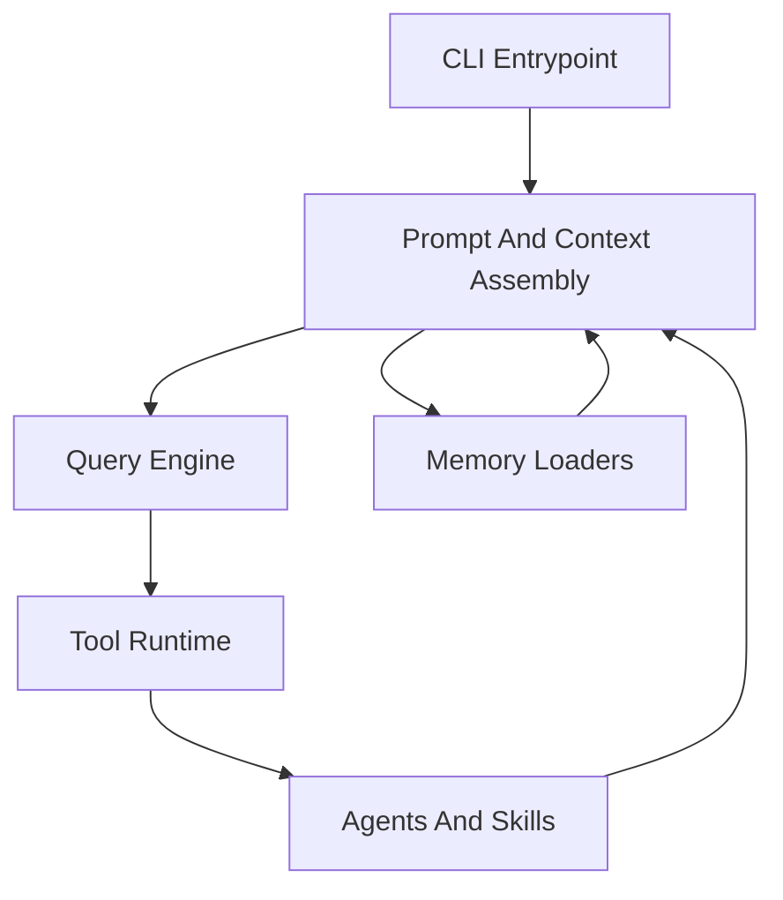
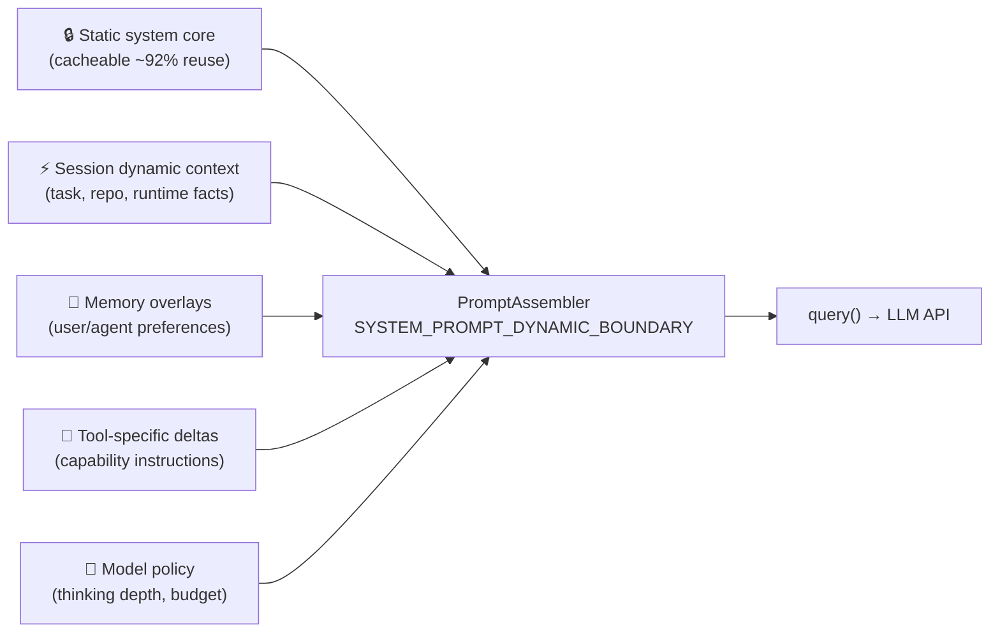
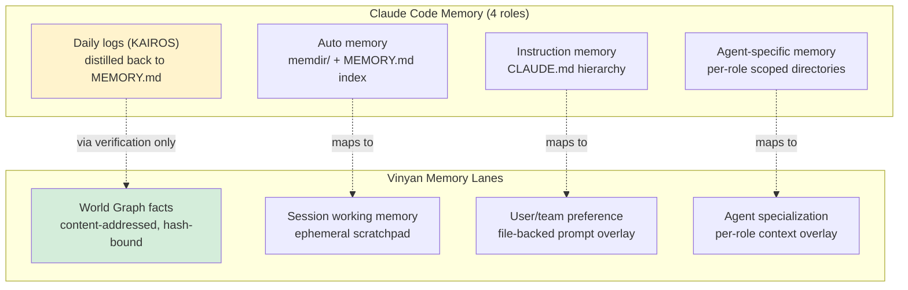
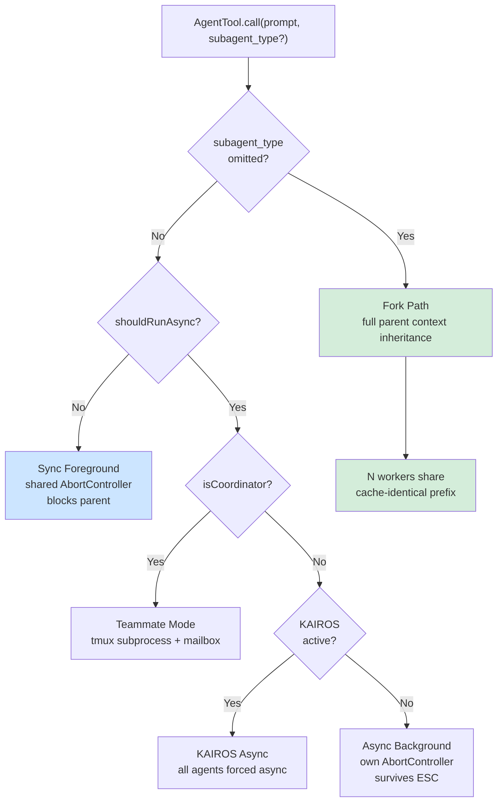
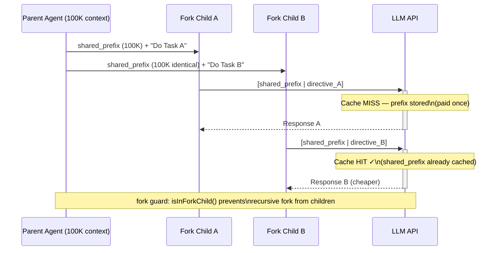
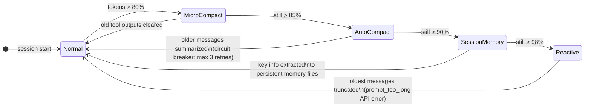

# Claude Code Architecture Lessons For Vinyan

**Status:** External architecture analysis  
**Date:** 2026-04-03  
**Scope:** Prompt harness, memory runtime, and extensible thinking patterns relevant to Vinyan ENS

> **Document boundary**: This document owns the architectural lessons Vinyan can reuse from the publicly mirrored `khumbal/claude-code` repository and related analysis articles.  
> It does **not** attempt to document Claude Code comprehensively, restate leaked source, or define Vinyan implementation contracts.  
> For Vinyan core architecture, see [decisions.md](../architecture/decisions.md). For ForwardPredictor design, see [forward-predictor-architecture.md](../architecture/forward-predictor-architecture.md). For Vinyan TDD contracts, see [tdd.md](../spec/tdd.md).

---

## 1. Executive View

The most important lesson is not "Claude Code has many tools." The deeper lesson is that the product is built as a **prompt harness runtime**: prompt assembly, context loading, memory injection, tool gating, and session orchestration are explicit subsystems rather than incidental glue. This framing is supported by the repo's own architecture summary and source layout, which center `main.tsx`, `QueryEngine.ts`, `Tool.ts`, `context.ts`, `memdir/`, and `tools/AgentTool/` as first-class modules rather than scattered helpers ([repo README](https://github.com/khumbal/claude-code), [main.tsx](https://raw.githubusercontent.com/khumbal/claude-code/main/src/main.tsx), [QueryEngine.ts](https://raw.githubusercontent.com/khumbal/claude-code/main/src/QueryEngine.ts), confidence: **high**).

For Vinyan, the strongest reusable ideas are:

| Lesson | Why it matters to Vinyan | Confidence |
|---|---|---|
| Separate **prompt assembly** from the query loop | Keeps governance clean while allowing generation policy to evolve independently | High |
| Treat **memory as multiple lanes**, not one store | Prevents instruction memory, factual memory, and working memory from collapsing into one undifferentiated blob | High |
| Make **thinking a policy object**, not prompt text only | Lets the orchestrator choose reasoning depth deterministically | High |
| Preserve **cache-safe prompt boundaries** | Reduces cost and prompt churn in long-running agent sessions | High |
| Use **agent overlays** for specialized memory/prompt behavior | Scales delegation without forking the whole runtime | High |

The main thing Vinyan should **not** copy is the tendency toward a very large entrypoint/runtime surface. Claude Code's architecture is powerful, but the same source evidence also shows a massive `main.tsx` startup path and a large amount of feature-gated behavior concentrated near the top of the stack ([main.tsx](https://raw.githubusercontent.com/khumbal/claude-code/main/src/main.tsx), confidence: **high**).

---

## 2. Architectural Reading

### 2.1 What the source actually shows

Claude Code appears to be organized around five cooperating layers:



Evidence:

- `main.tsx` is the orchestration-heavy entrypoint. It initializes settings, telemetry, tools, MCP, agent definitions, system prompt flags, session state, and interactive/headless branches ([main.tsx](https://raw.githubusercontent.com/khumbal/claude-code/main/src/main.tsx), confidence: **high**).
- `constants/prompts.ts` owns prompt composition and explicitly defines a `SYSTEM_PROMPT_DYNAMIC_BOUNDARY` to separate cacheable static sections from session-specific dynamic sections ([prompts.ts](https://raw.githubusercontent.com/khumbal/claude-code/main/src/constants/prompts.ts), confidence: **high**).
- `utils/queryContext.ts` reconstructs the cache-safe prompt prefix from `systemPrompt`, `userContext`, and `systemContext`, which shows the team treats prompt assembly as a stable runtime contract ([queryContext.ts](https://raw.githubusercontent.com/khumbal/claude-code/main/src/utils/queryContext.ts), confidence: **high**).
- `QueryEngine.ts` owns the turn lifecycle, message mutation, transcript persistence, slash-command preprocessing, tool loop, retry/limit exits, and structured-output retries ([QueryEngine.ts](https://raw.githubusercontent.com/khumbal/claude-code/main/src/QueryEngine.ts), confidence: **high**).
- `Tool.ts` defines a very broad tool contract including permissions, progress, concurrency safety, destructiveness, prompt rendering, search/read collapsing, and classifier input ([Tool.ts](https://raw.githubusercontent.com/khumbal/claude-code/main/src/Tool.ts), confidence: **high**).

### 2.2 Interpretation

This is not a "single agent with tools" architecture. It is a **runtime for assembling and constraining multiple agent behaviors**. The source supports the claim that the moat is largely in the harness rather than in any one prompt, which matches the external analysis that focused on the architecture as a harness layer rather than feature checklists ([Medium analysis](https://medium.com/data-science-collective/everyone-analyzed-claude-codes-features-nobody-analyzed-its-architecture-1173470ab622), confidence: **medium**, partial article access).

For Vinyan, this is directly relevant because ENS already argues that routing and verification must be deterministic while generation remains replaceable. Claude Code reinforces the idea that the **generation runtime** itself deserves architecture, not just the models.

---

## 3. Memory And Prompt Architecture

### 3.1 Prompt assembly is explicit, layered, and cache-aware

The clearest architectural pattern is prompt composition as a dedicated subsystem:

- `getSystemPrompt()` builds a static prefix, then inserts `SYSTEM_PROMPT_DYNAMIC_BOUNDARY`, then resolves dynamic sections such as memory, language, output style, MCP instructions, and session guidance ([prompts.ts](https://raw.githubusercontent.com/khumbal/claude-code/main/src/constants/prompts.ts), confidence: **high**).
- `fetchSystemPromptParts()` returns three separate context channels: `defaultSystemPrompt`, `userContext`, and `systemContext` ([queryContext.ts](https://raw.githubusercontent.com/khumbal/claude-code/main/src/utils/queryContext.ts), confidence: **high**).
- `QueryEngine` then adds further overlays such as memory mechanics prompts and appended prompts before calling `query()` ([QueryEngine.ts](https://raw.githubusercontent.com/khumbal/claude-code/main/src/QueryEngine.ts), confidence: **high**).

**Architectural takeaway for Vinyan:**

Vinyan should formalize prompt assembly into a dedicated layer with these separations:

| Prompt lane | Purpose | Governance owner |
|---|---|---|
| Static system core | Stable operating contract | Deterministic config / build |
| Session dynamic context | Current task, repo, runtime facts | Orchestrator |
| Memory overlays | User, repo, agent, team guidance | Memory subsystem |
| Tool-specific deltas | Capability instructions and constraints | Tool registry |
| Model policy | Thinking depth, token budget, mode | Risk router / orchestrator |



This separation fits A1 and A3 well: governance chooses *which prompt lanes are active*; the generator consumes the assembled result.

### 3.2 Memory is not one thing; it is four different jobs

The source distinguishes at least four memory roles:

1. **Instruction memory** via `CLAUDE.md`, `.claude/CLAUDE.md`, `.claude/rules/*.md`, `CLAUDE.local.md`, and managed/user/project/local discovery in `utils/claudemd.ts` ([claudemd.ts](https://raw.githubusercontent.com/khumbal/claude-code/main/src/utils/claudemd.ts), confidence: **high**).
2. **Auto memory** via `memdir/` with `MEMORY.md` as an index and typed topic files, loaded by `loadMemoryPrompt()` ([memdir.ts](https://raw.githubusercontent.com/khumbal/claude-code/main/src/memdir/memdir.ts), confidence: **high**).
3. **Agent-specific memory** via scoped per-agent directories (`user`, `project`, `local`) loaded through `loadAgentMemoryPrompt()` ([agentMemory.ts](https://raw.githubusercontent.com/khumbal/claude-code/main/src/tools/AgentTool/agentMemory.ts), confidence: **high**).
4. **Long-lived assistant logs** in KAIROS mode, where new memory is appended to daily logs and later distilled back into `MEMORY.md` ([memdir.ts](https://raw.githubusercontent.com/khumbal/claude-code/main/src/memdir/memdir.ts), confidence: **high**).

This is the single most important memory lesson for Vinyan: **do not force instruction memory, factual memory, and working memory into the same substrate**.

### 3.3 Why this matters for Vinyan ENS

Vinyan currently already has distinct concepts that should stay separate:

- **World Graph**: content-addressed facts tied to file hashes.
- **Working memory**: task-local, ephemeral, mutable planning state.
- **Protocol / design docs**: durable human-authored constraints.
- **Potential preference memory**: user/team operating preferences across sessions.

Claude Code's design supports a clean Vinyan split:

| Vinyan memory lane | Should behave like | Should not behave like |
|---|---|---|
| World Graph facts | Deterministic fact store | Prompt-injected preference memory |
| Session working memory | Mutable execution scratchpad | Long-term user preference memory |
| User/team preference memory | File-backed prompt overlay | Verified epistemic fact |
| Agent specialization memory | Per-role overlay | Global memory pool |



**Recommendation:** Vinyan should explicitly name these as separate architectural lanes in the TDD. That would prevent a common failure mode where "memory" becomes a catch-all term and silently erodes epistemic guarantees.

### 3.4 File-backed memory is effective because it is constrained

Claude Code's memory design is not "free-form notes everywhere." It is constrained by:

- a single entrypoint file `MEMORY.md`,
- line and byte truncation caps,
- scope-specific directories,
- typed frontmatter guidance,
- include/de-dup logic,
- safe path validation, and
- explicit search instructions for retrieving past context ([memdir.ts](https://raw.githubusercontent.com/khumbal/claude-code/main/src/memdir/memdir.ts), [paths.ts](https://raw.githubusercontent.com/khumbal/claude-code/main/src/memdir/paths.ts), [claudemd.ts](https://raw.githubusercontent.com/khumbal/claude-code/main/src/utils/claudemd.ts), confidence: **high**).

That combination matters. A file-based memory system is only viable if it has strong boundaries. The implementation strongly suggests the authors learned that unconstrained memory bloats prompts, duplicates content, and creates unsafe file access patterns.

**What Vinyan can reuse:**

- A memory index file for **human/agent-orienting summaries**, not raw facts.
- Hard caps and truncation warnings.
- Scope-specific directories.
- Retrieval-first behavior before writing new memory.
- Explicit path allowlists and trusted-source filtering.

**What Vinyan should not copy directly:**

- Treating memory as prompt text alone. ENS still needs content-addressed truth and explicit invalidation. Claude Code's file memory is operationally useful, but it is not an epistemic fact system.

### 3.5 CLAUDE.md does not live in the system prompt

A widely-held belief is that CLAUDE.md is injected into the system prompt. Source analysis and the karaxai deep dive confirm the opposite ([karaxai deep dive](https://karaxai.com/posts/how-claude-code-works-systems-deep-dive/), confidence: **high**):

- The **system prompt** is kept static and stable — this is the cacheable artifact (~92% prefix cache hit rate).
- CLAUDE.md content is re-sent **every single turn** as `<system-reminder>` XML tags embedded in **user messages**.
- This design lets project instructions evolve independently while protecting the expensive cache boundary.
- Observed compliance: files <200 lines achieve ~96% instruction compliance; >400 lines drops to ~71%. Verbosity is an active cost, not a free resource.

```mermaid
sequenceDiagram
    participant U as User Turn N
    participant SP as System Prompt (static)
    participant UM as User Message
    participant API as LLM API

    Note over SP: Cached — ~92% reuse rate<br/>Never changes per session
    U->>UM: Turn submitted
    UM->>UM: Inject &lt;system-reminder&gt;\nCLAUDE.md content (every turn)
    UM->>API: [system: static] + [user: dynamic + &lt;system-reminder&gt;]
    Note over API: Cache HIT on system prompt\nFresh read of CLAUDE.md each turn
```

For Vinyan, this is a critical distinction. "Instruction memory" should not be concatenated into the static system prompt if it changes frequently or varies by task. The runtime-injection pattern (user message overlay at each turn) is more flexible and cache-safe than baking instructions into the static contract.

---

## 4. Extensible Thinking

### 4.1 Thinking is modeled as configuration, not just prose

Claude Code defines `ThinkingConfig` as a typed runtime object with three modes: `adaptive`, `enabled { budgetTokens }`, and `disabled` ([thinking.ts](https://raw.githubusercontent.com/khumbal/claude-code/main/src/utils/thinking.ts), confidence: **high**). That config is passed through `main.tsx`, `ToolUseContext`, `QueryEngine`, and eventually into the query path ([main.tsx](https://raw.githubusercontent.com/khumbal/claude-code/main/src/main.tsx), [Tool.ts](https://raw.githubusercontent.com/khumbal/claude-code/main/src/Tool.ts), [QueryEngine.ts](https://raw.githubusercontent.com/khumbal/claude-code/main/src/QueryEngine.ts), confidence: **high**).

That is a strong pattern for Vinyan:

- "Thinking" should be a **first-class execution policy**, not a string appended to a prompt.
- The orchestrator should choose thinking mode based on risk, task type, verification cost, and budget.
- The generator should receive a typed policy, not infer it from prompt wording alone.

### 4.2 Capability gating is separated from the loop

`thinking.ts` also separates:

- model support detection,
- adaptive-thinking support detection,
- rollout gates, and
- default-on policy ([thinking.ts](https://raw.githubusercontent.com/khumbal/claude-code/main/src/utils/thinking.ts), confidence: **high**).

This is important because it stops the query loop from becoming the place where every model-specific rule accumulates.

**For Vinyan:** reasoning depth should likely be derived from:

| Signal | Example owner |
|---|---|
| Risk tier | Risk router |
| Verification cost | Oracle planner |
| Model capability | LLM provider adapter |
| Budget | Agent budget / routing policy |
| Task class | Task decomposition layer |

That gives Vinyan a path to add future modes such as `deliberative`, `counterfactual`, or `multi-hypothesis` without rewriting the core loop.

### 4.3 The real extension point is not "more thinking" but "more policies"

External coverage of the leak emphasized hidden modes like KAIROS and extended planning, but the more durable lesson is architectural: Claude Code keeps adding behavior by attaching **new prompt sections + runtime gates + mode flags**, not by rewriting the entire engine each time ([Layer5 analysis](https://layer5.io/blog/engineering/the-claude-code-source-leak-512000-lines-a-missing-npmignore-and-the-fastest-growing-repo-in-github-history), [prompts.ts](https://raw.githubusercontent.com/khumbal/claude-code/main/src/constants/prompts.ts), confidence: **medium-high**).

For Vinyan, the extension path should be:

1. Add a new reasoning policy object.
2. Add deterministic routing criteria.
3. Add verification consequences.
4. Only then add any prompt-layer language needed by the generator.

This preserves A3. The orchestrator remains the governor; the model gets a richer operating envelope, not policy authority.

### 4.4 Thinking is inherited by fork children, disabled for regular subagents

From `runAgent.ts` (direct source read, confidence: **high**):

```
thinkingConfig: useExactTools
  ? toolUseContext.options.thinkingConfig   // fork child: inherit parent
  : { type: 'disabled' as const }           // regular subagent: disabled
```

The driver is not model capability — it is **prompt cache parity**. Fork children must produce byte-identical API request prefixes to all share the same cache entry. Inheriting the parent's thinking config is one of several mechanisms that ensures this.

For Vinyan's `ReasoningPolicy`, this implies that policy must be **scope-aware**:

| Agent context | Thinking policy | Reason |
|---|---|---|
| Top-level orchestrator turn | Orchestrator sets policy | Normal reasoning |
| Regular worker subagent | Disabled by default | Saves tokens, simplifies execution |
| Fork child (parallel decomposition) | Inherits parent policy | Cache parity requirement |
| Verification pass | Explicit policy override | Deeper reasoning for high-risk verification |

---

## 5. What Vinyan Should Reuse

### 5.1 Adopt now

1. **Prompt Assembly Registry**
   Create a Vinyan prompt assembler with cache-safe sections and an explicit boundary between static contract text and dynamic session overlays. Claude Code's `SYSTEM_PROMPT_DYNAMIC_BOUNDARY` is the best single pattern to copy conceptually ([prompts.ts](https://raw.githubusercontent.com/khumbal/claude-code/main/src/constants/prompts.ts), confidence: **high**).

2. **Memory Lane Taxonomy**
   Define four separate Vinyan lanes: instruction memory, preference memory, working memory, and world facts. Claude Code demonstrates why these should not collapse into one store ([memdir.ts](https://raw.githubusercontent.com/khumbal/claude-code/main/src/memdir/memdir.ts), [claudemd.ts](https://raw.githubusercontent.com/khumbal/claude-code/main/src/utils/claudemd.ts), confidence: **high**).

3. **Agent Overlay Model**
   Let sub-agents inherit the core runtime but receive scoped overlays for tools, memory, and system prompt. Claude Code's agent loader and agent memory scopes are strong evidence that this scales better than creating fully separate runtimes per role ([loadAgentsDir.ts](https://raw.githubusercontent.com/khumbal/claude-code/main/src/tools/AgentTool/loadAgentsDir.ts), [agentMemory.ts](https://raw.githubusercontent.com/khumbal/claude-code/main/src/tools/AgentTool/agentMemory.ts), confidence: **high**).

4. **Typed Thinking Policy**
   Promote reasoning depth from prompt phrasing into an explicit runtime type. Vinyan should likely generalize beyond `adaptive/enabled/disabled`, but the pattern is sound ([thinking.ts](https://raw.githubusercontent.com/khumbal/claude-code/main/src/utils/thinking.ts), confidence: **high**).

### 5.2 Adapt carefully

1. **File-backed memory for preferences and operating guidance**
   Useful for human-readable continuity, but only for non-epistemic state. Do not route verified facts through this path.

2. **Daily log then distill**
   This is attractive for long-running assistant sessions, but for Vinyan it should produce candidate observations, not facts. Distillation outputs must still go through verification if they become ENS knowledge.

3. **Prompt-level autonomy modes**
   Proactive modes are useful, but in Vinyan they should stay subordinate to deterministic budget and approval gates.

---

## 6. What Vinyan Should Not Copy

### 6.1 Do not copy the giant entrypoint pattern

`main.tsx` is architecturally informative but also a warning sign: it concentrates startup orchestration, mode handling, prompt mutations, feature-gated branches, session wiring, and interactive/headless switching into one very large file ([main.tsx](https://raw.githubusercontent.com/khumbal/claude-code/main/src/main.tsx), confidence: **high**).

For Vinyan, this would directly conflict with A3 and the need for reproducible governance. The orchestrator, prompt assembly, and session transport should remain modular and testable in isolation.

### 6.2 Do not let prompt memory impersonate truth

Claude Code's memory system is designed for operational continuity, not epistemic integrity. Vinyan's World Graph already has a stronger truth model. Replacing that with prompt-memory convenience would be a regression.

### 6.3 Do not use feature-flag sprawl as architecture

The source shows heavy feature-gating across memory, proactive mode, assistant mode, MCP deltas, and thinking ([main.tsx](https://raw.githubusercontent.com/khumbal/claude-code/main/src/main.tsx), [prompts.ts](https://raw.githubusercontent.com/khumbal/claude-code/main/src/constants/prompts.ts), confidence: **high**). This is powerful for product rollout, but dangerous for a system like Vinyan that must remain explainable and state-reproducible.

Vinyan should prefer:

- config-driven deterministic routing,
- versioned policy objects,
- explicit protocol fields,
- data gates with stable semantics.

---

## 7. Maturity Assessment

| Area | Verdict | Notes |
|---|---|---|
| Prompt architecture | Strong | Clear separation of prompt sections, cache boundaries, and runtime overlays |
| Memory ergonomics | Strong | Multiple scopes, indexing, truncation, and safe path handling are thoughtful |
| Thinking extensibility | Strong | Typed config and capability gating are reusable patterns |
| Runtime complexity | Risky | Entry orchestration is powerful but very large and branch-heavy |
| External context quality | Mixed | Secondary articles are useful framing, but some analysis is partial or opinionated |

Overall verdict: **high architectural value, selective reuse only**.

Claude Code is most valuable to Vinyan as a reference for how to engineer the **generation harness** around a model. It is much less suitable as a direct template for ENS governance or epistemic truth management.

---

## 8. Practical Design Moves For Vinyan

1. Add a **PromptAssembler** component with section registry, static/dynamic boundary, and deterministic inputs.
2. Add a **MemoryLane** section to the TDD that explicitly separates World Graph facts, working memory, preference memory, and agent overlays.
3. Add a **ReasoningPolicy** type that generalizes current thinking/routing choices into a stable orchestrator-owned contract.
4. Keep any future long-lived assistant memory as **observational logs**, not verified facts.
5. Resist copying the all-in-one startup/runtime pattern; preserve ENS modularity.
6. Add agent-role-aware **context pruning** in context assembly: read-only agents (Explore, oracle subprocess) should skip costly overlays like gitStatus and infrequently-used instruction memory.
7. Design working memory (ephemeral scratchpad) with an **explicit compaction lifecycle**: micro (clear large tool outputs) → summarize → extract persistent learning. Do not let working memory grow unbounded.
8. When implementing parallel worker decomposition, adopt the **fork prefix pattern**: all workers receive the same task context prefix; only the per-worker directive differs at the end. This maximizes cache reuse in LLM calls.
9. Apply **tool schema deferral** to the oracle registry: load oracle names into the planner's context by default, load full oracle specs only when needed. This keeps the planning context lean.
10. Implement a **Dream-equivalent** background learning pass — a low-priority async process that reviews completed traces and updates repo memory when the orchestrator is idle.

---

## 9. Agent Execution Lifecycle

### 9.1 Five execution modes

From `AgentTool.tsx` (direct source read, confidence: **high**), Claude Code routes agent spawning into five paths:

| Mode | Trigger | Lifecycle |
|---|---|---|
| Sync foreground | Default, `run_in_background=false` | Blocks parent until done |
| Async background | `run_in_background=true` or `background=true` | Independent abort controller, survives ESC |
| KAIROS-forced async | `assistantForceAsync=true` (KAIROS feature flag) | All agents forced async |
| Fork | `subagent_type` omitted | Full parent context inheritance + cache-sharing |
| Teammate (tmux) | `isCoordinator=true` | Cross-process via mailbox file |

The routing logic:
```
shouldRunAsync = (run_in_background || selectedAgent.background
  || isCoordinator || forceAsync || assistantForceAsync
  || proactive.isProactiveActive()) && !isBackgroundTasksDisabled
```



For Vinyan, the equivalent design question is: when does a worker get **its own abort scope** vs sharing the parent's? Claude Code's answer is clear — async workers are fully isolated; sync workers share lifecycle.

### 9.2 Context pruning by agent role

From `runAgent.ts` (direct source read, confidence: **high**):

- `shouldOmitClaudeMd`: Explore/Plan agents silently skip injecting CLAUDE.md when `omitClaudeMd: true` is set in agent definition.
- `resolvedSystemContext` for Explore/Plan agents strips `gitStatus` — saving ~40KB per spawn.
- At Anthropic's scale (~34M+ spawns/week), this saves on the order of 1-3 gigatoken/week.

This is a **fleet-scale optimization that becomes a design principle**: agent roles should carry context budgets. Read-only agents (oracle subprocesses, exploration workers) do not need the same context scope as the top-level orchestrator.

### 9.3 Per-agent extensibility is first-class

Each agent in Claude Code can carry its own:

- `effort` level (overrides global `effortValue`) — thinking budget
- `mcp servers` (additive to parent MCP context) — tool scope
- `skills` array (preloaded as user messages before the query loop)
- `permissionMode` (independent tool permission scope)
- `maxTurns` (independent iteration budget)

This means **agent definitions are policy documents**, not just routing labels. For Vinyan, worker definitions should explicitly carry budget, oracle access scope, and permission level — not inherit them from the orchestrator by default.

---

## 10. Fork Mechanism — Cache-Aware Context Sharing

### 10.1 How fork builds cache-identical prefixes

From `forkSubagent.ts` (direct source read, confidence: **high**):

```
FORK_AGENT = {
  permissionMode: 'bubble',   // escalate permissions to parent
  model: 'inherit',
  tools: ['*'],
  maxTurns: 200
}

FORK_PLACEHOLDER_RESULT = 'Fork started — processing in background'
// Identical for ALL fork children — this is intentional
```

The fork message construction:
1. Take the parent's full assistant message (all `tool_use` blocks included).
2. Append a single user message with **identical placeholder** `tool_result` content for all children.
3. Each child receives only its own unique directive text appended at the end.

Result: API prefix is byte-identical across all children → all children share the same cache hit → 100K parent context tokens paid once, not N times.



The fork guard: `isInForkChild(messages)` scans for `<fork-boilerplate>` XML in message history. If found, the child is not allowed to spawn further fork children — preventing recursive fork explosion.

### 10.2 Implication for Vinyan parallel task decomposition

When Vinyan decomposes a task into N parallel workers (A1: epistemic separation, A6: zero-trust execution), the context passed to each worker should use the fork prefix pattern:

- **Shared prefix**: Full planning context, task description, World Graph facts, oracle results visible to all workers — sent identically to all N LLM calls → paid once if using a caching provider.
- **Per-worker suffix**: Only the specific subtask directive added at the end of the shared prefix.
- **No recursive fork**: Workers operate at L1 isolation; they do not spawn further parallel decompositions from their own context.

This is relevant beyond cost savings — it ensures all workers reason from a **consistent epistemic baseline**, reducing inter-worker contradiction.

---

## 11. Progressive Compaction — Four-Tier Context Management

### 11.1 The four tiers

From `yanchuk/CLAUDE_CODE_ARCHITECTURE.md` (gist analysis, confidence: **high**) and `src/services/compact/` directory:



| Tier | Threshold | Action | API cost | Information preserved |
|---|---|---|---|---|
| Micro-compact | ~80% | Clear old FileRead/Bash/Grep results → `[Old tool result content cleared]` | None | All reasoning, inputs; only raw outputs lost |
| Auto-compact | ~85% (~167K/200K) | Summarize older messages, inject compact boundary marker | 1 LLM call | Broad topics, conclusions, recent exchanges |
| Session memory compact | ~90% | Extract key info to persistent memory files | 1 LLM call | Preserved across sessions if in memory files |
| Reactive compact | ~98% | Truncate oldest message groups on `prompt_too_long` API error | None | Last resort, high information loss |

Auto-compact has a **circuit breaker**: max 3 consecutive failures before the strategy is abandoned.

Files:
- `src/services/compact/compact.ts` — summarization engine
- `src/services/compact/autoCompact.ts` — threshold tracking and trigger
- `src/services/compact/microCompact.ts` — surgical tool output clearing
- `src/services/compact/sessionMemoryCompact.ts` — persistent extraction
- `src/services/compact/apiMicrocompact.ts` — native API context management

### 11.2 What survives vs what is lost in auto-compact

From karaxai analysis ([karaxai deep dive](https://karaxai.com/posts/how-claude-code-works-systems-deep-dive/), confidence: **high**):

| Survives compaction | Lost in compaction |
|---|---|
| Broad topic structure | Exact numbers and code snippets |
| General conclusions and direction | Specific variable names and file paths |
| Recent exchanges (last 10-15 messages) | Nuanced reasoning chains |
| Explicit decisions | Error messages and stack traces |
| CLAUDE.md (re-read from disk) | Multiple code iterations |

### 11.3 Vinyan working memory implications

Vinyan's current design treats working memory as an ephemeral scratchpad. Claude Code's compaction architecture reveals a more nuanced model:

- **Micro-compact equivalent**: Vinyan should drop raw oracle outputs from the context after verification is complete. The verdict matters; the raw 50K-line tool output does not need to persist.
- **Auto-compact equivalent**: Long-running orchestration sessions (Phase 6 multi-turn worker protocol) should be able to summarize earlier planning turns into a compact representation, preserving only active plan state and verified facts.
- **Persistent extraction equivalent**: Completed task traces should export learnings to the World Graph and skill cache before the session context is discarded.
- **Invariant to maintain**: Tool use/tool result pairs must remain paired even after compaction. Orphaned `tool_use` blocks cause protocol errors (this is why `filterIncompleteToolCalls()` exists in `runAgent.ts`).

---

## 12. Sources

### Primary sources

- [khumbal/claude-code README](https://github.com/khumbal/claude-code)
- [main.tsx](https://raw.githubusercontent.com/khumbal/claude-code/main/src/main.tsx)
- [QueryEngine.ts](https://raw.githubusercontent.com/khumbal/claude-code/main/src/QueryEngine.ts)
- [Tool.ts](https://raw.githubusercontent.com/khumbal/claude-code/main/src/Tool.ts)
- [context.ts](https://raw.githubusercontent.com/khumbal/claude-code/main/src/context.ts)
- [prompts.ts](https://raw.githubusercontent.com/khumbal/claude-code/main/src/constants/prompts.ts)
- [queryContext.ts](https://raw.githubusercontent.com/khumbal/claude-code/main/src/utils/queryContext.ts)
- [thinking.ts](https://raw.githubusercontent.com/khumbal/claude-code/main/src/utils/thinking.ts)
- [memdir.ts](https://raw.githubusercontent.com/khumbal/claude-code/main/src/memdir/memdir.ts)
- [paths.ts](https://raw.githubusercontent.com/khumbal/claude-code/main/src/memdir/paths.ts)
- [claudemd.ts](https://raw.githubusercontent.com/khumbal/claude-code/main/src/utils/claudemd.ts)
- [loadAgentsDir.ts](https://raw.githubusercontent.com/khumbal/claude-code/main/src/tools/AgentTool/loadAgentsDir.ts)
- [agentMemory.ts](https://raw.githubusercontent.com/khumbal/claude-code/main/src/tools/AgentTool/agentMemory.ts)

### Secondary context

- [Layer5: The Claude Code Source Leak](https://layer5.io/blog/engineering/the-claude-code-source-leak-512000-lines-a-missing-npmignore-and-the-fastest-growing-repo-in-github-history)
- [Medium: Everyone Analyzed Claude Code’s Features. Nobody Analyzed Its Architecture.](https://medium.com/data-science-collective/everyone-analyzed-claude-codes-features-nobody-analyzed-its-architecture-1173470ab622)

### Session 2 sources (2026-04-04)

#### Primary sources

- [AgentTool.tsx](https://raw.githubusercontent.com/khumbal/claude-code/main/src/tools/AgentTool/AgentTool.tsx) — agent spawning lifecycle, 5 execution modes, KAIROS forcing, fork routing, worktree isolation, permission context per worker
- [runAgent.ts](https://raw.githubusercontent.com/khumbal/claude-code/main/src/tools/AgentTool/runAgent.ts) — agent runtime generator, thinking inheritance rule, context pruning by role, per-agent MCP/skills/effort, `filterIncompleteToolCalls()`, transcript recording
- [forkSubagent.ts](https://raw.githubusercontent.com/khumbal/claude-code/main/src/tools/AgentTool/forkSubagent.ts) — fork mechanism, cache-identical prefix construction, placeholder uniformity, fork guard
- [tokenBudget.ts](https://raw.githubusercontent.com/khumbal/claude-code/main/src/utils/tokenBudget.ts) — user-specified token budget shorthand syntax (`+500k`, `use 2M tokens`), `getBudgetContinuationMessage()`

#### Secondary context

- [yanchuk/CLAUDE_CODE_ARCHITECTURE.md](https://gist.github.com/yanchuk/0c47dd351c2805236e44ec3935e9095d) — comprehensive architecture deep dive with 4-tier compaction details, tool orchestration, deferred tool loading, Dream task, AppState design, 12 architecture principles
- [KaraxAI: How Claude Code Actually Works](https://karaxai.com/posts/how-claude-code-works-systems-deep-dive/) — CLAUDE.md injection mechanism, 3-memory-system taxonomy, compaction information survival analysis, skill routing mechanism, no-indexing design rationale

### Access limitations

- GitHub code search indexing for `github_repo` was unavailable during this research, so source discovery was done via README structure plus direct raw file reads.
- The Medium article was only partially accessible without login, so it was used only as secondary framing, not as primary evidence.