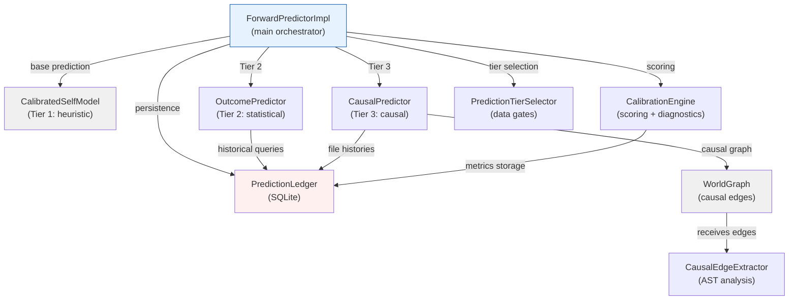
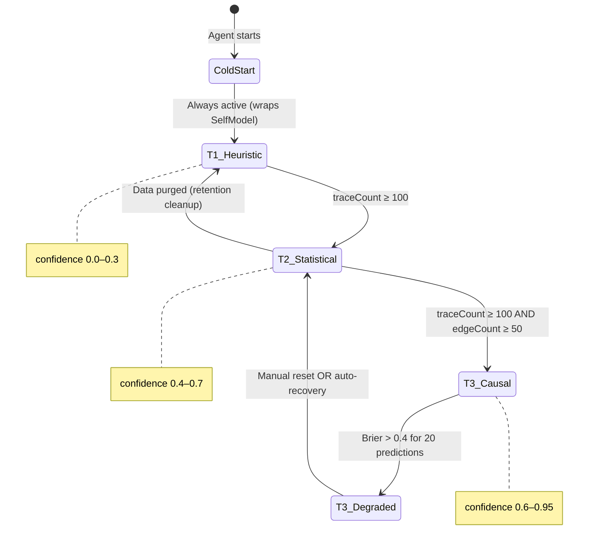

# ForwardPredictor — Architecture & System Design

**Status:** Architecture Complete — Ready for Implementation Review  
**Date:** 2026-04-03  
**Authors:** Expert Agent Team (Core Architecture, Calibration, Integration)  
**GAP Reference:** gap-analysis.md §10.2 GAP-A (World Graph ≠ World Model)  
**Axioms:** A1 (Epistemic Separation), A3 (Deterministic Governance), A7 (Prediction Error as Learning)

> **Document boundary**: This document owns the architecture, component design, algorithms, and integration contracts for the ForwardPredictor subsystem.  
> For research grounding, see [world-model-research.md](../research/world-model-research.md).  
> For implementation spec (schemas, types), see [world-model.md](../design/world-model.md).  
> For existing Self-Model spec, see [decisions.md D11](decisions.md).

---

## 1. Executive Summary

The ForwardPredictor transforms Vinyan from a **reactive** system (verify after action) into a **predictive** one (predict before dispatch). It answers four questions before any worker receives a task:

| Question | Output | Consumer |
|----------|--------|----------|
| What is P(tests pass)? | `TestOutcomeDistribution` | Risk Router (L0-L3 escalation) |
| What is the blast radius? | `PredictionDistribution` {lo, mid, hi} | PLAN step (sub-plan ranking) |
| What quality score to expect? | `PredictionDistribution` {lo, mid, hi} | PLAN step + worker budget |
| Which files are most likely to break? | `CausalRiskEntry[]` | Developer context + escalation |

**Architecture thesis**: Code has formal structure that doesn't need to be "discovered" via gradient descent. Vinyan's world model follows the **mental models** paradigm (Craik, 1943): a constructed external representation mirroring relevant code structure (AST types, dependencies, causal edges), **calibrated** from oracle outcomes rather than learned from raw observations. This contrasts with learned world models (Ha & Schmidhuber, 2018; DreamerV3, Hafner et al. 2023) and aligns with the MuZero principle: predict only what matters for decisions — value-equivalent rather than observation-equivalent prediction (Schrittwieser et al., Nature 2020).

**Three-tier data-gated progression:**

```
Tier 1: Heuristic    [always active]     ← wraps CalibratedSelfModel
Tier 2: Statistical   [≥100 traces]      ← Bayesian blend + empirical percentiles
Tier 3: Causal        [≥100 traces + ≥50 edges] ← BFS over typed causal edges
```

---

## 2. Component Architecture

### 2.1 Module Map

```
src/orchestrator/
  ├─ forward-predictor.ts           # ForwardPredictorImpl — main orchestrator
  ├─ forward-predictor-types.ts     # Types (existing, extend)
  ├─ outcome-predictor.ts           # Tier 2: statistical prediction engine
  ├─ causal-predictor.ts            # Tier 3: causal risk engine
  └─ calibration-engine.ts          # Scoring, decomposition, diagnostics

src/db/
  └─ prediction-ledger.ts           # PredictionLedger — SQLite persistence + queries

src/oracle/dep/
  └─ causal-edge-extractor.ts       # Semantic edge extraction from AST

src/gate/
  └─ prediction-tier-selector.ts    # Data gate: which tier to use
```

### 2.2 Component Responsibilities

| Component | Responsibility | Why Separate |
|-----------|---------------|-------------|
| **ForwardPredictorImpl** | Orchestrates 3 tiers, bridges SelfModel, manages tier transitions | Central coordination point; called from multiple phases (PREDICT, PLAN, LEARN) |
| **OutcomePredictor** | Bayesian blend of task-type prior + file-level statistics; percentile distributions | Pure stats engine — no I/O, testable in isolation (A1) |
| **CausalPredictor** | BFS over causal edges; per-file break probability; aggregate risk | Algorithmic complexity warrants isolation; fault-isolated from OutcomePredictor |
| **CalibrationEngine** | Brier decomposition, CRPS, adaptive edge weights, reliability diagrams | Math-heavy; drives all diagnostic/alert logic |
| **PredictionLedger** | Persist predictions + outcomes; fast aggregate queries | All DB I/O centralized; testable with in-memory SQLite |
| **CausalEdgeExtractor** | Extract calls-method, extends-class, implements-interface, etc. from AST | Extensible (TypeScript first, then Python/Go); reused by WorldGraph + Sleep Cycle |
| **PredictionTierSelector** | Enforce data gates; handle degradation back to lower tiers | Policy separated from implementation; thresholds configurable |

### 2.3 Dependency Graph



---

## 3. Prediction Pipeline

### 3.1 Algorithm Overview

```
predictOutcome(task, perception) → OutcomePrediction:

  ① SELECT TIER
     tier ← tierSelector.select(traceCount, edgeCount, miscalibrationFlag)

  ② TIER 1: HEURISTIC (always)
     heuristic ← selfModel.predict(task, perception)
     prediction ← wrapAsOutcomePrediction(heuristic, confidence: 0.3)

  ③ IF tier ≥ statistical:
     fileStats ← ledger.getFileOutcomeStats(task.targetFiles)
     statsEnhance ← outcomePredictor.enhance(task, heuristic, fileStats)
     prediction ← blendTier2(prediction, statsEnhance)

  ④ IF tier ≥ causal:
     edges ← worldGraph.queryCausalDependents(task.targetFiles, maxDepth=3)
     causal ← causalPredictor.computeRisks(task, edges, fileHistories)
     prediction ← applyCausalRisks(prediction, causal)

  ⑤ PERSIST + EMIT
     ledger.recordPrediction(prediction)
     bus.emit('prediction:generated', prediction)

  RETURN prediction
```

### 3.2 Tier Composition: Augment, Not Replace

Each tier keeps the previous tier's data and adds new information:

```typescript
// Tier 2 refines distribution estimates from historical data
function blendTier2(tier1: OutcomePrediction, stats: StatisticalEnhancement): OutcomePrediction {
  return {
    ...tier1,
    testOutcome: stats.testOutcome,     // Bayesian-blended P(pass)
    blastRadius: stats.blastRadius,     // Empirical percentiles from traces
    qualityScore: stats.qualityScore,   // Empirical percentiles
    basis: 'statistical',
    confidence: stats.confidence,       // 0.4–0.7 range
  };
}

// Tier 3 adjusts P(pass) via causal analysis, adds risk explanations
function applyCausalRisks(tier2: OutcomePrediction, causal: CausalRiskAnalysis): OutcomePrediction {
  const pPass = causal.adjustedPPass;
  const pPartial = tier2.testOutcome.pPartial;
  const pFail = Math.max(0, 1.0 - pPass - pPartial);  // Clamp: prevent negative
  const total = pPass + pPartial + pFail;
  return {
    ...tier2,
    testOutcome: {
      pPass: pPass / total,       // Normalize to sum=1
      pPartial: pPartial / total,
      pFail: pFail / total,
    },
    causalRiskFiles: causal.riskFiles,  // Top 10 at-risk files with chains
    basis: 'causal',
    confidence: Math.max(0.6, Math.min(0.95, tier2.confidence + 0.1)),  // Floor 0.6 for T3
    causalChainDepth: 3,
  };
}
```

**Rationale**: Tier 3 keeps Tier 2's blast/quality distributions (orthogonal to causal risk) while adjusting test outcome probability based on graph-derived risk. A1: statistical estimation ≠ causal verification.

### 3.3 Tier 2 Algorithm: Bayesian Blend

```typescript
// outcomePredictor.enhance():

// 1. Task-type prior from SelfModel
const taskTypePrior = { pPass, pPartial, pFail } from heuristic

// 2. File-level likelihood: weighted average of affected files' success rates
const fileAvgSuccess = mean(fileStats.map(f => f.successCount / f.samples))

// 3. Bayesian blend: α × prior + (1-α) × file evidence
//    α = exp(-fileCount/50) → decays as more file evidence accumulates
const alpha = Math.exp(-fileStats.length / 50)  // ~0.95 at n=3, ~0.5 at n=35
const blendedPPass = alpha * taskTypePrior.pPass + (1 - alpha) * fileAvgSuccess

// 4. Distributional output: percentiles from historical traces
const blastRadius = ledger.getPercentiles(taskType, [10, 50, 90])
const qualityScore = ledger.getPercentiles(taskType, [10, 50, 90])
```

### 3.4 Tier 3 Algorithm: Causal BFS

```typescript
// causalPredictor.computeRisks():

// 1. BFS from target files over causal_edges (max depth 3)
const fileRisks = new Map<string, { breakProbability: number; pathWeight: number; chain: CausalEdge[] }>();
const visited = new Set<string>();

// Seed: direct dependents of target files (pathWeight starts at 1.0)
const queue: Array<{ filePath: string; depth: number; pathWeight: number; chain: CausalEdge[] }> = [];
for (const target of targetFiles) {
  for (const edge of worldGraph.getDependents(target)) {
    queue.push({
      filePath: edge.toFile,
      depth: 1,
      pathWeight: 1.0,  // Seed: direct dependents start at weight 1.0
      chain: [edge],
    });
  }
}

while (queue.length > 0) {
  const { filePath, depth, pathWeight, chain } = queue.shift()!;
  if (visited.has(filePath) || depth > 3) continue;

  // Mark visited BEFORE processing (prevents cycles)
  visited.add(filePath);

  // 2. Break probability = path_weight × file_fail_rate
  const failRate = fileHistories.get(filePath)?.failRate ?? 0.1;
  const breakProbability = pathWeight * failRate;
  fileRisks.set(filePath, { breakProbability, pathWeight, chain });

  // 3. Propagate to transitive dependents
  if (depth < 3) {
    for (const edge of worldGraph.getDependents(filePath)) {
      if (visited.has(edge.toFile)) continue;  // Skip already-visited
      queue.push({
        filePath: edge.toFile,
        depth: depth + 1,
        pathWeight: pathWeight * CAUSAL_EDGE_WEIGHTS[edge.edgeType],
        chain: [...chain, edge],
      });
    }
  }
}

// 4. Aggregate risk: P(≥1 break) = 1 - ∏(1 - P(file_i breaks))
const topRisks = Array.from(fileRisks.values())
  .sort((a, b) => b.breakProbability - a.breakProbability)
  .slice(0, 10);
const aggregatedRisk = 1 - topRisks.reduce((acc, r) => acc * (1 - r.breakProbability), 1.0);

// 5. Adjust P(pass): P(pass|causal) = P(pass_statistical) × (1 - aggregatedRisk)
const adjustedPPass = tier2PPass * (1 - aggregatedRisk);
```

> **Design note**: BFS (FIFO) is preferred over best-first (priority queue) because the depth-3 limit already constrains the search space to ~50 files. O(E log V) heap overhead is not justified. Revisit if depth limit increases to 5+.

### 3.5 Performance Budget

| Operation | Latency Budget | Expected | Margin |
|-----------|---------------|----------|--------|
| Tier 1 (SelfModel) | <10ms | ~2ms | 5× |
| Tier 2 (percentile queries) | <50ms | ~20ms | 2.5× |
| Tier 3 (BFS + aggregation) | <100ms | ~60ms | 1.7× |
| **Total (all tiers)** | **<150ms** | **~82ms** | **1.8×** |

---

## 4. Calibration & Scoring Engine

### 4.1 Scoring Rule Selection

| Target | Current | New | Proper? | Rationale |
|--------|---------|-----|---------|-----------|
| Test outcome | Brier (3-class) | **Keep Brier** | Strictly ✅ | Decomposable, 40+ years of literature |
| Blast radius | MAPE | **CRPS** | Strictly ✅ | Incentivizes honest distributional reporting |
| Quality score | MAE | **CRPS** | Strictly ✅ | Consistent with blast; MAE is improper |
| Prediction intervals | None | **Interval Score** | ✅ | Evaluates lo/hi bound calibration |

### 4.2 Brier Score Decomposition (G2)

Murphy (1973) decomposition enables targeted improvement:

$$BS = \underbrace{REL}_{\text{lower = better}} - \underbrace{RES}_{\text{higher = better}} + \underbrace{UNC}_{\text{fixed}}$$

| Component | Meaning | Diagnostic Action |
|-----------|---------|-------------------|
| **Reliability** (REL) | "When I say 80%, does it happen 80%?" | High REL → recalibrate confidence bounds |
| **Resolution** (RES) | "Can I distinguish easy from hard cases?" | Low RES → improve prediction features |
| **Uncertainty** (UNC) | Inherent randomness of outcomes | Cannot reduce — depends on codebase |

**Binning strategy**: Equal-count bins, adaptive count:
- 100–500 traces → 5 bins (≥20 per bin)
- 500–2000 → 8 bins
- 2000+ → 10 bins (cap)

**Alert thresholds:**

| Condition | Threshold | Severity | Action |
|-----------|-----------|----------|--------|
| REL > 0.3 | Poor calibration | 🔴 Critical | Recalibrate; consider tier degradation |
| RES < 0.05 | No discrimination | 🟡 Warning | Improve features; escalate routing to L2 |
| ΔREL > 0.15 in 50 predictions | Distribution shift | 🟡 Warning | Concept drift; retrain edge weights |

### 4.3 CRPS for Continuous Predictions (G3)

**CRPS** (Continuous Ranked Probability Score) replaces MAPE/MAE for blast radius and quality:

$$\text{CRPS}(F, x) = \frac{1}{m} \sum_i |y_i - x| - \frac{1}{2m^2} \sum_{i,j} |y_i - y_j|$$

For percentile predictions, treat (lo, mid, hi) as weighted samples:

```typescript
function crpsPercentiles(lo: number, mid: number, hi: number, actual: number): number {
  const samples = [lo, mid, mid, hi];  // mid weighted 2×
  const term1 = samples.reduce((sum, y) => sum + Math.abs(y - actual), 0) / samples.length;
  let term2 = 0;
  for (const yi of samples) for (const yj of samples) term2 += Math.abs(yi - yj);
  term2 /= 2 * samples.length ** 2;
  return term1 - term2;
}
```

**Why CRPS > MAPE**: MAPE doesn't penalize overly wide/narrow intervals. CRPS rewards honest uncertainty — an agent receives a better score for reporting wide bounds when genuinely uncertain.

**Migration**: Compute CRPS alongside MAPE from FP-C onward; switch routing logic to CRPS-only in FP-F (Project Phase 2+).

### 4.4 Adaptive Edge Weights (G4)

After sufficient traces, learn per-project edge weights via Bayesian update:

```
weight_new = α × empirical_break_frequency + (1 - α) × weight_default
where α increases with observation count (logistic ramp from 50 to 200 traces)
```

**Cold-start safeguards:**

| Traces | Strategy |
|--------|----------|
| 0–50 | 100% global defaults |
| 50–100 | 70% default, 30% learned |
| 100–200 | 50% default, 50% learned |
| 200+ | 100% learned; emit `calibration:weights_converged` |

**Stability bounds**: Clip learned weights to [0.1, 0.99] — no edge type is ever zero or certain.

### 4.5 Temporal Decay (G5)

Exponential decay: weight $w(t) = e^{-\lambda t}$ where $\lambda = \ln 2 / T_{1/2}$.

- **ForwardPredictor**: $T_{1/2}$ = 30 days (individual predictions — noisy, need longer window)
- **Sleep Cycle**: $T_{1/2}$ = 14 days (patterns — slower-moving, existing design)
- **No conflict**: Independent decay systems, compatible stacking

### 4.6 Reliability Diagram (G7)

Plots predicted confidence (x) vs observed frequency (y). Perfect calibration = diagonal.

**Alert**: Calibration Error (RMSE across bins) > 0.15 → recalibration warning.  
**PoE** (Probability of Exceedance): Track how often actual falls outside [lo, hi]. Target: ~20% (by definition of 10th/90th percentile bounds).

### 4.7 CalibrationEngine Interface

```typescript
export interface CalibrationEngine {
  // Scoring
  scoreTestOutcome(predicted: TestOutcomeDistribution, actual: 'pass' | 'partial' | 'fail'): number;
  scoreContinuous(predicted: PredictionDistribution, actual: number): number;  // CRPS

  // Diagnostics
  getBrierDecomposition(): BrierDecomposition;
  getReliabilityDiagram(): ReliabilityDiagramData;
  getCalibrationSummary(): CalibrationSummary;

  // Adaptive weights
  getEdgeWeights(): LearnedEdgeWeights;
  updateEdgeWeights(traces: ExecutionTrace[]): Promise<void>;

  // Configuration
  setTemporalDecayHalfLife(days: number): void;
}

interface CalibrationSummary {
  brierScore: number;
  brierReliability: number;
  brierResolution: number;
  brierUncertainty: number;
  crpsBlastAvg: number;
  crpsQualityAvg: number;
  predictionCount: number;
  basis: 'heuristic' | 'statistical' | 'causal';
  edgeWeightsConverged: boolean;
  calibrationBins: Array<{
    predictedProbRange: [number, number];
    actualFrequency: number;
    count: number;
  }>;
}
```

> **Migration note**: The existing `ForwardPredictor.getCalibrationSummary()` returns `blastMAPE` and `qualityMAE`. The `CalibrationSummary` above defines the target interface. Migration is staged:
> - **FP-C**: Introduce `CalibrationSummary` with new fields as **optional**. Existing `blastMAPE`/`qualityMAE` remain required. Compute both metrics in parallel.
> - **FP-F** (Project Phase 2+): Promote CRPS fields to required. Mark `blastMAPE`/`qualityMAE` as `@deprecated`.
> - **FP-G** (Project Phase 3): Remove deprecated fields. CRPS is the sole continuous scoring metric.

---

## 5. Core Loop Integration

### 5.1 Phase-by-Phase Insertion

```
PERCEIVE ─── perception = assemble()
             NEW: causalEdges = extractCausalEdges(perception)  [if FP active]
       ↓
PREDICT ──── selfModelPred = selfModel.predict(task, perception)
             NEW: forwardPred = forwardPredictor?.predictOutcome(task, perception)
             NEW: compositePred = merge(selfModelPred, forwardPred)
       ↓
PLAN ─────── plan = decomposer.decompose(task, perception, memory)
             NEW: [Phase 3+] alternatives = generateAlternatives(plan)
             NEW: [Phase 3+] rankedPlans = rankByPredictedOutcome(alternatives)
       ↓
GENERATE ─── result = workerPool.dispatch(selectedPlan, routing)
             [unchanged — ForwardPredictor doesn't affect dispatch]
       ↓
VERIFY ───── verdict = oracleGate.verify(result.mutations)
             NEW: record oracle verdicts to PredictionLedger
       ↓
LEARN ────── trace = traceCollector.record(...)
             selfModel.calibrate(prediction, trace)
             NEW: brierScore = forwardPredictor?.recordOutcome(predictionOutcome)
             NEW: calibrationEngine.analyzePredictionError(pred, actual)
```

### 5.2 PREDICT Phase: Parallel Composition

```typescript
// ForwardPredictor runs alongside SelfModel with 3s timeout
const selfModelPred = await deps.selfModel.predict(input, perception);

let forwardPred: OutcomePrediction | undefined;
if (deps.forwardPredictor) {
  forwardPred = await Promise.race([
    deps.forwardPredictor.predictOutcome(input, perception),
    timeout(3000),
  ]).catch(() => undefined);  // Graceful degradation
}

// Confidence-weighted merge
const compositePred = forwardPred
  ? mergeForwardAndSelfModel(selfModelPred, forwardPred)
  : { type: 'selfModel', data: selfModelPred };
```

### 5.3 LEARN Phase: Calibration Feedback

```typescript
// Outcome mapping: ExecutionTrace.outcome (4 states) → PredictionOutcome.actualTestResult (3 states)
// RULE: Only record outcomes that reflect TEST RESULTS. Skip infrastructure/governance outcomes.
function mapTraceOutcome(trace: ExecutionTrace): {
  shouldRecord: boolean; testResult?: 'pass' | 'partial' | 'fail'; reason: string;
} {
  switch (trace.outcome) {
    case 'success':
      return { shouldRecord: true, testResult: 'pass', reason: 'verification success' };

    case 'failure': {
      // Derive 'partial' from oracle verdict granularity
      const verdicts = Object.values(trace.oracleVerdicts || {});
      const failCount = verdicts.filter(v => !v).length;
      const failRate = verdicts.length === 0 ? 1.0 : failCount / verdicts.length;
      if (failRate >= 0.8) return { shouldRecord: true, testResult: 'fail', reason: `${failCount}/${verdicts.length} oracles failed` };
      if (failRate >= 0.2) return { shouldRecord: true, testResult: 'partial', reason: `${failCount}/${verdicts.length} oracles failed (≥20% <80%)` };
      return { shouldRecord: true, testResult: 'pass', reason: `<20% oracle failures — likely false positive` };
    }

    case 'timeout':
      // Infrastructure failure, NOT a test result — skip to avoid polluting calibration
      return { shouldRecord: false, reason: 'timeout is infrastructure issue' };

    case 'escalated':
      // Governance decision (low confidence → re-route), NOT a test outcome
      if (trace.shadowValidation) {
        return { shouldRecord: true,
          testResult: trace.shadowValidation.testsPassed ? 'pass' : 'fail',
          reason: `escalated but shadow validation present: testsPassed=${trace.shadowValidation.testsPassed}` };
      }
      return { shouldRecord: false, reason: 'escalated + no shadow validation — skip' };


    default:
      return { shouldRecord: false, reason: `unknown outcome: ${trace.outcome}` };
  }
}

// After trace recorded, feed back to ForwardPredictor
if (deps.forwardPredictor && workingMemory.forwardPredictionId) {
  const mapping = mapTraceOutcome(trace);
  if (mapping.shouldRecord) {
    const outcome: PredictionOutcome = {
      predictionId: workingMemory.forwardPredictionId,
      actualTestResult: mapping.testResult!,
      actualBlastRadius: trace.affectedFiles.length,
      actualQuality: trace.qualityScore?.composite ?? 0.5,
      actualDuration: trace.durationMs,
    };
    const brier = await deps.forwardPredictor.recordOutcome(outcome);
    bus?.emit('prediction:calibration', { taskId: input.id, brierScore: brier });
  } else {
    bus?.emit('prediction:outcome-skipped', {
      predictionId: workingMemory.forwardPredictionId,
      reason: mapping.reason,
    });
  }
}
```

### 5.4 OrchestratorDeps Extension

```typescript
export interface OrchestratorDeps {
  // ... existing deps ...
  forwardPredictor?: ForwardPredictor;  // NEW: optional, activated by factory
}
```

---

## 6. Factory Wiring

### 6.1 Progressive Activation

```typescript
// factory.ts — createOrchestrator()

let forwardPredictor: ForwardPredictor | undefined;
if (db && traceStore) {
  const ledger = new PredictionLedger(db.getDb());
  const tierSelector = new PredictionTierSelectorImpl({ minTracesStatistical: 100, minEdgesCausal: 50 });
  const outcomePredictor = new OutcomePredictorImpl(ledger);
  const causalPredictor = new CausalPredictorImpl(ledger, worldGraph);
  const calibrationEngine = new CalibrationEngineImpl(ledger);
  const causalEdgeExtractor = new CausalEdgeExtractorImpl({ workspace });

  forwardPredictor = new ForwardPredictorImpl({
    selfModel, outcomePredictor, causalPredictor,
    tierSelector, calibrationEngine, ledger, bus,
  });
}
```

**Prerequisites**: SQLite DB + TraceStore must exist. ForwardPredictor is undefined without persistence — core loop ignores it.

### 6.2 Configuration Schema

```typescript
interface ForwardPredictorConfig {
  enabled: boolean;                       // default: true if DB available
  tiers: {
    statistical: { minTraces: number };   // default: 100
    causal: { minTraces: number; minEdges: number };  // default: 100, 50
  };
  budgets: {
    predictionTimeoutMs: number;          // default: 3000
    maxAlternativePlans: number;          // default: 3
  };
  calibration: {
    temporalDecayHalfLifeDays: number;    // default: 30
    miscalibrationThreshold: number;      // default: 0.4 (Brier)
    miscalibrationWindow: number;         // default: 20 predictions
  };
}
```

---

## 7. Event Bus Events

### 7.1 Emitted Events

| Event | Phase | Payload |
|-------|-------|---------|
| `prediction:generated` | PREDICT | predictionId, taskId, tier, confidence |
| `prediction:calibration` | LEARN | predictionId, brierScore, basis |
| `prediction:miscalibration` | LEARN | brierScore, tier, severity |
| `prediction:tier-transition` | Any | fromTier, toTier, reason |
| `plan:counterfactual` | PLAN | selectedPlanId, alternativeScores |
| `calibration:diagnostics_ready` | Every 50 predictions | BrierDecomposition, alerts |
| `calibration:weights_converged` | Sleep Cycle | LearnedEdgeWeights |
| `datagate:prediction-tier-unlocked` | Trace accumulation | tier, reason |

### 7.2 Listened Events

| Event | Handler |
|-------|---------|
| `worldgraph:fact-committed` | Refresh causal edge cache |
| `sleepcycle:analysis-complete` | Ingest trace-mined edges |
| `task:completed` | Trigger calibration if prediction exists |

---

## 8. State Machine & Lifecycle

### 8.1 Tier Lifecycle



### 8.2 Cold-Start Safeguards

Inherited from CalibratedSelfModel, adapted for ForwardPredictor:

| Safeguard | Implementation | Duration |
|-----------|---------------|----------|
| S1: Conservative Override | Force L2 minimum routing | Tasks 0–50 |
| S2: Meta-Uncertainty Cap | Confidence ≤ 0.29 until ≥10 observations/task-type | n < 10 |
| S3: Audit Sampling | 10% predictions sent to review queue | Tasks 0–100 |
| S4: Influence Gating | confidence² caps routing influence | Always |

### 8.3 Degradation & Recovery

**Degradation**: Brier > 0.4 over 20 predictions → `miscalibrationFlag = true` → TierSelector returns 'statistical' (drop from Tier 3).

**Auto-recovery**: Filter calibration to recent 50 traces. If Brier improves to < 0.35 → re-enable Tier 3 with reset counter.

**Manual recovery**: `resetTierState('causal')` → clears flag, emits `prediction:tier-transition`.

---

## 9. Error Handling & Graceful Degradation

| Component | Failure Mode | Recovery | Impact |
|-----------|-------------|----------|--------|
| ForwardPredictor (all) | Unavailable (no DB) | Core loop uses SelfModel only | Zero — system works as Phase 1 |
| ForwardPredictor | Timeout (>3s) | Use SelfModel prediction | No delay to core loop |
| PredictionLedger | DB locked/corrupted | In-memory fallback (last 1000 predictions) | Reduced calibration accuracy |
| CausalEdgeExtractor | AST parse error | Return empty edges → Tier 2 only | No causal risk analysis |
| CalibrationEngine | Decomposition error | Skip diagnostics; keep aggregate Brier | Reduced visibility |
| TierSelector | Miscalculation | Conservative: drop to lower tier | Under-predicts rather than over-predicts |

**Design principle**: Every ForwardPredictor integration point is wrapped in try/catch with fallback. The core loop never blocks or fails due to ForwardPredictor issues.

---

## 10. Counterfactual Plan Scoring (G1 — Phase 3+)

### 10.1 Concept

Instead of executing the first plan TaskDecomposer produces, generate N alternative plans and score each with ForwardPredictor:

```
TaskDecomposer.generatePlans(N=3) → Plan[]
ForwardPredictor.scorePlan(plan) → PlanScore  // for each
Select plan with best risk-adjusted quality
Record ALL plans' predictions (including non-selected) for calibration
```

### 10.2 Plan Scoring Algorithm

```typescript
interface PlanScore {
  expectedQuality: number;        // worst-case subtask quality
  expectedDuration: number;       // sum of subtask durations
  riskAdjustedQuality: number;    // quality × (1 - riskPenalty) × √confidence
  confidence: number;
  causalRiskFiles: CausalRiskEntry[];
}

// Normalize blast radius via percentile-rank (robust to outliers)
// blastConfig = { p10, p50, p90 } from historical PredictionLedger data
function normalizeBlastRadius(blast: number, config: { p10: number; p90: number }): number {
  if (blast <= config.p10) return 0.1 * (blast / config.p10);
  if (blast <= config.p90) return 0.1 + 0.8 * ((blast - config.p10) / (config.p90 - config.p10));
  return Math.min(0.99, 0.9 + 0.1 * Math.log(blast / config.p90 + 1) / Math.log(10));
}

// Rank: prefer high quality, penalize high blast radius
const normalizedBlast = normalizeBlastRadius(prediction.blastRadius.mid, blastConfig);
riskAdjustedQuality = quality × (1 - 0.3 × normalizedBlast) × √confidence
```

> **Normalization rationale**: Percentile-rank is preferred over min-max because blast radius has extreme outliers (one task may modify 200+ files). The [p10, p90] range maps to [0.1, 0.9] linearly; values above p90 are compressed logarithmically to prevent a single outlier from dominating the ranking.

### 10.3 Activation Gate

- Tier 3 active (≥100 traces + ≥50 edges)
- Task type has ≥20 prior traces
- Plan complexity ≥3 subtasks
- Budget allows 2s for plan generation + 1.5s for scoring

### 10.4 Plan Ranking History (NOT Calibration)

Recording all plans enables **policy learning** for future ranking — but this is NOT calibration in the statistical sense. Calibration requires ground truth outcomes; non-executed plans have none.

**What recording non-selected plans enables:**
- Collect contrastive rankings (Plan A scored 0.8, Plan B scored 0.5; Plan B executed and succeeded)
- Post-hoc analysis: "would the selected plan have been different with updated weights?"
- Foundation for Phase 4+ off-policy evaluation (requires inverse propensity weighting + recorded selection probabilities)

**What it does NOT enable:**
- Brier score computation for non-executed plans (no `actualTestResult`)
- Proper calibration of the scoring model without execution
- Unbiased off-policy estimates (would require IPW infrastructure, per Pearl 2009)

```typescript
interface PlanRankingRecord {
  taskId: string;
  selectedPlanId: string;
  selectedReason: 'highest_quality' | 'lowest_risk' | 'heuristic';
  planRankings: Array<{
    planId: string;
    predictedOutcome: OutcomePrediction;
    rank: number;
    executed: boolean;  // true only for selected plan
  }>;
  // Ground truth: only present for the selected (executed) plan
  actualOutcome?: {
    brierScore: number;
    trace: PredictionOutcome;
  };
}
```

> **Future (Phase 4+)**: If selection probabilities are recorded (softmax over plan scores), inverse propensity weighting (IPW) can provide unbiased estimates for non-selected plans. This requires the `PlanRankingRecord.selectedReason` field and a propensity model.

---

## 11. Sleep Cycle Integration

### 11.1 Trace-Mined Edge Inference

During Sleep Cycle analysis, extract co-occurrence patterns from traces:

1. If files A and B co-occur in failed traces (Wilson LB ≥ 0.6, ≥ 10 observations) → infer causal edge
2. Edge type: `trace-mined`, confidence = Wilson LB score
3. Insert into WorldGraph via `recordCausalEdge()`
4. If edge count crosses 50 → emit `datagate:prediction-tier-unlocked` for Tier 3

### 11.2 File Outcome Statistics Refresh

Sleep Cycle refreshes `file_outcome_stats` table:
- Aggregates per-file success rate, average quality, total tasks
- Used by OutcomePredictor for Tier 2 file-level likelihood

### 11.3 Pattern → Prediction Feedback

Sleep Cycle patterns (e.g., "refactoring increases blast radius by 15%") feed into OutcomePredictor as feature modifiers:
- If active pattern matches task type → adjust predicted blast radius
- Conservative: only apply patterns with Wilson LB ≥ 0.7

---

## 12. Multi-Task Interaction Prediction (G6 — Phase 3+)

### 12.1 Concept

When multiple tasks execute concurrently and modify overlapping files, their predictions are no longer independent. G6 addresses this by detecting potential interactions before dispatch.

### 12.2 Interaction Detection

```typescript
interface TaskInteraction {
  taskA: string;           // taskId
  taskB: string;
  sharedFiles: string[];   // files both tasks may modify
  interactionRisk: number; // P(conflict) based on overlap + historical co-failure
  recommendation: 'parallel-safe' | 'serialize' | 'needs-review';
}
```

**Algorithm**: Before dispatching a new task, query active tasks' `causalRiskFiles`. If intersection with the new task's predicted blast radius is non-empty:
- 0 shared files → `parallel-safe`
- 1–2 shared files with low risk → `serialize` (queue behind active task)
- 3+ shared files OR high-risk overlap → `needs-review` (escalate routing level)

### 12.3 Activation Gate

- Tier 3 active
- ≥2 concurrent tasks in worker pool
- Historical co-failure data for the overlapping files (≥5 observations)

### 12.4 Current Status: Deferred to Phase 3+

Multi-task interaction requires concurrent task tracking infrastructure that doesn't exist yet. The interface is defined above for forward compatibility. Implementation sequence: FP-E (core wiring) → observe concurrent task patterns → FP-G+ (implement interaction detection).

---

## 13. Coexistence: ForwardPredictor × SelfModel

### 13.1 Relationship

SelfModel = **foundation** (always active, per-task-type EMA).  
ForwardPredictor = **extension** (data-gated, distributional + causal).

| Concern | SelfModel | ForwardPredictor |
|---------|-----------|------------------|
| Scope | Per-task-type aggregate | Per-task + per-file + causal graph |
| Output | Point estimates | Distributional (percentiles) |
| Causal reasoning | None | BFS over typed edges |
| Calibration metric | Composite error | Brier (proper) + CRPS |
| Cold-start handling | S1-S4 safeguards | Inherits S1-S4 + tier gates |
| Data requirement | 0 traces (works from task 1) | 100+ traces for Tier 2 |

### 13.2 Signal Flow

```
SelfModel.predict() → point estimates (quality, duration, testResult)
       ↓                  
ForwardPredictor wraps as OutcomePrediction format
       ↓
Tier 2: Bayesian blend with file-level evidence
       ↓
Tier 3: Causal risk adjustment
       ↓
OutcomePrediction → consumed by PLAN + Risk Router
       
LEARN step: both calibrate independently
  SelfModel.calibrate(prediction, trace)  → updates EMA
  ForwardPredictor.recordOutcome(actual)  → updates Brier + ledger
```

---

## 14. Design Decisions

| # | Decision | Rationale | Alternative Rejected |
|---|----------|-----------|---------------------|
| D1 | Three-tier architecture with data gates | DreamerV3: progressive complexity; don't trust early predictions | Single unified model (too coarse), parallel ensemble (harder to diagnose) |
| D2 | Tier 3 augments Tier 2 | A1: keep statistical distributions + add causal adjustment | Replace entire prediction (loses empirical percentiles) |
| D3 | Brier for categorical, CRPS for continuous | Gneiting & Raftery (2007): proper scoring rules | All MAPE (improper; games narrow intervals) |
| D4 | BFS max depth 3 with edge weight table | Balance relevant dependencies vs false positives from distant files | No depth limit (over-estimates), adaptive weights day 1 (insufficient data) |
| D5 | Data gates at 100/50 | Conservative minimum for empirical percentile stability | Lower gates 50/25 (more noise in Brier), dynamic gates (no clear policy) |
| D6 | ForwardPredictor is optional in OrchestratorDeps | Graceful degradation — system works as Phase 1 without it | Required dependency (breaks cold start) |
| D7 | Record all plan predictions including non-selected | Enables post-hoc ranking analysis without selection bias | Record only selected (biased — only see what we chose) |

---

## 15. Implementation Sequence

> **Naming note**: The phases below (FP-A through FP-G) are internal to the ForwardPredictor subsystem.
> They are distinct from project-level phases (0–6) defined in `implementation-plan.md`.

| ForwardPredictor Phase | Deliverables | Dependencies |
|-------|-------------|-------------|
| **FP-A: Foundation** | PredictionLedger, migration, types extension, PredictionTierSelector | SQLite DB exists |
| **FP-B: Causal Edges** | CausalEdgeExtractor, WorldGraph extensions, PerceptionAssembler integration | FP-A + existing dep-analyzer |
| **FP-C: Core Predictor** | OutcomePredictor (Tier 1/2), ForwardPredictorImpl, CalibrationEngine (Brier) | FP-A |
| **FP-D: Causal Predictor** | CausalPredictor (Tier 3), causal BFS, risk aggregation | FP-B + FP-C |
| **FP-E: Core Loop Wiring** | OrchestratorDeps extension, factory wiring, bus events | FP-C + FP-D |
| **FP-F: Calibration V2** | Brier decomposition, CRPS, adaptive weights, reliability diagrams | FP-E + 100 traces |
| **FP-G: Counterfactual** | Alternative plan generation, plan scoring, selection algorithm | FP-F + Tier 3 active |

**Cross-reference: Project Phase ↔ ForwardPredictor Phase**

| Project Phase | ForwardPredictor Phases | Scope |
|---------------|------------------------|-------|
| Phase 1E onwards | FP-A, FP-B, FP-C, FP-D | Foundation + core prediction |
| Phase 2 onwards | FP-E, FP-F | Core loop wiring + calibration v2 |
| Phase 3+ | FP-G | Advanced counterfactual planning |

---

## 16. Open Questions

| # | Question | Impact | Proposed Resolution |
|---|---------|--------|-------------------|
| Q1 | Are 100 traces sufficient for reliable Tier 2? | Tier 2 accuracy | Monitor Brier; if > 0.5 at 100 traces, raise gate to 200 |
| Q2 | Should edge weights vary per oracle? | Tier 3 accuracy | Start with uniform per-edge-type; add oracle dimension in Phase 3+ |
| Q3 | Can trace-mined edges produce false causal edges? | Graph quality | Wilson LB ≥ 0.6 is conservative; add validation via AST oracle |
| Q4 | How does prediction accuracy degrade with codebase evolution? | Long-term calibration | Temporal decay (§4.5) + concept drift detection via ΔREL spike |
| Q5 | Should ForwardPredictor consume LLM context? | A3 compliance | No — ForwardPredictor is rule-based (A3); LLM only in PLAN step |
| Q6 | Optimal number of counterfactual plans? | Phase 3 performance | Start with 3; tune based on marginal quality improvement per plan |
