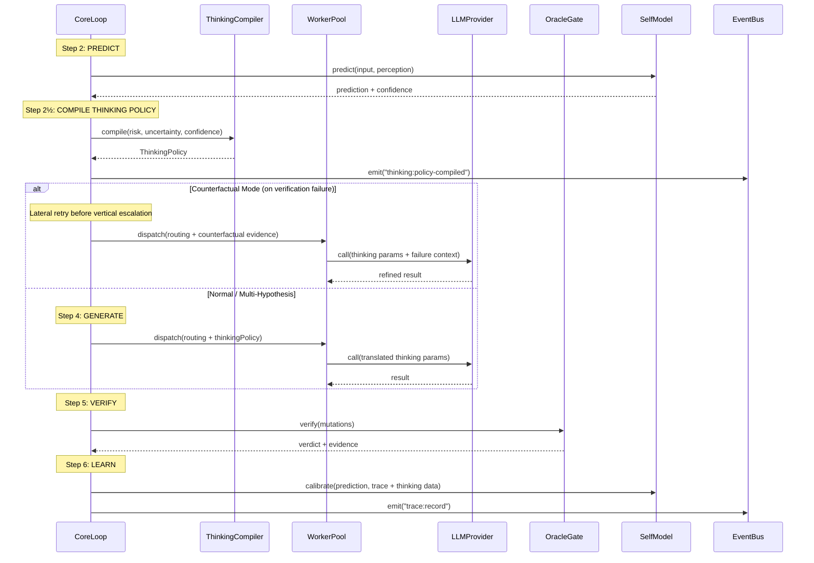

# Extensible Thinking — System Design & Implementation Plan

> 📋 **Status: To-Be — Designed, NOT prioritized.** Multi-hypothesis thinking, per-task-type thinking overrides, and the per-task-type calibration loop described here are **not yet implemented** and not on the active roadmap. Read for direction; do not assume any of this is wired.

> **Document boundary**: This document owns the system design, component contracts, data contracts, and phased implementation plan for Vinyan's Extensible Thinking feature.
> For the debate foundations, see [extensible-thinking-debate-synthesis.md](../research/extensible-thinking-debate-synthesis.md). For academic validation, see [extensible-thinking-deep-research.md](../research/extensible-thinking-deep-research.md). For current architecture, see [decisions.md](../architecture/decisions.md).

**Date:** 2026-04-04 (design) · 2026-04-04 (review round 2)
**Status:** Design reviewed — revised phasing after 4-team adversarial audit
**Authored by:** 4-team Expert Agent synthesis (Alpha: Core Architecture, Beta: Runtime Integration, Gamma: Data Pipeline, Delta: Migration & Safety)
**Reviewed by:** 4-team adversarial audit (Devil's Advocate, Implementation Realist, Epistemic Purist, Systems Economist)
**Confidence in design approach:** High (theoretical: 15 papers, 6 frameworks, expert consensus)
**Confidence in implementation:** TBD (Phase 1a will calibrate; Phase 2+ requires empirical validation)

---

## 1. Problem Statement

Vinyan's current routing conflates **risk** (verification depth) and **ambiguity** (thinking depth) into a single L0-L3 axis:

```
Task → riskScore → L0/L1/L2/L3 → { fixed ThinkingConfig, fixed verification }
```

This creates two failure modes:

| Scenario | Current Behavior | Correct Behavior |
|----------|-----------------|-------------------|
| Rename 50 files (high risk, low ambiguity) | L3: deep thinking + deep verify | Light thinking + deep verify |
| Novel algorithm (low risk, high ambiguity) | L1: no thinking + light verify | Deep thinking + light verify |

**Solution:** Decouple thinking depth from verification depth via a **2D routing grid** (risk × ambiguity), governed by a deterministic **ThinkingPolicy Compiler**.

---

## 2. Design Principles

12 principles from debate consensus (P1-P8) and research validation (P9-P12):

| # | Principle | Constraint |
|---|-----------|-----------|
| P1 | Thinking is generation, not governance | Oracle gate verifies thinking output (A1) |
| P2 | Policy flows one-way: Orchestrator → Worker | Workers cannot modify or negotiate policy (A6) |
| P3 | Oracle-grounded measurement only | No causal claims about thinking effectiveness |
| P4 | Economic + epistemic activation gates | Modes activate only when data proves value |
| P5 | Generator never self-selects | Oracle scores determine hypothesis winner (A1) |
| P6 | 4 precomputed profiles for cache efficiency | Prompt cache hit rate preserved |
| P7 | Confidence decay: learned → less thinking | Budget decreases as SelfModel confidence increases |
| P8 | Types now, behavior later | Extend type system before implementing modes |
| P9 | Non-monotonic thinking budget | Ceiling exists — more thinking isn't always better |
| P10 | Parallel > serial for high-ambiguity | Multi-hypothesis beats deep single-pass for exploration |
| P11 | Refinement > restart | Pass failure diagnostics, not just "try again" |
| P12 | Counterfactual influence > causal attribution | Measure "would outcome differ?" not "did thinking help?" |

---

## 3. Architecture Overview

### 3.1 Component Topology

```
TaskInput
  │
  ├──→ [Risk Scorer]       → riskScore (0-1)         ← existing risk-router.ts
  ├──→ [Uncertainty Scorer] → uncertaintyScore (0-1)  ← NEW: uncertainty-computer.ts
  └──→ [SelfModel Lookup]  → confidence, failRate    ← existing self-model.ts
          │
          ▼
  ┌─────────────────────────────────────────────┐
  │        ThinkingPolicy Compiler              │  ← NEW: thinking-compiler.ts
  │  f(risk, uncertainty, confidence) → Policy   │     Pure, deterministic (A3)
  │                                             │
  │  ┌─────────┐  ┌──────────┐  ┌───────────┐  │
  │  │ Profile  │  │ Ceiling  │  │ Mode      │  │
  │  │ Selector │  │ Computer │  │ Selector  │  │
  │  └─────────┘  └──────────┘  └───────────┘  │
  └──────────────────┬──────────────────────────┘
                     │
                     ▼
            RoutingDecision + ThinkingPolicy
                     │
      ┌──────────────┼──────────────┐
      │              │              │
      ▼              ▼              ▼
  [WorkerPool]   [OracleGate]  [TraceCollector]
      │              │              │
      ▼              ▼              ▼
  [LLM Provider]  [Verdicts]   [SelfModel.calibrate()]
  (thinking API)              (A7 learning loop)
```

### 3.2 2D Routing Grid

```
                      HIGH UNCERTAINTY (≥0.50)
                            │
             ┌──────────────┼──────────────┐
             │  B: Deep Think│ D: Deep Think │
             │  Light Verify │ Deep Verify   │
             │  effort: high │ effort: max   │
             │  oracles: 2   │ oracles: all  │
  LOW RISK   │              │               │  HIGH RISK
  (<0.35) ───┤──────────────┤───────────────┤── (≥0.35)
             │  A: No Think │ C: Light Think│
             │  No Verify   │ Deep Verify   │
             │  L0 reflex   │ effort: low   │
             │  oracles: 0  │ oracles: all  │
             └──────────────┼──────────────┘
                            │
                      LOW UNCERTAINTY (<0.50)
```

**4 Profiles** (A, B, C, D) cover the grid. Transition profiles (AB, CD) deferred to Phase 2.3 pending cache measurement.

**Thresholds are configurable** via `ExtensibleThinkingConfigSchema.thresholds` — defaults shown above.

### 3.3 Data Flow — End to End



---

## 4. Component Design

### 4.1 ThinkingPolicy Type System

**File:** `src/orchestrator/thinking-policy.ts` (new)

> **Review note (Round 4):** This section reflects the final state after §8.6 design fixes + expert panel corrections A1-A3 + Round 4 cross-document audit.

> **Deviations from Debate Consensus (§3.1):**
>
> | Debate Field | Design Field | Reason | Round |
> |---|---|---|---|
> | `source` | `policyBasis` | EA-6: avoid implicit effectiveness claim | R2 |
> | `reasoning: ReasoningPolicy` | _(removed)_ | A3: dead code, zero consumers. Restore in Phase 2+ when budget-split has consumer | R3 |
> | `oracleConfidenceDelta` | _(removed)_ | Full oracle verdicts (ThinkingTraceEvent) provide richer signal | R3 |
> | _(new)_ | `profileId` | 2D grid implementation (Debate §7 insight) | Design |
> | _(new)_ | `uncertaintyScore`, `riskScore`, `selfModelConfidence` | Audit trail for deterministic reproducibility (A3) | Design |
> | _(new)_ | `thinkingCeiling` | P9 non-monotonic ceiling + A2 10% floor fix | R2 |

```typescript
import { z } from 'zod';
import type { ThinkingConfig } from './types.ts';

// ── Profile System (4 profiles — AB/CD deferred to Phase 2.3) ───────────
export type ThinkingProfileId = 'A' | 'B' | 'C' | 'D';

// ── Task Uncertainty Signal (renamed from AmbiguitySignal — see expert panel A2) ──
// What we compute is task uncertainty (novelty + complexity), not linguistic ambiguity.
// Real ambiguity signals (NLP parse confidence, constraint conflicts) are Phase 3+ scope.
export interface TaskUncertaintySignal {
  score: number;                    // 0.0–1.0
  components: {
    planComplexity: number;         // deterministic: task structure (A5: highest weight)
    priorTraceCount: number;        // heuristic: novelty decay curve (A5: lower weight)
  };
  basis: 'cold-start' | 'novelty-based' | 'calibrated';
}

// ── Core ThinkingPolicy Type ────────────────────────────────────────────
export interface ThinkingPolicy {
  /** How this policy was determined (metadata, NOT effectiveness claim — per EA-6) */
  policyBasis: 'default' | 'calibrated' | 'override';

  /** LLM thinking mode */
  thinking: ThinkingConfig;

  // NOTE: `reasoning: ReasoningPolicy` removed (expert panel A3).
  // ReasoningPolicy is currently dead code — computed in SelfModel but has zero consumers.
  // Will be added back in Phase 2+ when budget split logic has an actual consumer.

  /** Which 2D profile does this policy instantiate */
  profileId: ThinkingProfileId;

  /** Uncertainty score that influenced this policy */
  uncertaintyScore?: number;

  /** Risk score passed to compiler (audit trail) */
  riskScore?: number;

  /** SelfModel confidence for this task type */
  selfModelConfidence?: number;

  /** Content-addressed observation key for A7 learning (A4: SHA-256 of target file hashes) */
  observationKey?: string;

  /** Non-monotonic ceiling (P9) — never 0, minimum 10% of base budget */
  thinkingCeiling?: number;

  /** Per-task-type calibration slot (field names preserved from Debate §4.3) */
  taskTypeCalibration?: {
    taskTypeSignature: string;       // canonicalized form (name + arity + scope)
    minObservationCount: number;
    basis: 'insufficient' | 'emerging' | 'calibrated';  // 'insufficient' = <50 traces
    // recommendedThinking deferred to Phase 2.1: added when basis ≥ 'emerging'
  };

  /** Counterfactual influence measure (Phase 3, CAIR-inspired) */
  counterfactualInfluence?: number;
}
```

**Integration with RoutingDecision** — add optional field in `src/orchestrator/types.ts`:

```typescript
export interface RoutingDecision {
  // ... existing fields (level, model, budgetTokens, etc.) ...
  thinkingPolicy?: ThinkingPolicy;  // NEW: optional, backward compatible
}
```

**Backward compatibility:** Existing code reads `routingDecision.thinkingConfig` — this remains unchanged. `thinkingPolicy` is an optional computed accessor that carries richer metadata.

**Extended ThinkingConfig union** (Phase 1a: type-only, per Debate §4.2 verdict "Design it now"):

```typescript
// In src/orchestrator/types.ts — extend existing ThinkingConfig union
export type ThinkingConfig =
  | { type: 'adaptive'; effort: 'low' | 'medium' | 'high' | 'max'; display?: 'omitted' | 'summarized' }
  | { type: 'enabled'; budgetTokens: number; display?: 'omitted' | 'summarized' }
  | { type: 'disabled' }
  // Phase 1a type-only additions (Debate §4.2 verdict: "Design it now"):
  | { type: 'multi-hypothesis'; branches: 2 | 3 | 4;
      diversityConstraint: 'different-patterns' | 'different-resources';
      selectionRule: 'highest-oracle-confidence' | 'first-to-pass' | 'voting-consensus';
      allFailBehavior: 'escalate-level' | 'return-best-effort' | 'refuse';
      tieBreaker: 'first-branch' | 'lowest-token-cost' | 'random'; }
  | { type: 'counterfactual'; trigger: 'verification_failure';
      maxRetries: number; constraintSource: 'working-memory'; }
  | { type: 'deliberative'; checkpoints: number; depthLimit: number; }
  | { type: 'debate'; participants: string[]; debateTurns: number;
      arbitrationRule: 'oracle-score' | 'evidence-weight'; };
// NOTE: Implementation of multi-hypothesis/debate deferred to Phase 3+.
// Type definitions here satisfy Debate verdict alignment.
```

### 4.2 ThinkingPolicy Compiler

**File:** `src/orchestrator/thinking-compiler.ts` (new)

Pure, deterministic function (A3-safe). No LLM in decision path.

> **Review note (Round 3):** Inlined §8.6 fixes: 4 profiles (not 6), simplified selectProfile(), 10% ceiling floor + 5% audit, content-addressed observationKey, configurable thresholds.

```typescript
// ── Profile Definitions (4 profiles × 2D grid) ──────────────────────────
// AB/CD transition profiles deferred to Phase 2.3 pending cache measurement.
// ⚠️ PLACEHOLDER budgets: baseBudget values are initial estimates pending Phase 0
// empirical calibration. Research §5.1 suggests 4K/8K/16K for a 3-tier model;
// 4-profile values below are extrapolated. Phase 0 Step 5 captures actual L2
// thinking token usage from ≥20 diverse tasks and reverse-engineers calibrated
// budgets per profile. Until then, treat these as order-of-magnitude targets.
const PROFILE_DEFINITIONS: Record<ThinkingProfileId, ProfileSpec> = {
  A: {  // Low-risk, Low-uncertainty → L0 reflex
    thinking: { type: 'disabled' },
    oraclePriority: [],
    baseBudget: 0,
  },
  B: {  // Low-risk, High-uncertainty → Deep think, light verify
    // P10 note: Research §4.1 suggests parallel > serial for high-ambiguity tasks.
    // Profile B currently uses serial adaptive generation. Parallel dispatch requires
    // multi-hypothesis infrastructure (Phase 3+). Re-evaluate when available.
    thinking: { type: 'adaptive', effort: 'high', display: 'summarized' },
    oraclePriority: ['ast', 'lint'],
    baseBudget: 60_000,
  },
  C: {  // High-risk, Low-uncertainty → Light think, deep verify
    thinking: { type: 'adaptive', effort: 'low', display: 'omitted' },
    oraclePriority: ['ast', 'type', 'dep', 'lint', 'test'],
    baseBudget: 10_000,
  },
  D: {  // High-risk, High-uncertainty → Deep think + deep verify
    thinking: { type: 'adaptive', effort: 'max', display: 'summarized' },
    oraclePriority: ['ast', 'type', 'dep', 'lint', 'test'],
    baseBudget: 100_000,
  },
};

// ── Profile Selection (deterministic, gap-free — per EA-1 fix) ──────────
// Thresholds are configurable via ExtensibleThinkingConfigSchema.thresholds
function selectProfile(
  risk: number,
  uncertainty: number,
  thresholds: { riskBoundary: number; uncertaintyBoundary: number },
): ThinkingProfileId {
  const highRisk = risk >= thresholds.riskBoundary;        // default: 0.35
  const highUncertainty = uncertainty >= thresholds.uncertaintyBoundary;  // default: 0.50
  if (!highRisk && !highUncertainty) return 'A';
  if (!highRisk && highUncertainty) return 'B';
  if (highRisk && !highUncertainty) return 'C';
  return 'D'; // highRisk && highUncertainty
}

// ── Confidence Decay Ceiling (P7 + P9 + A2 fix) ────────────────────────
// Never fully disables thinking (10% floor). 5% audit sampling for mastered tasks.
function computeThinkingCeiling(
  profileId: ThinkingProfileId,
  confidence: number,
): number | undefined {
  if (confidence < 0.4) return undefined;  // cold start: no ceiling
  const base = PROFILE_DEFINITIONS[profileId].baseBudget;
  if (base === 0) return 0;               // Profile A: no thinking anyway
  if (confidence >= 0.85) {
    // A2 fix: retain 10% budget floor + audit sampling
    // A3 clarification: Math.random() here is a statistical measurement mechanism,
    // NOT a governance decision (pass/fail/route). Audit sampling rate is configurable
    // via ExtensibleThinkingConfig.auditSampleRate. For deterministic replay in
    // testing, inject a seedable PRNG via deps.rng.
    return Math.random() < 0.05
      ? base                               // audit sample: full budget
      : Math.ceil(base * 0.10);           // minimal reinvestigation
  }
  return Math.ceil(base * (1 - confidence));
}

// ── Content-Addressed Observation Key (A4 fix) ──────────────────────────
async function buildObservationKey(
  taskTypeSignature: string,
  targetFiles: string[],
): Promise<string> {
  const targetHashes = await Promise.all(
    targetFiles.map(f => hashFileContent(f))
  );
  const contentHash = sha256Compact(targetHashes.sort().join(';'));
  return `${taskTypeSignature}:${contentHash}`;
}

// ── ThinkingPolicyCompiler Interface (M13: formally defined) ─────────────
export interface ThinkingPolicyCompiler {
  compile(input: ThinkingPolicyInput): Promise<ThinkingPolicy>;
}

export type ThinkingPolicyInput = {
  taskInput: TaskInput;
  riskScore: number;
  uncertaintySignal: TaskUncertaintySignal;
  routingLevel: 0 | 1 | 2 | 3;
  taskTypeSignature: string;
  selfModelConfidence?: number;
  thresholds?: { riskBoundary: number; uncertaintyBoundary: number };
};

// ── Main Compiler Function ──────────────────────────────────────────────
// Implements ThinkingPolicyCompiler.compile()
export async function compileThinkingPolicy(
  input: ThinkingPolicyInput,
): Promise<ThinkingPolicy> {
  const { riskScore, uncertaintySignal, taskTypeSignature } = input;
  const confidence = input.selfModelConfidence ?? 0.0;
  const thresholds = input.thresholds ?? { riskBoundary: 0.35, uncertaintyBoundary: 0.50 };

  // 1. Select profile from 2D grid (configurable thresholds)
  const profileId = selectProfile(riskScore, uncertaintySignal.score, thresholds);
  const profile = PROFILE_DEFINITIONS[profileId];

  // 2. Apply confidence decay ceiling (10% floor, 5% audit)
  const ceiling = computeThinkingCeiling(profileId, confidence);

  // 3. Build content-addressed observation key (A4)
  const observationKey = await buildObservationKey(
    taskTypeSignature, input.taskInput.targetFiles ?? []
  );

  return {
    policyBasis: confidence >= 0.4 ? 'calibrated' : 'default',
    thinking: profile.thinking,
    profileId,
    uncertaintyScore: uncertaintySignal.score,
    riskScore,
    selfModelConfidence: confidence,
    observationKey,
    thinkingCeiling: ceiling,
    taskTypeCalibration: {
      taskTypeSignature,
      minObservationCount: 0,
      basis: confidence >= 0.85 ? 'calibrated'
        : confidence >= 0.4 ? 'emerging' : 'insufficient',
    },
  };
}
```

### 4.3 Task Uncertainty Computation

**File:** `src/orchestrator/uncertainty-computer.ts` (new)

> **Renamed from `ambiguity-computer.ts`** (expert panel A2): What we compute is task uncertainty (novelty + complexity), not linguistic ambiguity. Name must match reality to avoid misleading downstream analysis. Real ambiguity signals (NLP parse confidence, constraint conflicts, type coverage) are Phase 3+ scope (see Open Questions C2).

> **Signal reduction justification (Round 4, M10):** Research §5.2 proposes 5 signals. Phase 2.1 uses 2 for three reasons: (1) A5 Tiered Trust — deterministic signals weighted higher; heuristic signals proven first. (2) IR-3 sparse input — `goalSpecificity` and `domainNovelty` depend on `constraints` and `acceptanceCriteria` which are rarely populated by current callers. (3) Pragmatic scoping — validate 2-component signal before adding complexity. Phase 3.5 restores full 5-component signal (goalSpecificity + domainNovelty) once NLP ambiguity metrics are implemented (see Open Questions C2).

```typescript
export function computeTaskUncertainty(input: {
  taskInput: TaskInput;
  priorTraceCount: number;
}): TaskUncertaintySignal {
  const { taskInput, priorTraceCount } = input;

  // Component 1: Plan complexity — deterministic signal (A5: higher weight)
  // Structural proxy: file count + constraint count
  const fileCount = Math.min(1.0, (taskInput.targetFiles?.length ?? 1) / 20);
  const constraintCount = Math.min(1.0, (taskInput.constraints?.length ?? 0) / 5);
  const planComplexity = fileCount * 0.6 + constraintCount * 0.4;

  // Component 2: Task novelty — heuristic signal (A5: lower weight)
  // First solve = high uncertainty, after 50 traces = mastered
  // Named `taskNovelty` (not `priorTraceConfidence`) — measures novelty, not confidence
  const taskNovelty = 1.0 - Math.min(1.0, priorTraceCount / 50);

  // Weighted aggregate — deterministic signals weighted higher per A5 (Tiered Trust)
  const score = Math.max(0, Math.min(1,
    planComplexity * 0.60 +           // deterministic: task structure
    taskNovelty * 0.40                // heuristic: novelty (lower weight)
  ));

  return {
    score,
    components: {
      planComplexity,
      priorTraceCount: Math.min(1.0, priorTraceCount / 50),
    },
    basis: priorTraceCount < 3 ? 'cold-start'
      : priorTraceCount < 50 ? 'novelty-based'
      : 'calibrated',
  };
}
```

**Graceful degradation (IR-3):** When `constraints` and `acceptanceCriteria` are empty (common per IR finding), signal degrades to taskNovelty-weighted only. When both `targetFiles` AND `constraints` are empty, `planComplexity ≈ 0` and score = `taskNovelty * 0.40`. No false-high scores from missing optional fields.

### 4.4 Core Loop Integration

**File:** `src/orchestrator/core-loop.ts` — changes to `executeTask()`

**Step 2½ (new): Compile ThinkingPolicy** — inserted after PREDICT, before GENERATE:

```typescript
// After SelfModel.predict() and getReasoningPolicy():
// NOTE (M16/C2): compileThinkingPolicy is async due to hashFileContent() in
// buildObservationKey. Cost: ~1-5ms for file hashing. On the PREDICT path this adds
// I/O latency. Acceptable at L1+ (where oracles already cost 1-10s). For L0 reflex,
// compiler is bypassed entirely (Profile A = disabled, no file hashing needed).
let compiledThinkingPolicy: ThinkingPolicy | undefined;
if (deps.thinkingPolicyCompiler) {
  const uncertainty = computeTaskUncertainty({
    taskInput: input,
    priorTraceCount: selfModelParams?.observationCount ?? 0,
  });
  compiledThinkingPolicy = await deps.thinkingPolicyCompiler.compile({
    taskInput: input,
    riskScore: routing.riskScore ?? 0,
    uncertaintySignal: uncertainty,
    routingLevel: routing.level,
    taskTypeSignature: taskSig,
    selfModelConfidence: selfModelParams?.predictionAccuracy,
    thresholds: deps.config?.extensibleThinking?.thresholds,  // M15: wire config thresholds
  });
  routing = {
    ...routing,
    thinkingPolicy: compiledThinkingPolicy,
    thinkingConfig: compiledThinkingPolicy.thinking, // backward compat
  };
  deps.bus?.emit('thinking:policy-compiled', {
    taskId: input.id, policy: compiledThinkingPolicy, routingLevel: routing.level,
  });
}
```

**Fallback:** If `thinkingPolicyCompiler` is not injected, existing L0-L3 `thinkingConfig` behavior is preserved unchanged.

### 4.5 Escalation: Counterfactual Before Vertical

**New lateral escalation path** (Phase 2.2) — after verification failure:

**CounterfactualContext type** (M11: complete evidence structure for counterfactual reasoning):

```typescript
/** Context passed to counterfactual retry — captures failure evidence */
export interface CounterfactualContext {
  failureReason: string;
  previousBudget: number;
  oracleVerdicts: Array<{
    oracleId: string;
    passed: boolean;
    confidence: number;
    failureDetail?: string;
  }>;
  constraintViolations: string[];  // from working-memory, per ThinkingConfig.counterfactual
  retryNumber: number;
  maxRetries: number;
}
```

```typescript
function selectEscalationPath(
  verification: OracleGateResult,
  routing: RoutingDecision,
  counterfactualRetries: number,
): 'counterfactual_retry' | 'vertical_escalate' | 'refuse' {
  if (verification.passed) return 'no_action';

  // Tier 1: Can we retry laterally? (same level, deeper thinking)
  const policy = routing.thinkingPolicy;
  if (policy?.counterfactualConfig
    && counterfactualRetries < policy.counterfactualConfig.maxRetries) {
    return 'counterfactual_retry';
  }

  // Tier 2: Vertical escalation
  if (routing.level < 3) return 'vertical_escalate';

  // Tier 3: Max level exhausted
  return 'refuse';
}
```

**Economic justification:** Counterfactual costs ~2x baseline; vertical escalation costs ~5x. Net savings: 3x per avoided escalation.

**Mode precedence (M7):** Escalation follows the thinking mode hierarchy:
- **Phase 2:** counterfactual → adaptive (only 2 modes active)
- **Phase 3+:** counterfactual → multi-hypothesis → adaptive → disabled

This matches Research §5.4 corrected order (counterfactual first, not multi-hypothesis first). Rationale: counterfactual is cheaper (~2x) and uses failure evidence to constrain the retry. Multi-hypothesis is more expensive (~Nx) and speculative.

### 4.6 Worker Pool Changes

**Multi-hypothesis mode** (Phase 3+ — moved from Phase 2.3, see expert panel B1) — dispatches N branches in parallel:

> **⚠️ Requires quality ranking oracle** (expert panel finding): Current OracleGate verifies structural correctness (AST, types, deps, lint, tests) but cannot rank solution quality across branches. Multi-hypothesis is deferred to Phase 3+ until a quality oracle is implemented. See Open Questions C1.

```typescript
// In WorkerPoolImpl.dispatch():
// ⚠️ PHASE 3+ IMPLEMENTATION — type defined in Phase 1a (§4.1) but execution
// deferred until quality ranking oracle is available. Code here is design-only.
if (routing.thinkingPolicy?.thinking.type === 'multi-hypothesis') {
  const branches = routing.thinkingPolicy.thinking.branches;
  const results = await Promise.all(
    Array.from({ length: branches }, (_, i) =>
      this.dispatchBranch(input, perception, memory, plan, routing, i)
    )
  );
  // Oracle selects winner (P5: never generator self-selection)
  return selectWinningHypothesis(results, routing.thinkingPolicy.thinking.selectionRule);
}
```

**Counterfactual context injection** — pass failure evidence to working memory:

```typescript
if (routing.thinkingPolicy?.mode === 'counterfactual') {
  workingMemory = {
    ...workingMemory,
    counterfactualContext: {
      priorMutations: memory.failedApproaches?.[0]?.approach,
      oracleFailures: memory.failedApproaches?.flatMap(a => a.feedback),
    },
  };
}
```

### 4.7 LLM Provider Translation

**File:** `src/orchestrator/llm/thinking-policy-translator.ts` (new)

```typescript
export function translatePolicyToProvider(
  policy: ThinkingPolicy | undefined,
  providerId: string,
): ProviderThinkingParams | undefined {
  if (!policy) return undefined;

  if (providerId === 'anthropic') {
    return buildAnthropicParams(policy.thinking);  // existing buildThinkingParams
  }
  if (providerId.startsWith('openai')) {
    // OpenAI: no token budget API, map to effort level
    return { reasoning_effort: mapEffort(policy.thinking) };
  }
  return { effort_level: mapGenericEffort(policy.thinking) };
}
```

**Backward compat:** If `thinkingPolicy` is absent, existing `buildThinkingParams(thinkingConfig)` path in `anthropic-provider.ts` continues to work.

### 4.8 Event Bus Extensions

**New events** — add to `VinyanBusEvents` in `src/core/bus.ts`:

```typescript
// Thinking Policy lifecycle events
'thinking:policy-compiled': {
  taskId: string; policy: ThinkingPolicy; routingLevel: RoutingLevel;
};
'thinking:depth-adjusted': {
  taskId: string; fromLevel: RoutingLevel; toLevel: RoutingLevel;
  newPolicy: ThinkingPolicy; reason: string;
};
'thinking:counterfactual-retry': {
  taskId: string; routingLevel: RoutingLevel;
  retryCount: number; failureReason: string;
};
'thinking:hypothesis-selection': {
  taskId: string; branchCount: number; selectedBranchId: number;
  scores: number[]; selectionRule: string;
};
'thinking:escalation-path-chosen': {
  taskId: string; path: 'lateral' | 'vertical' | 'refuse';
  fromLevel?: RoutingLevel; toLevel?: RoutingLevel;
};
```

---

## 5. Data Pipeline

### 5.1 Schema Extensions

Columns are tagged by the phase that requires them. Only add columns when entering that phase.

**Phase 0** — minimal (2 columns):

```sql
-- Phase 0: Wire existing ThinkingConfig
ALTER TABLE execution_traces ADD COLUMN thinking_mode TEXT;
ALTER TABLE execution_traces ADD COLUMN thinking_tokens_used INTEGER;
```

**Phase 1b** — instrumentation (1 JSON column for flexibility):

```sql
-- Phase 1b: Extensible metadata (avoid premature 8-column design)
ALTER TABLE execution_traces ADD COLUMN thinking_meta TEXT; -- JSON
-- Contains: { profile_id, uncertainty_score, effectiveness_score, ... }

CREATE INDEX idx_et_thinking ON execution_traces(thinking_mode, outcome, timestamp);
```

**Phase 2+** — extract dedicated columns only when query patterns justify:

```sql
-- Phase 2+: Only if GROUP BY / WHERE on these columns is frequent
ALTER TABLE execution_traces ADD COLUMN thinking_uncertainty_score REAL;  -- extracted from thinking_meta
ALTER TABLE execution_traces ADD COLUMN thinking_profile_id TEXT;         -- extracted from thinking_meta
ALTER TABLE execution_traces ADD COLUMN thinking_escalation_avoided BOOLEAN; -- Phase 2.2+
ALTER TABLE execution_traces ADD COLUMN thinking_branches_attempted INTEGER; -- Phase 3+ (multi-hypothesis)
ALTER TABLE execution_traces ADD COLUMN thinking_branches_passed_oracle INTEGER; -- Phase 3+
ALTER TABLE execution_traces ADD COLUMN thinking_effectiveness_score REAL; -- Phase 2.4+
```

**`thinking_mode_stats` table** — deferred to Phase 3 (CAIR measurement):

<details>
<summary>Phase 3: thinking_mode_stats DDL (click to expand)</summary>

```sql
CREATE TABLE thinking_mode_stats (
  task_type_signature TEXT NOT NULL,
  thinking_mode TEXT NOT NULL,
  window_start_timestamp INTEGER,

  trace_count INTEGER NOT NULL DEFAULT 0,
  success_count INTEGER NOT NULL DEFAULT 0,
  avg_thinking_tokens REAL,
  avg_effectiveness_score REAL,
  avg_oracle_confidence REAL,
  thinking_prevented_escalation_count INTEGER DEFAULT 0,

  -- Wilson CI for statistical significance
  wilson_lb_effectiveness REAL,
  wilson_ub_effectiveness REAL,
  confidence_level TEXT CHECK(confidence_level IN ('insufficient', 'emerging', 'calibrated')),

  -- Non-monotonic ceiling
  recommended_budget_tokens INTEGER,

  last_updated INTEGER NOT NULL,
  created_at INTEGER NOT NULL,
  decay_weight REAL DEFAULT 1.0,

  PRIMARY KEY (task_type_signature, thinking_mode, window_start_timestamp)
);
```

</details>
```

**Migration strategy:** Use existing PRAGMA `table_info` check pattern from `trace-schema.ts`:

```typescript
export function migrateThinkingColumns(db: Database): void {
  const columns = new Set(
    (db.prepare('PRAGMA table_info(execution_traces)').all() as Array<{name: string}>)
      .map(c => c.name)
  );

  // Phase 0: minimal columns
  const phase0Cols: Array<[string, string]> = [
    ['thinking_mode', 'TEXT'], ['thinking_tokens_used', 'INTEGER'],
  ];
  // Phase 1b: JSON metadata column
  const phase1bCols: Array<[string, string]> = [
    ['thinking_meta', 'TEXT'],
  ];

  for (const [col, type] of [...phase0Cols, ...phase1bCols]) {
    if (!columns.has(col)) db.exec(`ALTER TABLE execution_traces ADD COLUMN ${col} ${type}`);
  }
}
```

### 5.2 ThinkingTraceEvent Type

**Embedded in ExecutionTrace** (not a separate table) to preserve crash-safety:

```typescript
export interface ThinkingTraceEvent {
  taskId: string;
  taskTypeSignature: string;
  policy: ThinkingPolicy;
  thinkingConfig: ThinkingConfig;
  thinkingTokensUsed: number;
  branchesAttempted?: number;
  branchesPassedOracle?: number;
  uncertaintyScore?: number;
  oracleVerdict: Record<string, boolean>;
  oracleConfidence: number;
  escalationAvoided: boolean;
  tokenCost: number;
  latencyMs: number;
  predictionError: number;
}
```

### 5.3 SelfModel Calibration Extensions

**Extend `calibrate()`** to track thinking mode effectiveness:

```typescript
// After existing EMA calibration in CalibratedSelfModel:
if (trace.thinkingMode && trace.thinkingMode !== 'disabled') {
  this.calibrateThinkingEffectiveness(trace, params);
}

private calibrateThinkingEffectiveness(trace: ExecutionTrace, params: TaskTypeParams): void {
  const key = `${trace.taskTypeSignature}::${trace.thinkingMode}`;
  const stats = this.thinkingModeStats.get(key) ?? createDefaultStats();
  const alpha = adaptiveAlpha(stats.traceCount);

  stats.traceCount++;
  if (trace.outcome === 'success') stats.successCount++;
  stats.avgThinkingTokens = ema(stats.avgThinkingTokens, trace.thinkingTokensUsed ?? 0, alpha);
  stats.avgOracleConfidence = ema(
    stats.avgOracleConfidence,
    trace.oracleVerdict?.gateScore ?? trace.oracleVerdict?.confidence ?? 0.5,  // M14: use actual oracle verdict fields
    alpha,
  );
  stats.wilsonLbEffectiveness = wilsonLowerBound(stats.successCount, stats.traceCount);
  stats.basis = stats.traceCount < 10 ? 'insufficient' : stats.traceCount < 50 ? 'emerging' : 'calibrated';

  this.thinkingModeStats.set(key, stats);
}
```

**New method: `getThinkingCalibration()`**:

```typescript
getThinkingCalibration(taskTypeSignature: string): ThinkingCalibration {
  const stats = this.thinkingModeStats.get(`${taskTypeSignature}::adaptive-medium`);
  if (!stats || stats.basis === 'insufficient') {
    return { recommendedMode: 'disabled', budgetCeiling: 0, confidence: 0, basis: 'insufficient' };
  }

  const baseline = this.thinkingModeStats.get(`${taskTypeSignature}::disabled`);
  const delta = stats.avgOracleConfidence - (baseline?.avgOracleConfidence ?? 0.5);

  return {
    recommendedMode: delta > 0.05 ? mapEffectivenessToMode(stats.avgEffectivenessScore) : 'disabled',
    budgetCeiling: Math.round(stats.avgThinkingTokens * 1.5),
    confidence: stats.wilsonLbEffectiveness,
    basis: stats.basis,
  };
}
```

### 5.4 CAIR-style Effectiveness Measurement

**Location:** `src/sleep-cycle/sleep-cycle.ts` — runs offline after pattern extraction.

**Method:** Compare oracle confidence distributions across thinking modes for same task type:

```typescript
async measureThinkingEffectiveness(
  taskType: string, traceStore: TraceStore
): Promise<ThinkingEffectiveness> {
  const withThinking = traceStore.queryByThinkingMode(taskType, 'enabled');
  const baseline = traceStore.queryByThinkingMode(taskType, 'disabled');

  const wilsonLb = wilsonLowerBound(withThinking.successes, withThinking.total)
    - wilsonLowerBound(baseline.successes, baseline.total);

  const delta = (withThinking.avgOracleConf ?? 0.5) - (baseline.avgOracleConf ?? 0.5);

  return { thinkingMode: 'adaptive', wilsonLb: Math.max(0, wilsonLb), delta };
}
```

**Statistical thresholds:**

| Metric | Threshold | Meaning |
|--------|-----------|---------|
| `wilsonLb(effectiveness)` | ≥ 0.15 | Thinking statistically helps |
| `delta(oracleConfidence)` | > 0.05 | Meaningful improvement |
| Min traces per mode | ≥ 50 | Data sufficiency |
| Total traces (ambiguity activation) | ≥ 200 | Phase 2 gate |

### 5.5 Data Activation Gates

Features turn on only when data proves value:

```typescript
// src/orchestrator/data-gates.ts (new)

// ── Canonical Data Gate Thresholds (M3: single source of truth) ──────────
// ALL threshold references in §9, §8.4, §11 defer to this table.
// When changing thresholds, change HERE only — tests validate against this.
//
// | Gate                  | Per-Type Min | Total Min | Types Min | Extra Condition       | Phase |
// |-----------------------|-------------|-----------|-----------|----------------------|-------|
// | thinking-calibration  | 50          | —         | —         | —                    | 2.0   |
// | uncertainty-signal    | —           | 200       | 5         | —                    | 2.1   |
// | counterfactual        | 50          | —         | —         | failRate > 0.2       | 2.2   |
// | multi-hypothesis      | 100         | —         | —         | failRate > 0.3       | 3+    |
//
// NOTE: §9 Phase 2.1 earlier draft said "≥100 per type + ≥3 types".
// This canonical table supersedes all scattered references.
export function checkGates(db: Database): Record<string, boolean> {
  const perType = getPerTaskTypeTraceCount(db);
  const maxPerType = Math.max(0, ...Object.values(perType));
  const totalTraces = Object.values(perType).reduce((a, b) => a + b, 0);

  return {
    'thinking-calibration': maxPerType >= 50,
    'uncertainty-signal': totalTraces >= 200 && Object.keys(perType).length >= 5,
    'multi-hypothesis': maxPerType >= 100 && getFailRate(db) > 0.3,  // Phase 3+ (needs quality oracle)
    'counterfactual': maxPerType >= 50 && getFailRate(db) > 0.2,
  };
}
```

---

## 6. Feature Flag Strategy

**Config schema** — add to `OrchestratorConfigSchema`:

```typescript
const ExtensibleThinkingConfigSchema = z.object({
  enabled: z.boolean().default(true),
  modes: z.array(
    z.enum(['adaptive', 'counterfactual', 'multi-hypothesis', 'deliberative', 'debate'])
  ).default(['adaptive']),
  // Configurable 2D grid boundaries (expert panel A4 — no hardcoded magic numbers)
  thresholds: z.object({
    riskBoundary: z.number().min(0).max(1).default(0.35),
    uncertaintyBoundary: z.number().min(0).max(1).default(0.50),
  }).default({ riskBoundary: 0.35, uncertaintyBoundary: 0.50 }),
  data_gate_overrides: z.object({
    uncertainty_min_traces: z.number().positive().default(100),   // renamed from ambiguity_min_traces
    calibration_min_traces: z.number().positive().default(50),
  }).optional(),
});
```

**Disable any mode at runtime** (no code redeploy):

```json
{
  "orchestrator": {
    "extensible_thinking": {
      "enabled": true,
      "modes": ["adaptive"]
    }
  }
}
```

---

## 7. Backward Compatibility

| Consumer | Location | BC Risk |
|----------|----------|---------|
| `ThinkingConfig` type | `types.ts:195` | **NONE** — union unchanged |
| `RoutingDecision.thinkingConfig` | `risk-router.ts:149` | **NONE** — field stays |
| `ROUTING_LEVEL_CONFIGS` | `risk-router.ts` | **NONE** — defaults unchanged |
| `calculateRiskScore()` | `risk-router.ts:74` | **NONE** — not modified |
| `routeByRisk()` | `risk-router.ts:111` | **NONE** — not modified |
| `ExecutionTrace` persistence | `trace-store.ts` | **SCHEMA MIGRATION** — additive, `DEFAULT NULL` |

**Invisible fallback:** When `ThinkingPolicy` is absent (no compiler injected), routing falls back to existing L0-L3 `thinkingConfig` behavior. Zero behavioral change for existing code paths.

---

## 8. Adversarial Review Findings (Round 2)

4-team adversarial audit conducted after the initial design. Teams: Devil's Advocate (DA), Implementation Realist (IR), Epistemic Purist (EA), Systems Economist (SE). This section captures consensus findings and how they reshape the implementation plan.

### 8.1 Cross-Team Consensus (All 4 teams agree)

| # | Finding | Teams | Severity | Resolution |
|---|---------|-------|----------|------------|
| R1 | **Phase 1.1 scope misrepresented**: Claims "types only" but includes 8 DB columns, 5 events, schema migration, config changes | DA-1, SE-3, IR | Critical | **Split Phase 1.1 → Phase 1a (types only) + Phase 1b (schema + instrumentation)** |
| R2 | **Existing ThinkingConfig not wired**: G1-G8 gaps mean current thinking features are declared but unused. Building Phase 2 on unwired Phase 1 is premature | SE-12, IR | Critical | **Add Phase 0: Wire existing ThinkingConfig, measure thinking A/B before any new features** |
| R3 | **Confidence ceiling `≥0.85 → 0` too aggressive**: Violates A2 (hides uncertainty), violates A7 (learning blind spot — can't detect "thinking would have helped") | DA-5, EA-2, EA-7 | Major | **Replace hard disable with 10% budget floor + 5% audit sampling** |
| R4 | **Ambiguity weights arbitrary**: 0.25/0.35/0.20/0.20 are debate-derived guesses, not measured. Heuristic evidence weighted higher than deterministic (A5 tier inversion) | DA-3, EA-3, SE-6 | Major | **Reweight: deterministic signals > heuristic. Validate with synthetic test set before Phase 2.1** |
| R5 | **6 profiles premature**: AB/CD transitions add 50% complexity for <5% of task distribution. No cache hit baseline measured | DA-2, SE-10 | Major | **Start with 4 profiles (A/B/C/D). Add AB/CD in Phase 2.3 only if cache measurement justifies** |
| R6 | **CAIR over-engineered for early stage**: Requires 250+ traces per mode, Wilson CI — when simple A/B comparison works with 30 traces | SE-7 | Medium | **Use simple A/B in Phase 2. Upgrade to CAIR in Phase 3+ when data sufficient** |
| R7 | **Data gate (≥200 traces) may take months**: At 4 traces/day, gates open in ~50 days. Phase 2 features sit dormant | DA-7, SE-4, SE-13 | Medium | **Lower to ≥100 traces per type, add fallback: Phase 2.1-light at ≥50 traces + 3 types** |

### 8.2 Critical Axiom Findings (Epistemic Purist)

| # | Axiom | Finding | Resolution |
|---|-------|---------|------------|
| EA-4 | A4 (Content-Addressed Truth) | `observationKey` uses `Date.now() + hashCompact(input)` — NOT content-addressed to target file hashes. CAIR traces will orphan when files change | **Bind observationKey to SHA-256 of target file content hashes** |
| EA-3 | A5 (Tiered Trust) | Ambiguity weights: learned signal (heuristic, 0.35) > structural signals (deterministic, 0.25). Inverts evidence hierarchy | **Reweight: planComplexity 0.35, goalSpecificity 0.30, fileScope 0.20, priorTrace 0.15** |
| EA-1 | A3 (Deterministic Governance) | `selectProfile()` decision tree has fragile fallback: gap zones (risk 0.25-0.35, ambiguity 0.35-0.40) route differently in explicit vs fallback conditions | **Refactor to explicit zone coverage with property-based boundary tests** |
| EA-6 | A1 (Epistemic Separation) | `source: 'calibrated'` field creates implicit causal claim ("thinking was effective") — misleading downstream analysis | **Rename to `policyBasis`; add doc clarification: metadata ≠ effectiveness** |
| EA-12 | A1 (feedback loop) | SelfModel confidence → ThinkingPolicy → Oracle → SelfModel creates potential calibration oscillation | **Add anomaly detector in sleep-cycle: if confidence drifts monotonically >500 traces, flag** |

### 8.3 Implementation Reality Check (Implementation Realist)

| # | Design Claim | Reality | Verdict | Action |
|---|-------------|---------|---------|--------|
| IR-1 | "Add thinkingPolicy to RoutingDecision" | `thinkingConfig?` already exists at L43. Naming collision risk | ⚠️ | **Clarify: thinkingPolicy augments (not replaces) thinkingConfig** |
| IR-2 | "Insert Step 2½ after PREDICT" | Step 2½ (worker select) already exists at L444. Ordering conflict | ⚠️ | **Specify dependency: does worker-selection need thinking-policy first?** |
| IR-3 | "Ambiguity uses TaskInput fields" | `constraints` and `acceptanceCriteria` are optional, sparsely populated | ⚠️ | **Add graceful fallback: if fields empty, weight shifts to populated components** |
| IR-4 | "LLM Provider Translation" | `buildThinkingParams()` exists but accepts ThinkingConfig, not ThinkingPolicy. No translator module | ❌ | **Create translator module or extend buildThinkingParams to accept either type** |
| IR-5 | "SelfModel.calibrate() extended" | calibrate() already complex (~7 responsibilities). Adding thinking = god method risk | ⚠️ | **Extract into composable calibrators before adding thinking calibration** |
| IR-6 | Phase 1.1 effort "~120 lines, 1-2 days" | Realistic: 330-390 lines, 3-4 days (types + schema + tests + event contracts) | ❌ | **Revised estimate: 1a (types only) = 1-2 days; 1b (schema + instrumentation) = 3-5 days** |

### 8.4 Economic Critique (Systems Economist)

**Core argument:** Building Phase 2 machinery NOW when Phase 1 prerequisites (thinking measurement) are incomplete is premature optimization.

**Decision framework for proceeding:**

| Question | Current Answer | Implication |
|----------|---------------|-------------|
| Is existing ThinkingConfig wired and measured? | **NO** (G1-G8 open) | **BLOCK Phase 2+** until wired |
| Are there ≥100 real traces? | **NO** | **DEFER Phase 2.1** until data exists |
| Has anyone proven thinking helps? | **UNKNOWN** | **MEASURE A/B first** before building 2D grid |
| Will ≥5 task types appear? | **Only 2 today** | **Use fallback: ≥3 types sufficient for Phase 2.1-light** |

**Simpler alternatives to evaluate:**

| Alternative | Covers | Cost | Trade-off |
|-------------|--------|------|-----------|
| **A: Parameterize existing L0-L3 with confidence** | 50% of value (confidence decay) | 10% of code (~30 lines) | Loses explicit ambiguity detection |
| **B: Single-component ambiguity (priorTraceCount only)** | 80% of signal | 20% of code | Loses goal/domain heuristics |
| **C: 2 JSON columns instead of 8 columns** | 100% data richness | 25% schema complexity | Slightly harder to query |

### 8.5 Multi-Hypothesis Gap (Devil's Advocate, Critical)

Design Section 4.6 says "oracle selects winner" but leaves undefined:
1. **Selection metric**: Which oracle dimension? Composite? First-to-pass?
2. **All-fail scenario**: If all N branches fail oracle, then what?
3. **Tie-breaking**: If branches score identically, who wins?

**Required addition to ThinkingConfig union:**
```typescript
type SelectionRule = 'highest-oracle-confidence' | 'first-to-pass' | 'voting-consensus';
type AllFailBehavior = 'escalate-level' | 'return-best-effort' | 'refuse';
type TieBreaker = 'first-branch' | 'lowest-token-cost' | 'random';

interface MultiHypothesisConfig {
  type: 'multi-hypothesis';
  branches: 2 | 3 | 4;
  diversityConstraint: 'different-patterns' | 'different-resources';
  selectionRule: SelectionRule;      // NEW: mandatory
  allFailBehavior: AllFailBehavior;  // NEW: mandatory
  tieBreaker: TieBreaker;           // NEW: mandatory
}
```

### 8.6 Design Fixes Applied

Based on the review, the following changes are incorporated into the design:

**1. Confidence Ceiling (was §4.2) — revised:**
```typescript
function computeThinkingCeiling(
  profileId: ThinkingProfileId,
  confidence: number,
): number | undefined {
  if (confidence < 0.4) return undefined;  // cold start: no ceiling
  const base = PROFILE_DEFINITIONS[profileId].baseBudget;
  if (confidence >= 0.85) {
    // A2 fix: retain 10% budget floor + 5% audit sampling
    return Math.random() < 0.05
      ? base                               // audit sample: full budget
      : Math.ceil(base * 0.1);            // minimal reinvestigation
  }
  return Math.ceil(base * (1 - confidence));
}
```

**2. Uncertainty Weights (was §4.3 Ambiguity) — reweighted per A5 tiered trust:**
```typescript
// Deterministic signals weighted higher than heuristic (A5)
const score = Math.max(0, Math.min(1,
  planComplexity * 0.60 +        // deterministic: task structure
  priorTraceConfidence * 0.40    // heuristic: novelty (lower weight)
));
```

**3. observationKey (was §4.2) — content-addressed per A4:**
```typescript
const targetHashes = await Promise.all(
  (input.targetFiles ?? []).map(f => hashFileContent(f))
);
const contentHash = sha256Compact(targetHashes.sort().join(';'));  // .sort() required for A4 stability
const observationKey = `${taskTypeSignature}:${contentHash}`;
```

**4. ThinkingPolicy.source → policyBasis (was §4.1) — renamed per EA-6:**
```typescript
export interface ThinkingPolicy {
  policyBasis: 'default' | 'calibrated' | 'override';  // metadata, not effectiveness claim
  // ... rest unchanged
}
```

**5. Profile Grid — reduced from 6 to 4 (per DA-2, SE-10):**

Initial implementation uses 4 profiles (A/B/C/D). Transition profiles (AB/CD) deferred to Phase 2.3 pending cache measurement.

```
                      HIGH UNCERTAINTY (≥0.50)
                             │
             ┌───────────────┼───────────────┐
             │  B: Deep Think│ D: Deep Think │
             │  Light Verify │ Deep Verify   │
  LOW RISK   │               │               │  HIGH RISK
  (<0.35) ───┤───────────────┤───────────────┤── (≥0.35)
             │  A: No Think  │ C: Light Think│
             │  No Verify    │ Deep Verify   │
             └───────────────┼───────────────┘
                             │
                      LOW UNCERTAINTY (<0.50)
```

**6. selectProfile() — simplified and gap-free (per EA-1):**
```typescript
function selectProfile(
  risk: number,
  uncertainty: number,
  thresholds: { riskBoundary: number; uncertaintyBoundary: number },
): ThinkingProfileId {
  const highRisk = risk >= thresholds.riskBoundary;
  const highUncertainty = uncertainty >= thresholds.uncertaintyBoundary;
  if (!highRisk && !highUncertainty) return 'A';
  if (!highRisk && highUncertainty) return 'B';
  if (highRisk && !highUncertainty) return 'C';
  return 'D'; // highRisk && highUncertainty
}
```

---

## 9. Revised Phased Implementation Plan

> **Note:** Original Phase 1.1 plan (Section 9-old) superseded by this revised plan incorporating adversarial review findings.

### Phase 0: Wire Existing ThinkingConfig (Prerequisite) — Immediate

**Rationale:** Current ThinkingConfig has 8 known gaps (G1-G8). Must wire and measure before building new system.

| Step | File | Change | Acceptance Criteria |
|------|------|--------|-------------------|
| 1 | `src/orchestrator/llm/llm-reasoning-engine.ts` | Capture `thinkingTokensUsed` from LLM response, expose in REResponse | Token count visible in traces |
| 2 | `src/gate/risk-router.ts` | Verify ThinkingConfig actually flows to worker dispatch path | End-to-end: L2 task → LLM receives `thinking: {type:'adaptive', effort:'medium'}` |
| 3 | `src/orchestrator/core-loop.ts` | Emit `reasoningPolicy` to worker (close G2) | Worker receives budget split |
| 4 | `src/db/trace-store.ts` | Add `thinking_mode TEXT` + `thinking_tokens_used INTEGER` columns (2 columns, not 8) | Traces record thinking mode + tokens |
| 5 | _(calibration)_ | After ≥20 diverse L2 tasks: collect actual `thinkingTokensUsed` per profile. Update `PROFILE_DEFINITIONS.baseBudget` placeholder values with empirical P50 budgets. | C1: Budget numbers evidence-backed, not extrapolated |

**ReasoningPolicy status (M2 clarification):** Phase 0 Step 3 wires the EXISTING `routingDecision.reasoningPolicy` (from SelfModel, already computed but unconsumed) to the worker — this is separate from the new `ThinkingPolicy` type (§4.1) which intentionally omits the `reasoning` field. Phase 0 tests whether the existing budget split has observable effect. If no effect after measurement → officially remove `getReasoningPolicy()` from SelfModel. If positive effect → integrate budget-split logic into ThinkingPolicyCompiler at Phase 2+.

**Gate — A/B Protocol (expert panel B2):**
For L2 tasks only (same difficulty level):
- 25 tasks with `thinking=adaptive/medium` (current L2 default)
- 25 tasks with `thinking=disabled` (override for control group)
- Measure: `success_rate`, `oracle_composite_score`, `escalation_rate`, `avg_token_cost`
- Same task type distribution in both groups (alternate assignment)
- Requires: mechanism to override ThinkingConfig per task for A/B testing

**Decision point:** If success_rate delta > 5% OR oracle_composite delta > 0.05 → thinking helps, proceed to Phase 1a. If both ≤ thresholds → thinking provides marginal value, reconsider Phase 2+ scope.

**Effort:** ~80 lines, 2-3 days

### Phase 1a: Types Only — After Phase 0 gate passes

**Scope:** Pure type definitions. Zero runtime code, zero schema changes, zero events.

| Step | File | Change | Acceptance Criteria |
|------|------|--------|-------------------|
| 1 | `src/orchestrator/thinking-policy.ts` (new) | ThinkingPolicy, TaskUncertaintySignal, ThinkingProfileId types + Zod schemas | `tsc --noEmit` passes |
| 2 | `src/orchestrator/types.ts` | Add `thinkingPolicy?: ThinkingPolicy` to RoutingDecision (alongside existing `thinkingConfig`) | All existing types still compile |
| 3 | `src/config/schema.ts` | Add `ExtensibleThinkingConfigSchema` (optional, all defaults) | Config loader accepts old + new configs |

**Effort:** ~100 lines, 1-2 days

### Phase 1b: Instrumentation — After Phase 1a stable

**Scope:** Schema migration + event contracts + data collection. No routing changes.

| Step | File | Change | Acceptance Criteria |
|------|------|--------|-------------------|
| 1 | `src/db/trace-schema.ts` | Migration: add remaining thinking columns (profile_id, ambiguity_score, escalation_avoided, effectiveness_score, branches) | Migration runs clean; old traces readable |
| 2 | `src/db/trace-store.ts` | Update `insert()` to map new fields + add aggregate queries (countByTaskType, getFailRate) | Traces round-trip with new columns |
| 3 | `src/core/bus.ts` | Add 3 thinking:* event types (`policy-compiled`, `counterfactual-retry`, `escalation-path-chosen`) with Zod payloads | Type-checks pass |
| 4 | Tests | Unit: schema validation, migration, type safety. Integration: Phase 0 regression (50 tasks identical routing) | All existing + new tests pass |

**Gate:** After 1 week, verify traces are being stored with thinking metadata.
**Effort:** ~200 lines + ~120 lines tests, 3-5 days

### Phase 2.1: 2D Routing Grid (Simplified) — After ≥200 total traces + ≥5 task types

**Changes from original:**
- **4 profiles** (A/B/C/D), not 6
- **Uncertainty signal simplified**: Primary signal = `planComplexity` (deterministic, 0.60 weight per A5), secondary = `priorTraceCount` (heuristic, 0.40 weight). Other components deferred until validated.
- **Renamed**: `computeAmbiguity()` → `computeTaskUncertainty()` (expert panel A2: name matches what we actually measure)
- **Simple A/B measurement**, not CAIR (Wilson CI deferred to Phase 3)

| Step | File | Change |
|------|------|--------|
| 1 | `src/orchestrator/uncertainty-computer.ts` (new) | `computeTaskUncertainty()` — simplified: planComplexity (0.60 weight) + priorTraceCount (0.40 weight) |
| 2 | `src/orchestrator/thinking-compiler.ts` (new) | `compileThinkingPolicy()` with 4-profile grid + confidence ceiling (10% floor) |
| 3 | `src/orchestrator/core-loop.ts` | Insert Step 2½: call compiler, attach to routing. Ordering: after PREDICT, before WORKER SELECT |
| 4 | `src/orchestrator/self-model.ts` | Extract calibrators pattern, add `calibrateThinkingEffectiveness()` |

### Phase 2.2: Counterfactual Mode — After 2.1 proven + escalation cost measured > $0.01/task

| Step | File | Change |
|------|------|--------|
| 1 | `src/orchestrator/core-loop.ts` | Add counterfactual retry logic after verification failure |
| 2 | `src/orchestrator/worker/worker-pool.ts` | Inject failure evidence into working memory |
| 3 | `src/orchestrator/types.ts` | Add CounterfactualConfig to ThinkingConfig union |

### Phase 2.3: Non-Monotonic Ceiling + Confidence Decay — With Phase 2.1

> **Note:** Multi-hypothesis moved to Phase 3+ (expert panel B1 — needs quality ranking oracle, not just correctness oracle).

| Step | File | Change |
|------|------|--------|
| 1 | `src/orchestrator/self-model.ts` | `getThinkingCalibration()` with audit sampling |
| 2 | `src/orchestrator/thinking-compiler.ts` | Consume ceiling from SelfModel; 5% audit sampling for mastered tasks |
| 3 | `src/sleep-cycle/sleep-cycle.ts` | Simple A/B effectiveness comparison (upgrade to CAIR in Phase 3) |

### Phase 3+: Advanced — After Phase 2 ROI proven

| Phase | Mode | Gate | Note |
|-------|------|------|------|
| 3.1 | CAIR Measurement (full Wilson CI) | ≥250 traces per mode | Upgrade from simple A/B |
| 3.2 | Multi-Hypothesis + Profile Refinement | Quality ranking oracle implemented + fail rate >30% | Moved from Phase 2.3 — needs quality oracle, not just correctness oracle (see C1) |
| 3.3 | Deliberative (checkpoint reasoning) | Phase 2 positive ROI | |
| 3.4 | Debate (multi-engine arbitration) | ≥2 heterogeneous RE types | |
| 3.5 | 4-component uncertainty (goalSpecificity + domainNovelty) | Synthetic test set validates weights | Real ambiguity signals (see C2) |

**Consolidated Phase 3+ feature cross-reference (m3):**

Features tagged Phase 3+ appear in multiple sections. This table is the canonical phase assignment:

| Feature | Defined In | Phase | Blocking Gate | Axiom |
|---------|-----------|-------|--------------|-------|
| Multi-hypothesis execution | §4.1 type, §4.6 dispatch | 3.2 | Quality ranking oracle + fail rate >30% | A1 |
| Deliberative checkpoints | §4.1 type | 3.3 | Phase 2 positive ROI | A5 |
| Debate mode | §4.1 type | 3.4 | ≥2 heterogeneous RE types | A1 |
| 5-component uncertainty | §4.3 signal reduction note | 3.5 | NLP ambiguity metrics | A5 |
| Real ambiguity signals | §4.3 “Phase 3+ scope” | 3.5 | Synthetic test validation | A2 |
| CAIR full Wilson CI | §5.4 | 3.1 | ≥250 traces per mode | A5 |
| Auto-calibration of grid thresholds | §6 config | 3+ | Sleep-cycle integration | A7 |
| Profile B parallel dispatch (P10) | §4.2 Profile B note | 3.2 | Multi-hypothesis infra | P10 |

---

## 10. Revised Rollback Strategy

> Aligned with the revised phasing in Section 9.

| Phase | Rollback Path | Data Loss? | Downtime? |
|-------|--------------|-----------|-----------|
| 0 (wire existing) | Revert risk-router changes; ThinkingConfig still works as before | No | No |
| 1a (types only) | Remove ThinkingPolicy types; no runtime impact | No | No |
| 1b (instrumentation) | Revert insert() + llm-reasoning-engine changes | No | No |
| 2.1 (4-profile grid) | Set `extensible_thinking.enabled = false` in config | No | No (config reload) |
| 2.2 (counterfactual) | Remove mode from `modes` array in config | No | No |
| 2.3 (ceiling + decay) | Revert `getThinkingCalibration()` to return no ceiling | No | No |
| 3+ (multi-hypothesis) | Remove mode from `modes` array; revert WorkerPool dispatch | No | No |

**All rollbacks are <5 minutes, zero data loss.** Phase 0-1b are purely additive. Phase 2+ is feature-flag controlled.

---

## 11. Testing Strategy

### Unit Tests (pure functions — easy to test)

| Component | Test File | Key Assertions |
|-----------|-----------|---------------|
| ThinkingPolicy Compiler | `tests/orchestrator/thinking-compiler.test.ts` | Profile selection for all 4 zones (A/B/C/D); ceiling computation with 10% floor; observation key = SHA-256 of target file hashes |
| Uncertainty Computer | `tests/orchestrator/uncertainty-computer.test.ts` | Score range [0,1]; component weights A5-ordered (deterministic > heuristic); cold start → novelty-based → calibrated basis transitions |
| Data Gates | `tests/orchestrator/data-gates.test.ts` | Gates closed at 0 traces; open at ≥100 traces + ≥3 types; per-feature independence |

### Integration Tests

| Scenario | Test File | Key Assertions |
|---------|-----------|---------------|
| Core loop with ThinkingPolicy | `tests/integration/thinking-integration.test.ts` | Policy attached to routing; worker receives policy; trace records thinking data |
| Multi-hypothesis dispatch | `tests/integration/multi-hypothesis.test.ts` | N branches dispatched in parallel; oracle selects winner; total tokens = sum of branches |
| Counterfactual retry | `tests/integration/counterfactual.test.ts` | Lateral retry before vertical; failure evidence injected; retry count respected |
| Phase 0 regression | `tests/integration/phase0-compat.test.ts` | Identical routing decisions for all risk scores when ThinkingPolicy absent |

### Property-Based Invariants

```
∀ riskScore ∈ [0,1], uncertainty ∈ [0,1]:
  - selectProfile(risk, uncertainty, thresholds) returns valid ThinkingProfileId
  - compileThinkingPolicy() returns Zod-valid ThinkingPolicy
  - thinkingCeiling ≤ profile baseBudget (when defined)
  - If profileId ≠ 'A': thinkingCeiling ≥ baseBudget * 0.10 (10% floor — per §8.6)
  - If profileId = 'A': thinkingCeiling = 0 (Profile A = disabled, baseBudget = 0)
  - uncertaintyScore in output matches uncertaintySignal.score

∀ ThinkingPolicy:
  - if selfModelConfidence ≥ 0.85 → thinkingCeiling = baseBudget * 0.10 (not 0)
  - profileId in {'A','B','C','D'}  (4 profiles — per §8.6)
  - 5% random audit: even high-confidence tasks occasionally get full thinking budget
  - observationKey = SHA-256(sorted target file hashes) (content-addressed — A4)
  - policyBasis field (not 'source') — metadata, not effectiveness claim
  - no `reasoning: ReasoningPolicy` field (deferred until consumer exists — A3)
```

---

## 12. Risk Assessment

| Risk | Likelihood | Impact | Severity | Mitigation |
|------|-----------|--------|----------|-----------|
| DB migration fails mid-deployment | Medium | High | **15** | PRAGMA checks + test on schema snapshot + atomic rollback |
| Type regression in orchestrator | Low | Critical | **8** | `tsc --strict` + full test suite before merge |
| Backward compat break (Phase 0) | Very Low | Critical | **4** | Smoke test: 50 tasks identical routing + regression suite |
| Ambiguity signal noisy early | High | Medium | **12** | Gate activation on ≥200 traces; conservative weights |
| Multi-hypothesis costs exceed benefit | Medium | High | **10** | Economic gate (fail rate >30%) + CAIR measurement |
| Provider API changes break mapping | Medium | Low | **4** | Abstract via ReasoningEngine interface (existing) |
| Config loader rejects old configs | Low | Medium | **6** | `extensible_thinking` is optional with defaults |
| Multi-hypothesis blocked by quality oracle gap | High | Medium | **12** | Moved to Phase 3+; counterfactual (Phase 2.2) provides most value without oracle gap |
| Data gate premature activation (m5) | Medium | Medium | **8** | Single high-volume task type (≥200 traces) could open gate before diversity is proven. Mitigation: `distinctTaskTypes ≥ 5` check in canonical gate table (§5.5) ensures breadth, not just volume |

---

## 13. Files Changed Summary

### New Files (6)

| File | Purpose |
|------|---------|
| `src/orchestrator/thinking-policy.ts` | ThinkingPolicy + TaskUncertaintySignal types + Zod schemas |
| `src/orchestrator/thinking-compiler.ts` | Deterministic ThinkingPolicy Compiler (pure function) |
| `src/orchestrator/uncertainty-computer.ts` | Task uncertainty signal computation (pure function) |
| `src/orchestrator/data-gates.ts` | Progressive feature activation gates |
| `src/orchestrator/llm/thinking-policy-translator.ts` | ThinkingPolicy → provider-specific params |
| `tests/orchestrator/thinking-compiler.test.ts` | Unit tests for compiler + ambiguity |

### Modified Files (9)

| File | Change Scope |
|------|-------------|
| `src/orchestrator/types.ts` | Add `thinkingPolicy?` to RoutingDecision |
| `src/orchestrator/core-loop.ts` | Step 2½ (compile), Step 5½ (counterfactual), Step 6 (thinking trace) |
| `src/orchestrator/self-model.ts` | `calibrateThinkingEffectiveness()`, `getThinkingCalibration()` |
| `src/orchestrator/worker/worker-pool.ts` | Multi-hypothesis dispatch, counterfactual context injection |
| `src/gate/risk-router.ts` | Observation key emission (Phase 1b), wire ThinkingConfig per level (Phase 0) |
| `src/db/trace-schema.ts` | Phase 0: 2 columns + Phase 1b: 1 JSON column (not 8 — per expert panel A5) |
| `src/db/trace-store.ts` | Insert/query with thinking columns |
| `src/core/bus.ts` | 5 new thinking:* event types |
| `src/config/schema.ts` | ExtensibleThinkingConfigSchema |

---

## 14. Open Questions

### Original (from Round 1 debate)

1. **Uncertainty weight tuning:** Current weights (0.60/0.40 for planComplexity/priorTrace) are Phase 2.1 starting point. Should we A/B test alternative weight vectors once 500+ traces exist?

2. **EHD/confidence architecture alignment:** ThinkingPolicy must align with subjective logic / EHD confidence framework if adopted (see `ehd-confidence-architecture.md`).

3. **Cross-provider thinking budget normalization:** Anthropic exposes `budget_tokens`; OpenAI uses `reasoning_effort`. How to normalize for apples-to-apples comparison in CAIR measurement?

4. **Human override:** Should users force a thinking mode (`"use multi-hypothesis for this task"`)? Pragmatist says yes; Epistemicist says only if oracle gate still verifies.

5. **Thinking budget pricing evolution:** If providers change thinking token pricing, economic gates shift. Should ThinkingPolicy include a cost-model abstraction?

### New (from Round 2 adversarial review)

6. **Task type signature collision (DA-9):** Different work ("fix SQL" vs "fix validation") maps to same `taskType:'code'` → SelfModel treats them identically. Need sub-type taxonomy or content-based routing before thinking calibration can differentiate.

7. **Feedback loop monitoring (EA-12):** Thinking-observation → SelfModel → compiler → thinking-budget loop could create runaway oscillation. Need a damping coefficient or monotonic constraint on per-step adjustment magnitude.

8. **Phase 0 measurement baseline (SE-2):** Before any new types, measure current ThinkingConfig effectiveness via simple A/B (thinking=enabled vs disabled on same task type). This provides the baseline needed to evaluate all subsequent phases.

9. **SelfModel.calibrate() complexity (IR finding):** Already ~7 responsibilities. Adding thinking calibration requires method extraction first — needs refactoring plan before Phase 1b.

10. **TaskInput sparseness (IR finding):** `constraints` and `acceptanceCriteria` are rarely populated by current callers. Uncertainty computer must degrade gracefully to priorTraceCount-only signal when inputs are sparse.

11. **Schema vs JSON column trade-off (SE-11):** ~~8 dedicated columns vs single `thinking_meta JSONB`~~ Resolved: Phase 0 uses 2 dedicated columns + Phase 1b uses 1 JSON column. Phase 2+ extracts dedicated columns only when query patterns justify.

### New (from Round 3 expert panel)

12. **Quality ranking oracle for multi-hypothesis (C1, expert panel):** Current OracleGate verifies structural correctness (AST, types, deps, lint, tests) but cannot rank solution quality across branches that all pass. Multi-hypothesis (now Phase 3+) requires a quality oracle that answers "which is BEST?" not just "is this correct?". Research topics: quality-aware oracle design, LLM-as-judge with oracle cross-check, diversity-aware scoring.

13. **Real ambiguity vs task uncertainty (C2, expert panel):** Current `computeTaskUncertainty()` measures novelty + complexity, not linguistic ambiguity. Phase 3+ should explore real ambiguity signals: NLP parse confidence of goal statement, constraint conflict detection, target file type coverage (files without types = more ambiguous), prior failure patterns by ambiguity type.

14. **Auto-calibration of grid thresholds (C3, expert panel):** Current thresholds (riskBoundary=0.35, uncertaintyBoundary=0.50) are configurable but not self-tuning. Phase 3 sleep-cycle integration should optimize thresholds from trace data: maximize f(success_rate, -token_cost) over the 2D grid.

### New (from Round 4 cross-document audit)

15. **Multi-hypothesis 30% threshold (M12, Research §7.2 challenge):** The 30% fail-rate gate for multi-hypothesis activation lacks theoretical grounding — Research §7.2 challenges it as arbitrary. Should this be empirically calibrated from trace data (e.g., "activate multi-hypothesis when counterfactual retry alone fails >X% of the time")? Or should it be a configurable threshold with a conservative default?

16. **Cross-session budget drift:** As the SelfModel calibrates budgets per task type over sessions, budget recommendations could drift significantly from initial PLACEHOLDER values. Should there be a monotonic constraint (never increase more than 2× initial per calibration cycle) or a reset mechanism?

---

## Sources

| Ref | Source | Role |
|-----|--------|------|
| [1] | `extensible-thinking-debate-synthesis.md` | 4-team consensus: types, principles, roadmap |
| [2] | `extensible-thinking-deep-research.md` | 15 papers, 6 frameworks, 4 new principles |
| [3] | BudgetThinker (ICML 2026) | Budget adherence via control tokens |
| [4] | RethinkMCTS (EMNLP 2025) | Thought-level MCTS with rethink mechanism |
| [5] | Thinking-Optimal Scaling (NeurIPS 2025) | Non-monotonic thinking budget |
| [6] | CAIR (EMNLP 2025) | Counterfactual agent influence ranking |
| [7] | 2D Test-Time Compute (Adaptive ML) | Serial × parallel scaling dimensions |
