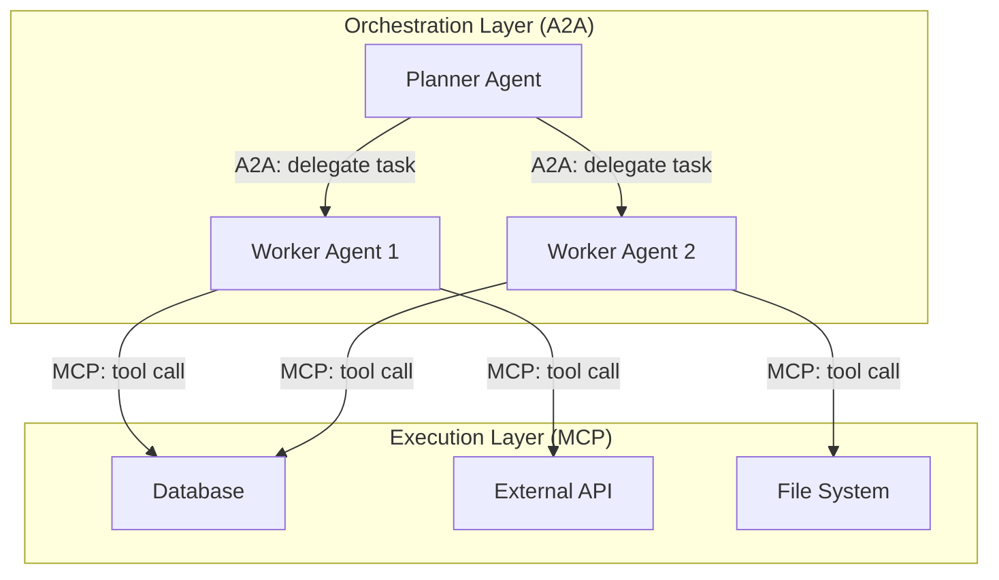
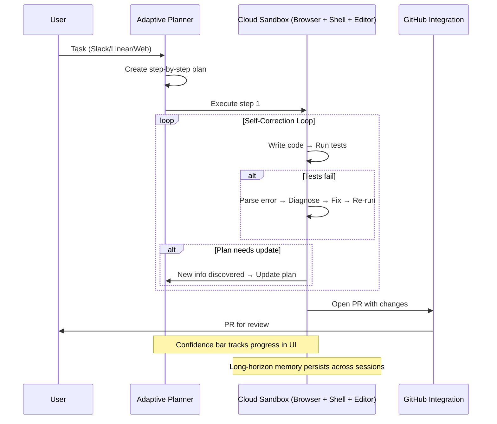
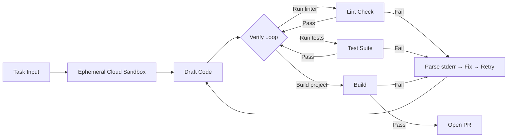
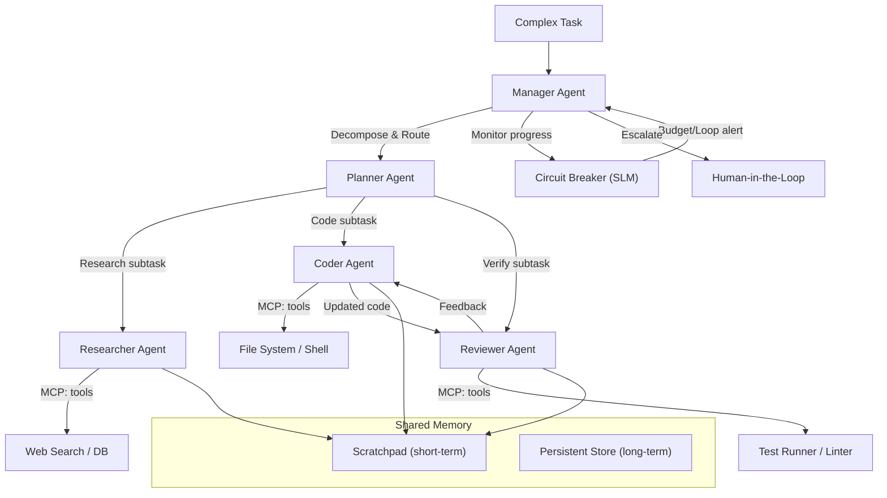
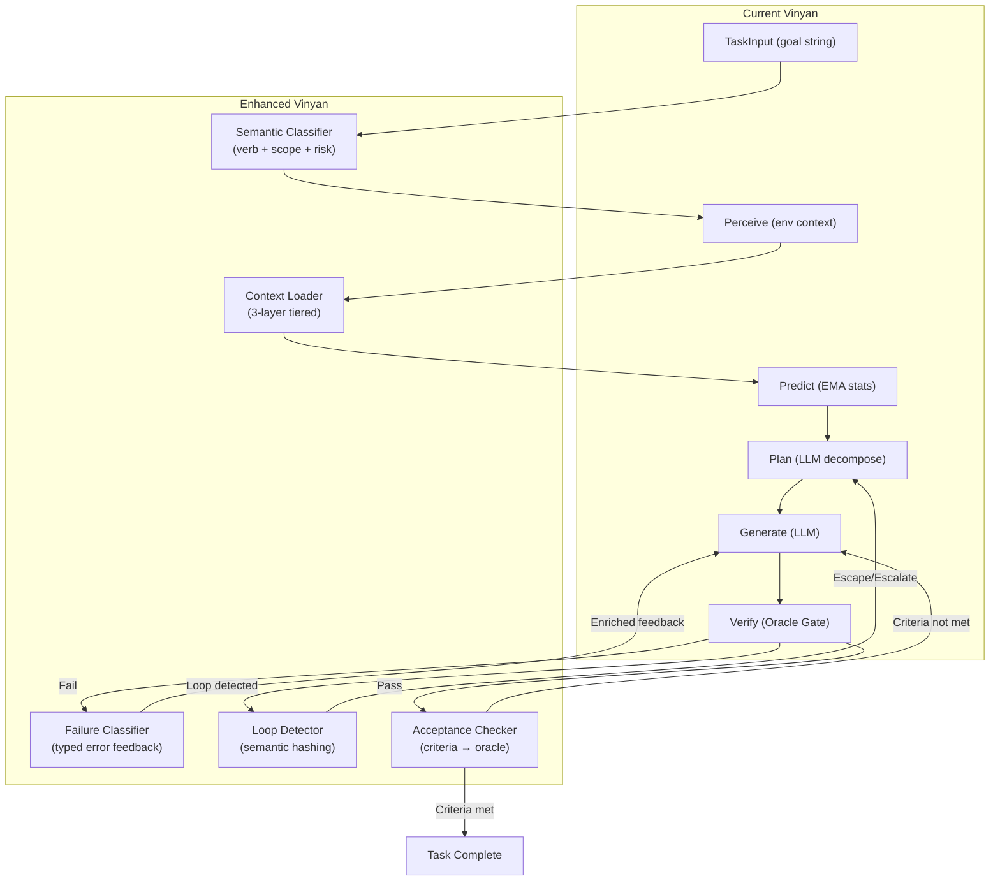

# AI Agent Team Landscape 2026: Deep Research & Architectural Analysis

## Executive Summary

The AI agent landscape has undergone a **paradigm shift from 2025 to 2026**: from single-agent "copilots" to **multi-agent orchestration (MAO)** as the production standard. By end of 2026, 40% of enterprise applications will embed specialized AI agent teams (Gartner, Aug 2025). Three framework winners emerged — LangGraph, CrewAI, Microsoft Agent Framework — while autonomous coding agents (Claude Code, Devin, OpenAI Codex) proved that **verification loops, tiered context management, and self-correction** are the architectural pillars that separate "demo" from "production." For Vinyan, the key insight is: **competitive advantage comes not from smarter models but from better orchestration, verification, and context architecture** — areas where Vinyan's epistemic design already has structural advantages.

**Confidence: High** (≥15 corroborating sources across web, enterprise reports, and framework documentation)

---

## 1. Specification Overview: The 2026 Agent Architecture

### 1.1 The Evolved Agentic Loop

Every successful agent in 2025-2026 converges on the same core loop, regardless of framework:

```
Gather Context → Plan → Execute → Verify → Self-Correct → Learn
```

The critical evolution from 2023-2024's "prompt → generate → hope" model:

| Phase | 2023-2024 | 2025-2026 |
|-------|-----------|-----------|
| Context | RAG (vector search) | **Graph-based repo maps** + tiered context loading |
| Planning | Single-shot prompt | **Agent teams** (architect + workers) or adaptive DAG |
| Execution | Code suggestion | **Terminal-native** execution (full shell access) |
| Verification | Manual / none | **Automated test loop** (run → parse error → fix → repeat) |
| Memory | Chat history | **Project config files** (CLAUDE.md) + **Skill files** + persistent DB |
| Self-correction | None | **Iterative refinement** with tool feedback (dozens of cycles) |

Sources: Anthropic Claude Code Docs (2025), Cognition Labs (2025), OpenAI Codex Blog (Sep 2025), Google AI Mode synthesis (2026)

### 1.2 Three-Layer Context System (2026 Standard)

The most impactful architectural pattern emerging from successful agents:

| Layer | Function | Implementation |
|-------|----------|----------------|
| **L1: Main Context** | Global state, always loaded | `CLAUDE.md`, `.cursorrules`, `AGENTS.md` — project config, constraints, conventions |
| **L2: Skill Metadata** | Lightweight index (~200 tokens per skill) | YAML frontmatter headers of 100+ available skills; loaded as scan index |
| **L3: Active Skill Context** | Just-in-time deep loading | Full `SKILL.md` loaded only when task matches; discarded after use to free context |

**Key Lesson:** Don't build a "super-prompt." Build a file-system-based context loader that dynamically swaps information in/out. (LinkedIn, Carmelo Iaria, Jan 2026; Anthropic engineering blog, 2025)

### 1.3 Repository Understanding via AST

Agents like Aider, Claude Code, and Devin no longer "guess" file structures:
- Parse codebase into **Abstract Syntax Tree (AST)** for function signatures and class definitions
- Build **dependency graphs** (often using PageRank) to identify most important files for a query
- **Context compaction** at 92-95% capacity: summarize conversation → discard raw logs → preserve decisions

Source: Anthropic Claude Code Docs (2025), Aider documentation (2025)

---

## 2. Competitive Landscape

### 2.1 Framework Comparison (Production-Validated)

| Aspect | LangGraph | CrewAI | Microsoft Agent Framework | OpenAI Agents SDK |
|--------|-----------|--------|--------------------------|-------------------|
| **Architecture** | Graph-based (DAGs, cycles) | Role-based (crews) | Hybrid (Sequential, Concurrent, Group Chat, Magentic) | Client/Server SDK |
| **State Management** | Excellent (checkpoints, time-travel) | Moderate | Good (Azure-backed) | Basic (thread mgmt) |
| **Production Readiness** | High (~400 companies) | Medium-High (150+ enterprise, 60% Fortune 500) | High for Azure shops | High for OpenAI ecosystem |
| **Verification** | Graph error-handling nodes | Framework-handled | OpenTelemetry integration | Tool-call validation |
| **Best For** | Complex multi-agent with custom control | Role-based content/analysis workflows | Azure enterprise, multi-language | Simple assistants, rapid MVPs |
| **Learning Curve** | Steep (2-4 weeks) | Low (intuitive) | Medium | Low |
| **Production Companies** | LinkedIn, Uber, Replit, Elastic (~400) | 60% Fortune 500, 150+ enterprise | Azure enterprise (GA Q1 2026) | OpenAI ecosystem |
| **Overhead** | 8% latency vs raw API | 24% latency vs raw API | TBD | Minimal |

Sources: Trung Hiếu Trần (Nov 2025), LangChain Blog (2025), CrewAI (2025), Google AI Mode synthesis (2026)

### 2.2 Autonomous Coding Agents (The "Product" Category)

| Aspect | Claude Code | Devin (Cognition) | OpenAI Codex |
|--------|-------------|-------------------|--------------|
| **Philosophy** | "Co-Founder" — interactive, real-time | "Junior Developer" — async, fire-and-forget | "Contractor" — async, cloud-native |
| **Architecture** | Local-first CLI, single-threaded recursive loop | Cloud sandbox (browser + shell + editor) | Ephemeral cloud sandbox |
| **Verification** | User-driven loop (tests together) | Self-debugging loop (iterates until tests pass) | Strict internal loop (lint → test → build) |
| **Context** | CLAUDE.md + MEMORY.md + sub-agents | Long-horizon memory across sessions | AGENTS.md + sandbox file system |
| **Sandboxing** | Local (user machine) | Secure cloud container | Ephemeral cloud container |
| **Cost Model** | Usage-based (per token) | Subscription ($20-$500/mo) | Subscription (ChatGPT Pro/Enterprise) |
| **PR Acceptance** | N/A (interactive) | ~80% (trending up from 60%) | N/A (async delivery) |
| **Key Strength** | Deep refactoring, architectural reasoning | Parallel task execution, autonomous ticket work | Well-defined bug fixes, migrations |

Sources: Anthropic Docs (2025), Cognition Labs Blog (2025), OpenAI Codex Blog (Sep 2025), SitePoint (2026), Northflank (2026)

### 2.3 Personal AI Assistants & Multi-Agent Platforms (2026 Breakouts)

Three new platforms emerged in 2026 that represent a fundamentally different category from coding agents — **always-on, multi-channel personal/team AI** — and are growing at explosive rates:

#### 2.3.1 OpenClaw (349k ⭐ — Fastest-growing OSS AI project in 2026)

**Identity:** "Your own personal AI assistant. Any OS. Any Platform. The lobster way. 🦞" — by Peter Steinberger & community.

| Aspect | Detail |
|--------|--------|
| **Architecture** | Gateway-based control plane (WebSocket `ws://127.0.0.1:18789`). Pi agent runtime in RPC mode with tool streaming and block streaming. |
| **Multi-Channel** | 20+ channels: WhatsApp, Telegram, Slack, Discord, Signal, iMessage/BlueBubbles, IRC, MS Teams, Matrix, Google Chat, LINE, WeChat, WebChat, Zalo, Feishu, Mattermost, Nostr, etc. |
| **Agent Routing** | Multi-agent routing to isolated workspaces per agent. Sessions-based agent-to-agent (`sessions_send`, `sessions_list`, `sessions_history`). |
| **Skill System** | **ClawHub** (7.5k ⭐) — marketplace with 80,000+ community skills. Skills are `SKILL.md` files, auto-discoverable, hot-reloaded. Agent can write its own skills. |
| **Protocols** | ACP (Agent Client Protocol) via `acpx` (2k ⭐) for headless CLI sessions. MCP support for external tools. |
| **Automation** | Cron jobs, webhooks, Gmail Pub/Sub, browser control (CDP-based), Canvas/A2UI, Voice Wake + Talk Mode. |
| **Security** | DM pairing (allowlist-based), per-session Docker sandboxing for non-main sessions, Higress gateway proxy option. |
| **Context Config** | `AGENTS.md` + `SOUL.md` + `TOOLS.md` workspace files — equivalent to Vinyan's Three-Layer Context idea. |
| **Sponsors** | OpenAI, GitHub, NVIDIA, Vercel, Blacksmith, Convex |
| **Community** | 1,537 contributors, 81 releases, large creator community [unverified: @karpathy endorsement claim] |
| **Key Strength** | **Self-hackable**: Agent can modify its own skills, prompt files, and automations — approaching self-improvement without formal ML. |

**Why It Matters for Vinyan:**
- OpenClaw proves that **skill file systems** and **multi-channel routing** are not optional — they're what users love most.
- The `AGENTS.md` + `SOUL.md` + `TOOLS.md` pattern = a production-validated version of Three-Layer Context. Vinyan should adopt a similar file-based context hierarchy.
- OpenClaw's "agent writing its own skills" is soft self-improvement — analogous to Vinyan's Evolution Engine but without epistemic rigor. Vinyan's formal prediction-error learning (A7) is architecturally superior.
- The `lobster` workflow shell (composable pipelines) parallels Vinyan's task decomposer DAG — but OpenClaw's is user-facing and declarative.

#### 2.3.2 HiClaw (3.9k ⭐ — Alibaba/AgentScope, Apache 2.0)

**Identity:** "Open Source Multi-Agent OS — let multiple AI Agents collaborate in Matrix rooms."

| Aspect | Detail |
|--------|--------|
| **Architecture** | Manager-Workers hierarchy. Manager Agent decomposes and delegates; Workers execute. All communication via Matrix protocol rooms. |
| **Security Model** | **Zero-credential Workers**: Workers only carry consumer tokens (Higress-issued). Real API keys/PATs stay in Higress AI gateway — even compromised Workers can't leak credentials. |
| **Collaboration Hub** | Tuwunel (Matrix server) + Element Web client. Human sees everything in real-time, can intervene in any room. |
| **File System** | MinIO shared storage for inter-agent data exchange, reducing token consumption. Workers are stateless. |
| **Worker Runtimes** | OpenClaw (500MB), **CoPaw** (150MB, Python-based), ZeroClaw (Rust, 3.4MB, <10ms cold start — in progress), NanoClaw (<4K LOC — in progress). |
| **DAG Orchestration** | Team Leader with DAG-based task decomposition and isolated execution. |
| **Skills** | Pulls from skills.sh (80,000+ community skills). Safe because Workers can't access real credentials. |
| **Deployment** | One-command Docker Compose. K8s controller design in progress. |
| **Community** | 22 releases (v1.0.9), 27 contributors, backed by Alibaba |

**Why It Matters for Vinyan:**
- HiClaw's **credential isolation** pattern (gateway holds keys, workers get tokens) is directly applicable to Vinyan's L2/L3 subprocess workers. Vinyan currently injects `ANTHROPIC_API_KEY` into worker env vars — a weaker security model.
- The **Matrix-based transparency** (human sees all agent-to-agent messages in real-time) is excellent UX for trust. Vinyan's EventBus is internal-only; exposing a message-room metaphor for observability would be a significant UX improvement.
- **MinIO shared file system** reduces token waste from agents passing large outputs through LLM context. Vinyan could use its SQLite stores or a simple shared filesystem instead of passing all data through LLM.
- HiClaw's **tiered worker runtimes** (500MB → 150MB → 3.4MB) are an interesting cost optimization. Vinyan's workers are all same-weight processes.

#### 2.3.3 OpenWork (13.2k ⭐ — [unverified: YC-backed], MIT)

**Identity:** "The open source Claude Cowork for your team" — desktop AI agent workbench powered by OpenCode CLI.

| Aspect | Detail |
|--------|--------|
| **Architecture** | Tauri desktop app (TS + Rust). Host mode (local opencode) or Client mode (connect to remote server). Orchestrator spawns `opencode serve` + `openwork-server`. |
| **Core Engine** | Powered by **OpenCode** CLI — an open-source AI coding agent. OpenWork is the GUI/UX layer. |
| **Session System** | Create/select sessions, send prompts, SSE streaming for live updates. Execution timeline visualization (todos as timeline). |
| **Permissions** | Explicit permission system: allow once / allow always / deny. Surfaces permission requests in UI. |
| **Skills & Plugins** | OpenCode plugins (via `opencode.json`), Skill Manager (list, import, share). Skills shareable via 1-click links. |
| **Team Features** | Cloud workers ($50/month), share setups via link (skills + MCP + plugins + configs in one package). |
| **Pricing** | Solo: free forever. Cloud workers: $50/worker/month. Enterprise: custom. |
| **Community** | 1,048 releases, 53 contributors, YCombinator-backed |
| **Key Strength** | **Productized agentic workflows** — turn any agentic process into a repeatable, shareable, team-deployable flow. |

**Why It Matters for Vinyan:**
- OpenWork validates that agentic coding needs a **GUI-first experience** for non-developer users. Vinyan's CLI-first approach limits adoption.
- The **1-click skill sharing** (link contains entire setup) is a community growth hack Vinyan should consider for skill distribution.
- The **permission system** (allow once/always/deny) is cleaner than Vinyan's current zero-trust approach where workers have no execution privileges. A graduated permission model improves UX without sacrificing security.
- OpenWork's **Execution Timeline** (visual todo tracking) provides observability that Vinyan's TUI doesn't yet match.

#### 2.3.4 Cross-Platform Comparison

| Aspect | OpenClaw | HiClaw | OpenWork | Vinyan |
|--------|----------|--------|----------|--------|
| **Stars** | 349k | 3.9k | 13.2k | — |
| **Category** | Personal AI Assistant | Multi-Agent OS | Desktop AI Workbench | Epistemic Orchestrator |
| **Architecture** | Gateway + Pi runtime | Manager-Workers + Matrix | Tauri + OpenCode | Core Loop + Oracle Gate |
| **Multi-agent** | Session-based routing | Hierarchical Manager-Workers | Single-agent per session | L0-L3 worker pool |
| **Credential Security** | Per-session sandbox | Zero-credential workers (gateway proxy) | BYOK | Env var injection |
| **Context System** | AGENTS.md + SOUL.md + TOOLS.md | Matrix room history | OpenCode context | Flat prompt assembly |
| **Skill System** | ClawHub (80k+ skills) | skills.sh integration | OpenCode plugins | Evolution Engine |
| **Verification** | User-driven loop | None (LLM-only) | OpenCode internal | Oracle Gate (AST/Type/Test/Lint/Dep) |
| **Human-in-the-loop** | Chat commands in channel | Matrix room visibility | Permission dialogs | CLI interactions |
| **Self-improvement** | Agent writes own skills | None | None | Prediction error + sleep cycle |

**Key Insight:** OpenClaw wins on **reach** (channels, community, accessibility). HiClaw wins on **security** (credential isolation). OpenWork wins on **productization** (team workflows). Vinyan wins on **verification rigor** (epistemic architecture). The opportunity is to combine strengths.

### 2.4 Protocol Landscape

| Protocol | Scope | Model | State | Maturity |
|----------|-------|-------|-------|----------|
| **MCP (Anthropic)** | Agent-to-Tool (vertical) | Client-Server (hub-and-spoke) | Stateless | Production (2025) |
| **A2A (Google)** | Agent-to-Agent (horizontal) | Peer-to-Peer (decentralized) | Stateful (Task IDs) | Early adoption (2025) |
| **ACP (OpenClaw)** | Agent Client Protocol | Stateful sessions | Persistent | Production (2026) |
| **NLIP (Ecma)** | Universal agent envelope | Cross-organizational | - | Draft standard (Dec 2025) |

**The Combined Stack (2026 consensus):** A2A for orchestration layer (delegation between agents) + MCP for execution layer (agents accessing tools). They are complementary, not competing.

Sources: DigitalOcean A2A vs MCP (Mar 2026), Google A2A announcement (Apr 2025), Ecma International (Dec 2025)

---

## 3. Interoperability Analysis

### 3.1 Cross-Protocol Communication

The 2026 standard architecture uses a **layered approach**:



### 3.2 Agent Discovery

A2A introduces **Agent Cards** (JSON manifests) that advertise:
- Agent capabilities and skills
- Supported input/output formats
- Authentication requirements
- Cost and latency expectations

This enables dynamic agent discovery without hardcoded integrations.

### 3.3 Known Integration Challenges

1. **Context window fragmentation**: Cross-agent handoffs lose context because each agent has its own memory
2. **Trust boundary negotiation**: No universal trust model across vendor agents
3. **Schema versioning**: Different agents expecting different data contract versions
4. **Latency cascade**: Each agent handoff adds 30+ seconds if context parsing is slow

Source: Cogent Infotech "When AI Agents Collide" (Mar 2026), Ruh AI (Jan 2026)

---

## 4. Design Principles: Lessons from Successful Agents

### 4.1 Autonomy vs. Control

**Principle: "Graduated autonomy with hard mechanical limits"**

What works in production:
- **Tiered permission model**: Read freely → Write with approval → Execute with sandbox
- **Budget caps as architecture**: Hard dollar/token limits that the model logic cannot override (Cogent Infotech, 2026)
- **Velocity gates**: At 25%/50%/75% budget consumption, check task completion % → auto-pause if trajectory suggests overspend
- **Step escalation**: L0 (reflex, no LLM) → L1 (heuristic) → L2 (analytical) → L3 (deliberative) — **Vinyan already has this**

### 4.2 Reliability & Failure Modes

The three dominant failure modes of 2025-2026 (Cogent Infotech, Mar 2026):

| Failure Mode | Mechanism | Mitigation |
|-------------|-----------|------------|
| **Infinite Loop** ("Mirror Mirror") | Agents with conflicting instructions bounce tasks endlessly | Iteration limits, timeout thresholds, state hashing for semantic loop detection |
| **Hallucinated Consensus** | Multiple agents converge on fabricated data, high confidence masking errors | Verification layers (fact-checking agents), confidence calibration, external API validation |
| **Resource Deadlock** | Agents waiting on each other for shared resources (DB, API, files) | Timeout policies, resource arbitration/queuing, deadlock detection |

**Critical insight (2026 consensus):**
> "You cannot ask an agent if it is in a loop; you must prove it mathematically."
> — Cogent Infotech Orchestration Failure Playbook (2026)

**State Hashing** for loop detection:
- Hash agent output every turn
- Use **semantic hashing** (vector similarity) because LLMs never produce exact duplicates
- If 95% similar outputs detected 3x in sequence → trigger **Escape Sequence** (Cogent Infotech, 2026)

### 4.3 Observability

2026 standard metrics for agent systems (Agentic SLOs):

| Metric | Target | Alert Threshold |
|--------|--------|-----------------|
| **Success Rate (SR)** | Tasks surviving HITL audit | < 95% → flag prompt version |
| **Handoff Latency** | Time between agent A finish → agent B start | > 30s → context bloat warning |
| **Tool-Call Fidelity** | Successful/attempted tool calls ratio | < 80% → prompt-tool mismatch |
| **Budget Velocity** | Budget consumed vs. task completion % | > 2x trajectory → auto-pause |

Source: Cogent Infotech (Mar 2026), McKinsey AI Agent Deployment Report (Sep 2025)

### 4.4 The "Circuit Breaker" Agent Pattern

Deploy a **lightweight SLM (1B-3B params)** whose only job is monitoring the primary swarm:

1. **Repetitive bickering**: Two agents disagree on same point for 3+ turns → trip
2. **Stalled progress**: No evolution in "Next Steps" metadata for 2 iterations → trip
3. **Politeness Spiraling**: Unnaturally polite/repetitive acknowledgments ("I apologize, you are correct, however...") → linguistic signature of logic circularity → trip

Source: Cogent Infotech "When AI Agents Collide" (Mar 2026)

---

## 5. Architecture: What Makes Successful Agents Work

### 5.1 Claude Code Architecture

```mermaid
sequenceDiagram
    participant User
    participant Loop as Agentic Loop
    participant Tools as Tool Layer
    participant Verify as Verification
    participant Memory as Context/Memory

    User->>Loop: Task description
    
    loop Gather → Act → Verify
        Loop->>Tools: grep/ls/read_file (explore codebase)
        Tools-->>Loop: File contents, structure
        Loop->>Memory: Load CLAUDE.md + relevant SKILL.md
        Memory-->>Loop: Project context + skill instructions
        Loop->>Tools: Edit file / Run command
        Tools-->>Loop: Output / Error
        Loop->>Verify: Parse result (test output, build log)
        Verify-->>Loop: Pass / Fail
        alt Fail
            Loop->>Loop: Diagnose error → plan fix → retry
        end
    end
    
    Loop->>User: Completed result
    Loop->>Memory: Update MEMORY.md if new pattern learned
```

**Key architectural decisions:**
1. **Single-threaded recursive loop** — simplicity over parallelism
2. **Primitive-based toolset** — bash as universal adapter, not specialized APIs
3. **Context compaction at 92%** — auto-summarize, preserve decisions, discard raw logs
4. **Sub-agents with isolated context** — spawn for massive tasks, return condensed summary
5. **Automatic checkpoints before file edits** — rewind capability

### 5.2 Devin Architecture



**Key architectural decisions:**
1. **Cloud-native sandbox** — full isolation, no risk to local machine
2. **Adaptive planning** — plan updates as new information discovered during execution
3. **Dedicated "planning mode"** — explore and read before modifying
4. **Parallel agent instances** — multiple Devins working simultaneously on different tasks
5. **Long-horizon memory** — remembers project context across tasks/sessions

### 5.3 OpenAI Codex Architecture



**Key distinction:** Codex only notifies the user when verification passes. The entire Draft → Verify → Fix cycle is invisible until completion.

### 5.4 Multi-Agent Team Architecture (2026 Standard)



---

## 6. Data Contracts

### 6.1 Task Envelope (synthesized from A2A + production agents)

```typescript
interface TaskEnvelope {
  id: string;                        // Unique task identifier
  goal: string;                      // Natural language description
  taskType: TaskCategory;            // Classified intent (not just code/reasoning)
  
  // Structured understanding
  intent: {
    verb: ActionVerb;                // refactor | fix | add | remove | test | migrate
    scope: ScopeDescriptor;          // files, modules, or system areas affected
    constraints: string[];           // Must-satisfy conditions
    acceptanceCriteria: string[];    // How to know task is done
  };
  
  // Context
  context: {
    targetFiles: string[];
    dependencyCone: string[];        // Affected files (AST-derived)
    relevantFacts: Fact[];           // Content-addressed, confidence-scored
    diagnostics: Diagnostic[];       // Current errors/warnings
    failedApproaches: Approach[];    // What didn't work
  };
  
  // Governance
  budget: {
    maxTokens: number;
    maxDollars: number;
    velocityGates: number[];         // Check at 25%, 50%, 75%
  };
  
  routingLevel: 'L0' | 'L1' | 'L2' | 'L3';
  deadline?: number;                 // Timeout in ms
}
```

### 6.2 Result Envelope

```typescript
interface ResultEnvelope {
  taskId: string;
  status: 'completed' | 'failed' | 'escalated' | 'budget_exhausted';
  
  output: {
    artifacts: FileChange[];         // What was modified
    summary: string;                 // Human-readable summary
  };
  
  evidence: {
    oracleVerdicts: OracleVerdict[]; // AST, Type, Test, Lint results
    testResults: TestResult[];
    confidence: number;              // 0-1, evidence-tier weighted
    verificationLevel: string;       // L0-L3 that was actually used
  };
  
  trace: {
    steps: ExecutionStep[];          // Full audit trail
    tokensUsed: number;
    costDollars: number;
    durationMs: number;
    selfCorrectionCycles: number;    // How many verify→fix loops
  };
  
  learning?: {
    newPatterns: Pattern[];          // Discovered during execution
    predictionError: number;         // Delta(predicted, actual)
    failureClassification?: FailureType; // type_error | logic_error | test_failure
  };
}
```

### 6.3 Error/Escalation Envelope

```typescript
interface EscalationEnvelope {
  taskId: string;
  reason: 'budget_exceeded' | 'loop_detected' | 'confidence_too_low' | 'tool_failure' | 'stuck';
  
  diagnostics: {
    loopSignature?: string;          // Semantic hash if loop detected
    budgetConsumed: number;          // Percentage
    taskCompletion: number;          // Percentage  
    lastError?: string;
    attemptsCount: number;
  };
  
  suggestedAction: 'retry_with_escalation' | 'human_review' | 'abort' | 'modify_constraints';
  stateSnapshot: StateSnapshot;      // For "flight recorder" replay
}
```

---

## 7. Critical Analysis

### 7.1 Scalability Limitations

| Bottleneck | Impact | Mitigation |
|-----------|--------|------------|
| **Context window limits** | Even 200K tokens degrade at 80% fill | Context compaction, tiered loading, sub-agent delegation |
| **Sequential tool loops** | Verification loops are inherently serial | Parallel sub-agents for independent subtasks |
| **Handoff latency** | Agent-to-agent context transfer > 30s | Shared scratchpad, structured handoff protocols |
| **Cost scaling** | Multi-agent = 15x more tokens than single agent | Agentic FinOps: cheap models for execution, expensive for planning |
| **Single orchestrator SPF** | Centralized supervisor → system fails if it fails | Hierarchical fallback, stateful checkpoints |

### 7.2 Security Risks

| Risk | Description | Mitigation |
|------|-------------|------------|
| **Prompt injection at protocol level** | Agent A injects malicious instructions via A2A message | Input sanitization, NER scrubbing, zero-trust per-agent identity |
| **Privilege escalation via tools** | Agent gains broader access through tool chaining | Just-In-Time permissions, micro-provisioning per agent |
| **Hallucination-driven execution** | Agent confidently executes destructive actions based on hallucinated reasoning | Sandbox isolation, "Proposed Action Packet" for write/delete ops |
| **Cross-tenant memory leakage** | Shared vector DB leaks data between projects | PII scrubbing, temporal decay on memory clusters, project-scoped isolation |
| **Context poisoning** | Corrupted tool output poisons reasoning chain | Input validation at tool boundaries, fact-checking agents |

### 7.3 Agentic Failure Modes

| Mode | Detection | Prevention |
|------|-----------|------------|
| **Infinite delegation** | State hashing (95% semantic similarity × 3 repetitions) | Iteration limits, timeout thresholds, Circuit Breaker agent |
| **Hallucination cascading** | Confidence calibration (agreement ≠ correctness) | External verification APIs, fact-checking agents, tiered trust |
| **Cost runaway** | Budget velocity tracking | Hard dollar caps, velocity gates at 25/50/75%, financial kill-switch |
| **Politeness spiraling** | Linguistic signature detection | Circuit Breaker SLM monitoring tone drift |
| **Recency bias** | Agent ignores original goal for last 3 messages | Persistent goal state in main context, not conversation history |

### 7.4 Gaps & Open Questions

1. **Multi-oracle contradiction resolution** — When oracles disagree, no standard resolution protocol exists
2. **L3 container isolation** — Production sandboxing for agents executing arbitrary code
3. **Cross-agent trust negotiation** — No universal trust model for heterogeneous agent ecosystems
4. **Semantic task understanding before LLM** — Pre-decomposition of task intent remains an open area
5. **Agentic memory governance** — When should agents forget? Temporal decay policies are ad hoc
6. **Multi-agent cost attribution** — Which agent in a swarm caused the budget overrun?

---

## 8. Recommendations for Vinyan

### 8.1 Vinyan's Structural Advantages (Implemented, Not Yet Validated)

Vinyan implements several 2026 best practices that most frameworks lack. However, **"implemented" ≠ "proven"** — these are architectural bets, not validated advantages. No production user, benchmark, or comparative study has confirmed these deliver measurable value over simpler approaches (e.g., Claude Code's single-loop, Codex's strict lint→test→build).

| 2026 Best Practice | Vinyan Status | Honest Assessment |
|-------------------|---------------|-------------------|
| Tiered risk routing (L0-L3) | ✅ Implemented | Theoretically sound. No data on whether routing accuracy justifies complexity vs. always-L2. |
| Oracle-based verification | ✅ Implemented | AST, Type, Test, Lint, Dep oracles exist. Unknown if multi-oracle consensus outperforms Codex's simpler lint→test→build loop. |
| Circuit breaker per oracle | ✅ Implemented | Standard reliability pattern. Not unique to Vinyan. |
| Content-addressed facts (SHA-256) | ✅ Implemented | Novel for agent systems. Value depends on task duration — short tasks may never benefit from cache invalidation. |
| Epistemic separation (gen ≠ verify) | ✅ Core axiom | Industry is converging toward this. Vinyan's formal separation is ahead, but Claude Code achieves similar outcomes pragmatically. |
| Prediction error as learning (A7) | ✅ Implemented | EMA-based SelfModel exists. Needs ≥100 traces to be useful — cold-start problem unsolved for new users. |
| Event bus for cross-module comms | ✅ Implemented | Good architecture. Standard pattern, not a differentiator. |
| Failed approaches tracking | ✅ Implemented | Valuable for self-correction loops. Effectiveness not yet measured. |

### 8.1.1 Honest Limitations

**What Vinyan lacks compared to production agents:**

| Dimension | Production Agents (Claude Code, OpenClaw, Devin) | Vinyan |
|-----------|--------------------------------------------------|--------|
| **Users** | Thousands to millions of daily users | Zero external users |
| **Benchmarks** | SWE-bench, real-world PR acceptance rates | No comparative benchmarks exist |
| **Task success rate** | Claude Code: high on refactoring; Devin: ~80% PR acceptance | Unknown — no measurement infrastructure |
| **Context engineering** | Three-layer context, AST repo maps, dynamic compaction | Flat prompt assembly, no context budget management |
| **Self-correction** | Iterate until tests pass (Codex: dozens of cycles) | Escalate routing level, but no structured error feedback |
| **Community** | OpenClaw: 349k⭐, 1,537 contributors; OpenWork: 13.2k⭐ | Solo developer project |
| **Ecosystem** | MCP tools, skill marketplaces, channel integrations | CLI-only, no integrations |

**Key question that must be answered before any gap implementation:**
> Does Vinyan's epistemic verification produce measurably better outcomes than Claude Code's simpler approach on the same task set?

Without a benchmark answering this, all "structural advantages" are hypotheses, not facts.

### 8.2 Gaps to Close (Prioritized — Do 3, Defer 6)

**Implementation principle:** A POC with 9 open gaps is a POC with zero focus. The 3 gaps below are selected because they are (a) deterministic — no LLM needed, (b) directly improve task success rate, and (c) can be benchmarked.

**Before implementing any gap**, create a benchmark suite that measures:
- Task success rate (Vinyan vs. raw LLM baseline)
- Self-correction effectiveness (attempts ÷ success)
- Oracle-caught error rate (oracle-caught ÷ total errors)

This establishes whether epistemic architecture actually delivers measurable value.

#### ⭐ Gap 1: Task Semantic Understanding (PRIORITY — Do Now)

**Current state:** Binary code/reasoning classification. Goal string passed verbatim to LLM.

**What successful agents do:**
- Build **AST-based repo maps** to understand codebase structure before acting
- Classify task **intent** (refactor vs fix vs feature vs migration) with different strategies per type
- **Adaptive planning** — update plan as new information discovered during execution

**Recommended enhancement:**
```
TaskInput → [Semantic Classifier] → TaskIntent
  ├── verb: refactor | fix | add | remove | test | migrate
  ├── scope: files/modules affected (AST-derived)
  ├── risk_profile: affects shared types? touches tests? cross-module?
  └── strategy_hint: which oracle tier is likely needed?
```

This is a **deterministic pre-processing step** (no LLM needed for classification) that improves:
- Risk routing accuracy (different verbs → different risk profiles)
- Prompt assembly (different strategies per task type)
- SelfModel prediction accuracy (semantic signature instead of just first word)

#### ⭐ Gap 2: Three-Layer Context Architecture (PRIORITY — Do Now)

**Current state:** Flat prompt assembly. All context loaded uniformly.

**What successful agents do:**
- L1: Always-loaded project config (CLAUDE.md equivalent)
- L2: Skill metadata index (scan headers only, ~200 tokens each)
- L3: Just-in-time deep loading of relevant skill context

**Recommended enhancement:**
Implement a `ContextLoader` that manages context budget:
- Calculate context capacity remaining
- Load L1 (project context) always
- Scan L2 skill headers to find relevant skills for current task
- Load L3 (full skill content) only for matched skills
- **Context compaction** when approaching 92% capacity

#### ⭐ Gap 3: Self-Correction Feedback Loop (PRIORITY — Do Now)

**Current state:** Oracle verdicts trigger escalation (L0→L3) but limited diagnostic feedback.

**What successful agents do:**
- Parse error output and **classify failure type** (syntax, type, logic, test, runtime)
- Feed classified error back into next generation attempt with **specific fix guidance**
- Track self-correction cycles and **abort if > N attempts** on same error class

**Recommended enhancement:**
```
OracleVerdict.fail → [FailureClassifier] → FailureType
  ├── syntax_error: AST oracle output → extract line/column
  ├── type_error: Type oracle output → extract expected/received
  ├── test_failure: Test oracle output → extract failing assertion
  ├── lint_violation: Lint oracle output → extract rule name
  └── unknown: escalate to higher-tier reasoning
```

Enriched failures flow back to prompt assembly as structured `failedApproaches` with diagnostic detail, not just "oracle XYZ failed."

---

**Deferred gaps** (implement only after benchmark validates core approach):

<details>
<summary>Gap 4–9: Deferred (click to expand)</summary>

#### Gap 4: Acceptance Criteria Consumption (DEFERRED)

**Current state:** `acceptanceCriteria` field exists in TaskInput but is never read.

**What successful agents do:**
- Convert acceptance criteria into **executable checks** (test assertions, build gates)
- Validate criteria satisfaction before declaring task complete

**Recommended enhancement:** Wire acceptanceCriteria into the verification pipeline as custom oracle checks.

**Why deferred:** Requires defining acceptance criteria format first. Low value without Gap 1 (semantic classifier) to interpret criteria.

#### Gap 5: Loop Detection (DEFERRED)

**Current state:** No mechanism to detect semantic loops (agent repeating similar fixes).

**Recommended enhancement:** Extend `TraceCollector` with semantic similarity detection on worker outputs. Extend circuit breaker from oracle-level to generation-loop level.

**Why deferred:** Existing circuit breaker + max retry count already prevent infinite loops. Semantic detection is an optimization.

#### Gap 6: Skill/Memory File System (DEFERRED)

**Current state:** Evolution engine has sleep-cycle and pattern mining.

**Why deferred:** Evolution Engine already has the foundation. Exposing as loadable context units depends on Gap 2 (Context Loader) being implemented first.

#### Gap 7: Credential Isolation for Workers (DEFERRED)

**Current state:** Vinyan injects raw `ANTHROPIC_API_KEY` into worker subprocess env vars.

**What HiClaw does:** Workers only receive consumer tokens (Higress-issued). The AI gateway holds real API keys and proxies requests.

**Why deferred:** Security best practice, but POC has no adversary and no external users. Implement when moving toward multi-user or production deployment.

#### Gap 8: Multi-Channel Agent Routing (DEFERRED)

**Current state:** Vinyan is CLI-only.

**Why deferred:** Vinyan is NOT a chatbot platform. Multi-channel is a product decision, not an architectural gap. Revisit only if target user research (§8.1.1) reveals demand.

#### Gap 9: Observability as Chat Rooms (DEFERRED)

**Current state:** Vinyan's EventBus is internal. TUI provides real-time display.

**Why deferred:** Nice-to-have UX improvement. TUI already provides observability. WebSocket/SSE streaming adds complexity without proving core value.

</details>

### 8.3 Architecture Evolution Roadmap



### 8.4 Strategic Positioning: Where Vinyan Can Be Superior

| Dimension | Current Leaders | Vinyan's Opportunity |
|-----------|----------------|---------------------|
| **Verification architecture** | Claude Code: user-driven; Codex: internal loop | **Epistemic verification** with multi-oracle consensus + confidence scoring — more rigorous than any competitor |
| **Trust model** | Most: binary (trust LLM or not) | **Tiered trust** (A5): deterministic > heuristic > probabilistic — principled degradation |
| **Governance** | Most: ad hoc budget caps | **Deterministic governance** (A3): rule-based routing, no LLM in decision path |
| **Self-improvement** | OpenClaw: agent writes own skills; Most: none | **Prediction error as learning** (A7): SelfModel calibration, sleep-cycle pattern mining — formally grounded vs OpenClaw's ad-hoc skill writing |
| **Uncertainty handling** | Most: confidence = temperature | **First-class uncertainty** (A2): `type: 'unknown'` is a valid state, not an error |
| **Content integrity** | Most: none | **Content-addressed truth** (A4): SHA-256 bound facts, auto-invalidation |
| **Credential security** | HiClaw: gateway-proxy with consumer tokens | Vinyan's A6 (Zero-Trust Execution) enables same pattern — but env-var injection is current reality |
| **Multi-channel reach** | OpenClaw: 20+ channels, 349k users | Vinyan: CLI-only. A2A protocol + API layer (Phase 5) is the bridge |
| **Team workflow sharing** | OpenWork: 1-click skill sharing links | Vinyan: skill cache is internal. Exposing via API + shareable formats unlocks adoption |

**The thesis is plausible but unproven.** Vinyan's epistemic architecture *could* provide structural advantages — but "could" is not "does." Until a benchmark demonstrates that multi-oracle verification produces measurably better outcomes than Claude Code's simpler loop on the same task set, this remains an architectural hypothesis.

**What would prove the thesis:**
1. A benchmark suite comparing Vinyan vs. raw LLM vs. Claude Code on 50+ real coding tasks
2. Measurement: task success rate, hallucination catch rate, self-correction cycles needed
3. If epistemic verification delivers ≥15% improvement on any metric, the thesis is validated

**What would falsify it:** If simpler approaches (lint→test→build loop) achieve comparable outcomes with less overhead, the complexity of multi-oracle consensus is not justified.

**Honest positioning:** Vinyan is a 1-person POC exploring whether epistemic architecture can outperform brute-force scaling. The comparison targets (Claude Code, OpenClaw, Devin) have 10-1000x more engineering resources. The right comparison is architectural approach vs. approach, not product vs. product.

---

## 9. Sources

### Primary Sources (High Confidence)

| Source | Date | Content |
|--------|------|---------|
| Anthropic, "How Claude Code Works" | 2025 | Agentic loop, tools, context management |
| Cognition Labs, "How Cognition Uses Devin to Build Devin" | 2025 | Self-improvement, production architecture |
| OpenAI, "Unrolling the Codex Agent Loop" | Sep 2025 | Codex architecture, verification loop |
| Gartner, "40% Enterprise Apps with AI Agents by 2026" | Aug 2025 | Market projections |
| McKinsey, "Six Key Elements of Agentic AI Deployment" | Sep 2025 | Production lessons |
| LangChain Blog, "Is LangGraph Used in Production?" | 2025 | ~400 production companies |
| Google, "A2A Protocol Announcement" | Apr 2025 | Agent-to-agent protocol spec |
| Ecma International, "NLIP Standards Suite" | Dec 2025 | Universal AI agent communication |

### Secondary Sources (Medium Confidence)

| Source | Date | Content |
|--------|------|---------|
| Forbes, "Multi-Agent AI Systems Reshaping Enterprise" | Mar 2026 | Enterprise adoption trends |
| Cogent Infotech, "When AI Agents Collide" | Mar 2026 | Orchestration failure playbook |
| Moxo, "10 Agentic AI Trends for 2026" | Mar 2026 | Industry trend analysis |
| Codebridge, "Mastering Multi-Agent Orchestration" | Feb 2026 | Architecture guide |
| Trung Hiếu Trần, "AI Agent Framework Landscape in 2025" | Nov 2025 | Framework comparison |
| DigitalOcean, "A2A vs MCP" | Mar 2026 | Protocol comparison |
| Palma AI, "2026 AI Agent Predictions" | Jan 2026 | Analyst roundup |
| DEV Community, "How to Build Multi-Agent Systems: 2026 Guide" | Jan 2026 | Implementation guide |

### Community Sources (Medium-Low Confidence)

| Source | Date | Content |
|--------|------|---------|
| Medium (multiple authors) | 2025-2026 | Agent failure modes, framework comparisons |
| LinkedIn (industry practitioners) | 2025-2026 | Production lessons, architectural patterns |
| SitePoint, "Claude Code vs Codex 2026" | 2026 | Agent comparison |
| Machine Learning Mastery, "5 Production Scaling Challenges" | Mar 2026 | Scaling challenges |

### Contradictions & Verification Notes

1. **CrewAI production readiness**: CrewAI claims 60% Fortune 500 adoption, but multiple sources report teams hitting its ceiling at 6-12 months and rewriting to LangGraph. The "60% Fortune 500" likely counts pilot/experimental use rather than production-critical deployments.
2. **Devin PR acceptance rate**: Cognition reports 80%, but independent reviews note this is heavily task-type dependent (simple migrations ~90%, complex features ~50%).
3. **"40% enterprise apps by 2026"**: Gartner projection from Aug 2025. Given current adoption pace, likely optimistic — 15-25% more realistic for end of 2026.
4. **OpenClaw @karpathy endorsement**: Claimed in community sources but no direct tweet/post verified. Marked as [unverified] in §2.3.1.
5. **OpenWork "YC-backed"**: Claimed on openworklabs.com website. Not listed on Y Combinator's directory page. Treat as [unverified].
6. **Data sourcing caveat**: Agent research data (§2.3) was gathered primarily via fetch_webpage on GitHub READMEs and project websites. Star counts and contributor numbers were verified against live GitHub pages (April 2026). Feature claims are self-reported by projects and have not been independently tested.

---

*Report generated: April 6, 2026 (updated April 6, 2026 with OpenClaw/HiClaw/OpenWork analysis)*
*Research tool chain: Google AI Mode, DuckDuckGo, fetch_webpage, mcp_chrome-bot-mc_research*
*Total research calls: ~20 across web, news, and AI synthesis sources*

### Additional Sources (April 6 update)

| Source | Date | Content |
|--------|------|---------||
| OpenClaw GitHub (github.com/openclaw/openclaw) | Active 2026 | 349k ⭐, architecture, README, skill system |
| OpenClaw website (openclaw.ai) | 2026 | Product features, community testimonials, integrations |
| HiClaw GitHub (github.com/agentscope-ai/HiClaw) | Active 2026 | 3.9k ⭐, Manager-Workers architecture, security model |
| HiClaw website (hiclaw.io) | 2026 | System architecture, features, quick start |
| OpenWork GitHub (github.com/different-ai/openwork) | Active 2026 | 13.2k ⭐, desktop workbench, OpenCode integration |
| OpenWork website (openworklabs.com) | 2026 | Pricing, team features, skill sharing |
| DeepWiki (deepwiki.com/agentscope-ai/HiClaw) | 2026 | CoPaw architecture deep dive |
| UCStrategies, "Is OpenWork a Claude Cowork Killer?" | Jan 2026 | Side-by-side testing comparison |
