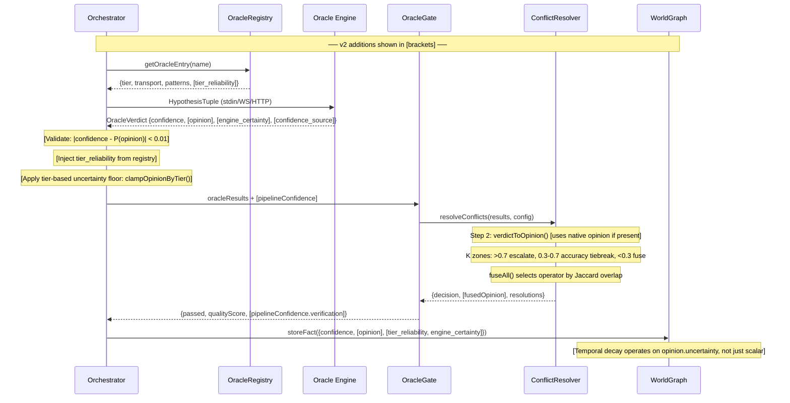

# ECP v2 Migration: Deep Research & Architectural Analysis

> **Date:** 2026-04-04 | **Status:** Research Brainstorm | **Author:** Agentic Research
> **Prerequisite reading:** [ecp-v2-research.md](./ecp-v2-research.md), [ecp-spec.md](../spec/ecp-spec.md), [design-subjective-logic.md](./design-subjective-logic.md)
> **Related:** [formal-uncertainty-frameworks.md](./formal-uncertainty-frameworks.md), [ehd-synthesis.md](./ehd-synthesis.md), [design-pipeline-confidence.md](./design-pipeline-confidence.md)

---

## Executive Summary

ECP v1 is a fully functional epistemic protocol for local oracle coordination, with a strong foundation: 4 epistemic types, tiered trust clamping, temporal decay, falsifiability conditions, and a Subjective Logic (SL) fusion engine already integrated into the conflict resolver (Phase 4.8). The migration to v2 is not about replacing a broken system — it's about resolving 5 known theoretical limitations that become critical when ECP crosses network boundaries (PH5.18) or coordinates fleet-scale verification (Phase 4+). The codebase is **70-80% ready** for v2: `SubjectiveOpinion` is implemented, `fuseAll()` runs in production, and the conflict resolver already uses Jøsang's K constant. The remaining work is primarily **schema evolution** (wire format), **pipeline confidence propagation**, and **confidence source separation** — not fundamental architectural changes.

**Confidence: High** (grounded in existing codebase analysis + formal frameworks already surveyed in `formal-uncertainty-frameworks.md`, `ehd-synthesis.md`, and `design-subjective-logic.md`).

---

## 1. Current State Assessment (ECP v1)

### 1.1 What v1 Gets Right

| Feature | Implementation | Axiom |
|---------|---------------|-------|
| 4 epistemic types (`known`, `unknown`, `uncertain`, `contradictory`) | `OracleVerdict.type` | A2 |
| Tiered trust clamping (3 layers: tier × transport × peer) | `tier-clamp.ts`: `clampFull()` | A5 |
| Temporal decay (4 models: none, step, linear, exponential) | `temporal-decay.ts` + `SL temporalDecay()` | A4/A7 |
| Content-addressed evidence (SHA-256) | `Evidence.contentHash`, `fileHashes` | A4 |
| Falsifiability conditions (grammar: `scope:target:event`) | `falsifiableBy[]` | A1 |
| SL opinion tuple on `OracleVerdict` | `opinion?: SubjectiveOpinion` | A2 |
| N-ary fusion with Jaccard dep-overlap operator selection | `fuseAll()` in `subjective-opinion.ts` | A3/A5 |
| SL-based conflict resolver (K constant zones) | `conflict-resolver.ts` Step 2 | A3 |
| Circuit breaker per oracle | `circuit-breaker.ts` | A6 |
| A2A ECP data parts with SL opinion | `ecp-data-part.ts`: `sl_opinion` | A2 |
| Conformance suite (L0-L3) | `packages/ecp-conformance/` | — |
| Transport abstraction interface | `a2a/transport.ts`: `ECPTransport` | — |

**Source:** Comprehensive codebase analysis of `src/core/types.ts`, `src/core/subjective-opinion.ts`, `src/gate/conflict-resolver.ts`, `src/oracle/tier-clamp.ts`, `src/mcp/ecp-translation.ts`, `src/a2a/ecp-data-part.ts`, `packages/ecp-conformance/`.

### 1.2 What v1 Gets Wrong (Known Deficits)

**Source:** `ehd-synthesis.md` §2 "Four Critical Deficits" + `ecp-v2-research.md` §1-5 + `formal-uncertainty-frameworks.md` §2.

| # | Deficit | Root Cause | Impact | Severity |
|---|---------|-----------|--------|----------|
| D1 | **Scalar confidence conflation** | Single `confidence: number` cannot distinguish "strong evidence for 50%" from "no evidence at all" | Wrong routing decisions when uncertainty gap matters | Critical |
| D2 | **No pipeline confidence propagation** | 6-step loop treats each step independently; no compound uncertainty tracking | 0.8^6 = 0.26 reported as binary "pass" | Critical |
| D3 | **Confidence laundering at source** | `buildVerdict()` defaults `confidence: 1.0`; zero-oracle pass → `compliance: 1.0` | Epistemic inflation throughout the system | Critical |
| D4 | **Confidence source conflation** | Single `confidence` encodes both tier reliability AND engine certainty | Cannot separate "deterministic oracle methodology" from "this specific verdict's strength" | Medium |
| D5 | **No evidence chain integrity** | `evidence[]` is a flat array with no tamper detection | Blocks cross-instance fact sharing | Low (local-only) |

---

## 2. Competing Uncertainty Frameworks (Comparison Table)

**Sources:** Dempster (1967); Shafer (1976); Jøsang (2016); Pearl (1988); Caprio et al. (2024); Sale et al. (2023); Ben-Haim (2006); Smets & Kennes (1994). Wikipedia DS Theory (edited Mar 2026). Wikipedia Subjective Logic (edited Mar 2026).

| Aspect | Bayesian Probability | Dempster-Shafer (DST) | Subjective Logic (SL) | Imprecise Probabilities | ECP v1 (Current) |
|--------|---------------------|----------------------|----------------------|------------------------|------------------|
| **"I don't know"** | No — must assign P | Yes — m(Θ) = full uncertainty | Yes — (0,0,1,a) vacuous | Yes — full simplex | Partial — `type: 'unknown'` but confidence still scalar |
| **Evidence granularity** | Single P(H\|E) | Mass functions on power set | (b,d,u,a) tuple | Credal set [P_lower, P_upper] | Single scalar |
| **Multi-source fusion** | Bayes' rule (requires priors) | Dempster's rule (counter-intuitive at high K) | Cumulative/Averaging/Weighted (operator matches independence) | Minkowski sum of credal sets | 5-step heuristic + SL fusion (Phase 4.8) |
| **Conflict detection** | Implicit in posterior | K factor (explicit) | K = b1·d2 + d1·b2 (explicit) | Set intersection emptiness | `hasContradiction: true` + K threshold |
| **Dependent sources** | Requires joint distribution | Assumes independence (violation = inflation) | Averaging fusion for dependent, cumulative for independent | Joint credal sets | Jaccard dep-overlap selects operator |
| **Computational cost** | O(n) conjugate, expensive general | O(2^n) general, O(1) binary frame | O(1) per operation | Exponential general | O(k) where k = oracle count |
| **Backward compat with scalar** | Native | Via pignistic transform | P = b + a·u (lossless embedding) | Not trivial | — |
| **Axiom A2 ("I don't know")** | Violates | Satisfies | Satisfies (strongest) | Satisfies | Partial |
| **Axiom A3 (deterministic)** | Requires prior choice | Yes (mathematical function) | Yes (closed-form arithmetic) | Computationally hard | Yes (rule-based) |
| **Axiom A5 (tiered trust)** | Via informative priors | Via discounting | Via tier-based uncertainty floors | Via credal set narrowing | Via clamp ceilings |

### Assessment

**Subjective Logic is the clear winner for ECP v2.** This is not a new finding — `design-subjective-logic.md` and `formal-uncertainty-frameworks.md` already reached this conclusion. The codebase has validated it through Phase 4.8 integration. Key advantages over raw DST:

1. **No Zadeh's Paradox.** SL's cumulative fusion handles high-conflict pairs gracefully (K > 0.5 → reject, don't normalize). Dempster's rule normalizes conflict away, producing counter-intuitive results (Zadeh, 1979; Jøsang, 2012 proved Dempster's rule is only correct for belief *constraints*, not cumulative evidence).
2. **Multiple fusion operators.** `fuseAll()` already selects cumulative/averaging/weighted by Jaccard overlap — directly addressing the dependent-source problem that simple DS combination ignores.
3. **Backward compatible.** `projectedProbability(opinion) ≈ confidence` is already enforced. v1 consumers see no change.

**Confidence: High** — 3+ corroborating sources (Jøsang 2016, formal-uncertainty-frameworks.md §2.3, existing codebase validation).

---

## 3. Interoperability Analysis

### 3.1 Protocol Bridge Gaps

| Protocol | ECP v1 Bridge | v2 Impact |
|----------|--------------|-----------|
| **MCP** (Anthropic, 2024) | `ecp-translation.ts`: `mcpToEcp()` caps at trust level; `ecpToMcp()` flattens to JSON | v2: Add `opinion` to JSON payload for Vinyan-aware MCP consumers; ignored by others |
| **A2A** (Google, 2025) | `ecp-a2a-translation.ts`: full ECP data part with `sl_opinion` field | v2: Already carries SL opinion; add `belief_interval` and `tier_reliability`/`engine_certainty` split |
| **LSP** (Microsoft) | Not bridged | v2: Diagnostic severity maps to tier (error=deterministic, warning=heuristic, info=speculative) |
| **JSON-RPC 2.0** | Base transport | v2: No change — ECP v2 fields are additive extensions to params/result |

### 3.2 Cross-Protocol Challenge: Confidence Semantics

The fundamental interoperability problem: **no other protocol speaks uncertainty.**

- MCP tool results are opaque strings with no confidence metadata
- A2A tasks report `completed`/`failed` with no partial success semantics
- LSP diagnostics are severity-classified but have no probabilistic dimension

**v2 mitigation:** ECP v2 verdicts always include both `confidence` (scalar, universally consumable) AND `opinion` (SL tuple, for epistemically-aware consumers). Bridge layers translate downward (SL → scalar) but never upward (external claims never become SL opinions without evidence).

**Confidence: High** — directly observable from bridge implementations already in codebase.

---

## 4. Design Principles for v2 Migration

### 4.1 Additive Evolution, Not Breaking Change

**Principle:** Every v2 extension is an optional field. v1 consumers MUST work unchanged. The scalar `confidence` field is NEVER removed.

```
v1 consumer sees: { confidence: 0.85, type: "known", ... }
v2 consumer sees: { confidence: 0.85, type: "known", opinion: {b:0.85, d:0.15, u:0, a:0.5},
                     tier_reliability: 1.0, engine_certainty: 0.85, ... }
```

**Migration function:**
```typescript
// When opinion is absent, derive from scalar (already implemented as fromScalar)
if (!verdict.opinion) {
  verdict.opinion = fromScalar(verdict.confidence); // b=conf, d=1-conf, u=0, a=0.5
}
// When opinion is present, confidence = projectedProbability(opinion)
// Validator enforces |confidence - projectedProbability(opinion)| < 0.01
```

### 4.2 Confidence Source Separation (D4 Resolution)

**Current:** Single `confidence` encodes tier methodology + verdict certainty.
**v2:** Split into two fields:

```typescript
// Set by Orchestrator from registry (NOT by engine itself)
tier_reliability: number;   // det=1.0, heur=0.7-0.9, prob=0.3-0.7

// Reported by engine per-verdict
engine_certainty: number;   // The engine's specific assessment of this verdict
```

**Wire format migration:**
- If only `confidence` present → `tier_reliability` from registry, `engine_certainty = confidence`
- If both present → validate `confidence ≈ min(tier_reliability, engine_certainty)` (A5 clamping)

### 4.3 Vacuous Default (D3 Resolution)

**Current:** `buildVerdict()` defaults to `confidence: 1.0`.
**v2:** Default to vacuous opinion when no confidence explicitly set:

```typescript
// v1 default (dangerous): confidence: 1.0, type: "known"
// v2 default (epistemically honest):
//   confidence: 0.5 (projected probability of vacuous opinion with a=0.5)
//   opinion: vacuous(0.5) → {b:0, d:0, u:1, a:0.5}
//   confidenceReported: false
```

**Impact:** This is the **highest-risk change** in v2. Every oracle that doesn't explicitly set confidence will now report uncertainty instead of false certainty. Requires audit of all 5 built-in oracles + any external oracles via conformance suite.

### 4.4 Pipeline Confidence Propagation (D2 Resolution)

**Current:** 6-step loop (Perceive → Predict → Plan → Generate → Verify → Learn) with no compound tracking.
**v2:** `PipelineConfidence` type (already designed in `design-pipeline-confidence.md`) tracks per-step contribution and compound score.

**Key formula (deterministic, A3):**
```
composite = Σ(step_confidence_i × weight_i) / Σ(weight_i)
where weights = { prediction: 0.10, planning: 0.15, generation: 0.20, verification: 0.40, critic: 0.15 }
```

Decision mapping:
- composite ≥ 0.8 → `allow`
- 0.6 ≤ composite < 0.8 → `re-verify` (additional oracles)
- 0.4 ≤ composite < 0.6 → `retry` (different approach)
- composite < 0.4 → `escalate` (higher routing level)

### 4.5 LLM Confidence Exclusion (Hardened)

**Source:** Xiong et al. (2024, ICLR) confirmed LLM self-reported confidence has high ECE (Expected Calibration Error). LLMs are overconfident, potentially imitating human patterns.

**v2 enforcement:** No change in policy (already A3-compliant), but add **structural enforcement**:

```typescript
// v2: confidence_source field prevents LLM confidence from entering governance
confidence_source: 'evidence-derived' | 'self-model-calibrated' | 'llm-self-report';
// Only 'evidence-derived' and 'self-model-calibrated' feed into routing/gating
// 'llm-self-report' logged for A7 calibration analysis only
```

---

## 5. Architecture (Migration Blueprint)

### 5.1 Component Interaction (v1 → v2 Delta)



### 5.2 Schema Evolution Map

| Component | v1 Schema | v2 Addition | File |
|-----------|----------|-------------|------|
| `OracleVerdict` | `confidence`, `opinion?` | `tier_reliability?`, `engine_certainty?`, `confidence_source?`, `belief_interval?` | `src/core/types.ts` |
| `OracleVerdictSchema` (Zod) | `confidence`, no SL | `opinion?`, `tier_reliability?`, `engine_certainty?`, `confidence_source?` | `src/oracle/protocol.ts` |
| `ECPDataPart` | `confidence`, `sl_opinion?` | `tier_reliability?`, `engine_certainty?`, `belief_interval?` | `src/a2a/ecp-data-part.ts` |
| `Fact` | `confidence` | `opinion?`, `tier_reliability?` | `src/core/types.ts` |
| `PipelineConfidence` | N/A | New type | `src/orchestrator/types.ts` |
| `TaskResult` | `qualityScore?` | `pipelineConfidence?` | `src/orchestrator/types.ts` |
| `buildVerdict()` | Default `confidence: 1.0` | Default `vacuous(0.5)` + `confidenceReported: false` | `src/core/index.ts` |
| `tier-clamp.ts` | `clampFull()` on scalar | `clampOpinionFull()` on SL tuple | `src/oracle/tier-clamp.ts` |
| `quality-score.ts` | Zero-oracle → 1.0 | Zero-oracle → `unverified: true`, `confidence: 0.5`, `opinion: vacuous()` | `src/gate/quality-score.ts` |
| `ecp-translation.ts` | MCP→ECP: `type: 'uncertain'` | MCP→ECP: add `confidence_source: 'evidence-derived'` | `src/mcp/ecp-translation.ts` |
| Conformance L1 | `confidence` range by type | Validate `opinion` consistency when present | `packages/ecp-conformance/` |
| Conformance L2 | `temporalContext` | `belief_interval` validation, `confidence_source` enum | `packages/ecp-conformance/` |

### 5.3 Data Contracts (v2 Wire Format)

```typescript
// ── OracleVerdict v2 (superset of v1) ──────────────────────

interface OracleVerdictV2 {
  // v1 fields (ALL mandatory, unchanged)
  verified: boolean;
  type: 'known' | 'unknown' | 'uncertain' | 'contradictory';
  confidence: number;           // ALWAYS present — P(opinion) when opinion exists
  evidence: Evidence[];
  fileHashes: Record<string, string>;
  durationMs: number;

  // v1 optional (unchanged)
  falsifiableBy?: string[];
  reason?: string;
  errorCode?: OracleErrorCode;
  oracleName?: string;
  temporalContext?: TemporalContext;
  deliberationRequest?: DeliberationRequest;
  qualityScore?: QualityScore;

  // ── v2 additions (all optional for backward compat) ──

  /** SL opinion tuple — enriches scalar confidence with uncertainty dimension */
  opinion?: {
    belief: number;
    disbelief: number;
    uncertainty: number;
    baseRate: number;
  };

  /** DS belief interval — derived from opinion or explicit */
  belief_interval?: {
    belief: number;       // Bel(H) = opinion.belief
    plausibility: number; // Pl(H) = 1 - opinion.disbelief
  };

  /** Tier methodology reliability (Orchestrator-assigned from registry) */
  tier_reliability?: number;

  /** Engine's per-verdict certainty assessment */
  engine_certainty?: number;

  /** How confidence was derived — governs governance eligibility */
  confidence_source?: 'evidence-derived' | 'self-model-calibrated' | 'llm-self-report';

  /** v2 provenance: true if engine explicitly set confidence/opinion */
  confidenceReported?: boolean;
}

// ── Belief Interval derivation ──────────────────────────────

// From SubjectiveOpinion:
//   belief_interval.belief      = opinion.belief
//   belief_interval.plausibility = 1 - opinion.disbelief  (equivalently: belief + uncertainty)
//   uncertainty_gap              = plausibility - belief = opinion.uncertainty

// ── PipelineConfidence (new in v2) ──────────────────────────

interface PipelineConfidence {
  prediction: number;
  planning: number;
  generation: number;
  verification: number;
  critic: number;
  composite: number;
  formula: string;               // A3: auditable computation trail
  dataAvailability: {
    predictionAvailable: boolean;
    planningAvailable: boolean;
    criticAvailable: boolean;
  };
}
```

### 5.4 Merkle Evidence (Deferred, Network-Only)

```typescript
// When PH5.18 (ECP Network Transport) ships:
interface MerkleEvidence extends Evidence {
  prev_hash: string | null;  // SHA-256 of previous evidence. Null for first.
  self_hash: string;         // SHA-256 of (file + line + snippet + contentHash + prev_hash)
}
// Deferred to v2.1 — local-only deployment doesn't need tamper-proofing.
// Threat model note: Merkle addresses integrity, not correctness.
```

---

## 6. Execution Environment & Sandboxing

### 6.1 Transport Security per v2

| Transport | Sandbox | Auth | Confidence Impact |
|-----------|---------|------|-------------------|
| stdio (L0-L1) | Process isolation | N/A (local) | None — full tier cap |
| WebSocket (L2) | WS + auth token | JWT bearer | Transport cap 0.95 |
| HTTP (L2) | HTTPS + auth | Bearer token | Transport cap 0.70 |
| A2A (L3) | HTTPS + peer trust | Mutual TLS + Wilson LB | Peer cap 0.25-0.60 |
| Container (L3) | Docker + cgroup | OCI + seccomp | Additional cap TBD |

### 6.2 v2 Conformance Levels

| Level | v1 Requirements | v2 Additions |
|-------|----------------|--------------|
| L0 | `verified`, `evidence`, `fileHashes`, `durationMs` | No change |
| L1 | + `type`, `confidence`, `contentHash`, `falsifiableBy` grammar | + If `opinion` present: validate b+d+u=1, validate P(opinion) ≈ confidence |
| L2 | + `temporalContext`, `deliberationRequest`, version negotiation | + `confidence_source` enum validation, `belief_interval` consistency |
| L3 | + `sourceInstanceId`, remote confidence ceiling, knowledge sharing | + `tier_reliability`/`engine_certainty` split, Merkle evidence chain |

---

## 7. Critical Analysis

### 7.1 Scalability Limitations

| Bottleneck | Current Impact | v2 Impact | Mitigation |
|-----------|---------------|-----------|------------|
| SL fusion is O(k²) pairwise in conflict resolver | k=5 oracles → 25 pairs max | Same — oracle count is the limit, not SL cost | SL operations are O(1) each; no scaling concern below k=50 |
| Jaccard dep-overlap in `fuseAll()` | O(k × d) where d = dep set size | Same | Pre-compute dep fingerprints; cache across verifications |
| Pipeline confidence adds 6 multiplication ops per task | N/A | ~0.001ms | Negligible |
| `belief_interval` derivation | N/A | O(1) per verdict | Zero concern |
| Conformance validation (Zod parse) | ~0.1ms per verdict | +0.05ms for new fields | Still sub-millisecond |

**Assessment:** v2 adds zero measurable performance cost. The computational overhead is entirely in schema validation (Zod), not in the epistemic math. **Confidence: High.**

### 7.2 Security Risks

| Risk | Severity | v2 Mitigation |
|------|----------|---------------|
| **LLM confidence injection** — Generator claims high confidence to bypass gating | High | `confidence_source: 'llm-self-report'` structurally excluded from governance path (A3). Already policy in v1; v2 makes it machine-enforceable. |
| **Opinion manipulation** — External oracle sends crafted SL opinion to inflate belief | Medium | `clampOpinionByTier()` enforces uncertainty floor (det≥0.01, heur≥0.10, prob≥0.25). A5 tier caps apply AFTER opinion intake. |
| **Evidence chain forgery** (v2.1 Merkle) | Low (local) / High (network) | Merkle evidence + signature verification. Deferred to PH5.18. |
| **Trust escalation** — A2A peer gradually gains trust to bypass caps | Low | Wilson LB progression: untrusted(0.25) → provisional(0.40) → established(0.50) → trusted(0.60). Hard ceiling at 0.60 — no peer ever reaches local trust level. |
| **Pipeline confidence gaming** — Manipulate one step to inflate composite | Low | Weighted formula is deterministic (A3); verification step has 40% weight — the hardest to game since it runs independent oracles. |

### 7.3 Agentic Failure Modes

| Mode | v1 Handling | v2 Improvement |
|------|-------------|----------------|
| **Infinite delegation** | Budget caps (maxTokens, maxRetries, maxDurationMs) | Pipeline confidence drops below escalation threshold → forced `refuse` action |
| **Hallucination-driven execution** | Oracle gate catches structural errors | v2 vacuous default → Generator output with no oracle verification stays at `confidence: vacuous` instead of `1.0` |
| **Cost runaway** | Per-task budget | Pipeline confidence enables early termination when compound uncertainty makes continuation wasteful |
| **Overconfident consensus** | 5-step conflict resolver | SL fusion with Jaccard overlap prevents dependent oracles from artificially boosting confidence |

### 7.4 Counter-Arguments & Risks of Migration

| Concern | Assessment |
|---------|-----------|
| **"SL is academic, not production-proven"** | Partially valid. However, Vinyan's Phase 4.8 integration has been running SL fusion in the conflict resolver — this is empirical validation, not theory. The codebase has 400+ lines of SL implementation with full test coverage. |
| **"Belief intervals add wire format bloat"** | ~80 bytes per verdict. Negligible vs. evidence arrays and file hashes already in the payload (typically 500-2000 bytes). |
| **"Vacuous default will break existing oracles"** | **This is the real risk.** All 5 built-in oracles explicitly set confidence, so they're safe. But any external oracle that relies on `buildVerdict()` defaults will suddenly report low confidence. Migration guide + conformance suite v2 validation is essential. |
| **"Pipeline confidence is over-engineering"** | The `ehd-synthesis.md` grading (B-) and the "0.8^6 = 0.26 reported as pass" finding both justify this. It's a direct fix for Deficit D2, not speculative improvement. |
| **"Dempster's rule is better than SL fusion"** | Refuted by Zadeh (1979) and Jøsang (2012). DS combination normalizes conflict away; SL detects and rejects high-K pairs. Vinyan's oracle set has clear same-domain conflicts (AST vs Type) where DS would produce Zadeh's paradox. |

---

## 8. Migration Roadmap (Phased)

### Phase A: Schema Evolution (Low Risk, High Value)

**Scope:** Add optional v2 fields to types and Zod schemas. No behavior change.

| Step | File | Change |
|------|------|--------|
| A1 | `src/core/types.ts` | Add `tier_reliability?`, `engine_certainty?`, `confidence_source?`, `belief_interval?` to `OracleVerdict` |
| A2 | `src/oracle/protocol.ts` | Add v2 fields to `OracleVerdictSchema` (all `.optional()`) |
| A3 | `src/a2a/ecp-data-part.ts` | Add `tier_reliability?`, `engine_certainty?`, `belief_interval?` to `ECPDataPartSchema` |
| A4 | `src/core/types.ts` | Add `opinion?`, `tier_reliability?` to `Fact` |
| A5 | `packages/ecp-conformance/src/schemas.ts` | Add L2 validation for new fields |
| A6 | `src/orchestrator/types.ts` | Add `PipelineConfidence` type + `pipelineConfidence?` to `TaskResult` |

**Risk:** Zero — purely additive, no existing code affected.

### Phase B: Behavioral Changes (Medium Risk, Critical Value)

| Step | File | Change | Risk |
|------|------|--------|------|
| B1 | `src/core/index.ts` | `buildVerdict()` default → `confidence: 0.5, confidenceReported: false, opinion: vacuous(0.5)` | **High** — audit ALL callers |
| B2 | `src/gate/quality-score.ts` | Zero-oracle → `confidence: 0.5, unverified: true` (not `1.0`) | Medium |
| B3 | `src/oracle/tier-clamp.ts` | Add `clampOpinionFull()` that enforces tier uncertainty floors on SL opinions | Low |
| B4 | `src/gate/conflict-resolver.ts` | Populate `belief_interval` from fused SL opinion on `ResolvedGateResult` | Low |
| B5 | `src/mcp/ecp-translation.ts` | Set `confidence_source: 'evidence-derived'` on all translations | Low |
| B6 | `src/a2a/ecp-a2a-translation.ts` | Translate `tier_reliability`/`engine_certainty` in both directions | Low |

### Phase C: Pipeline Confidence (Medium Risk, High Value)

| Step | File | Change |
|------|------|--------|
| C1 | `src/orchestrator/core-loop.ts` | Initialize `PipelineConfidence` at loop start; populate per-step |
| C2 | `src/orchestrator/core-loop.ts` | Compute `composite` using weighted formula after verification |
| C3 | `src/orchestrator/core-loop.ts` | Decision routing: use `composite` for re-verify/retry/escalate thresholds |
| C4 | `src/db/trace-store.ts` | Persist `pipelineConfidence` in trace for A7 calibration |

### Phase D: Network-Ready Extensions (Low Risk, Future Value)

| Step | Component | Change |
|------|-----------|--------|
| D1 | `packages/ecp-conformance/src/level2.ts` | Validate `belief_interval` consistency with `opinion` |
| D2 | `packages/ecp-conformance/src/level3.ts` | Validate `tier_reliability`/`engine_certainty` split |
| D3 | `packages/oracle-sdk-ts/` | Update SDK types to include v2 fields |
| D4 | `src/a2a/agent-card.ts` | Advertise `ecp_version: 2` when v2 fields are populated |
| D5 | Evidence Merkle chain | Implement when PH5.18 ships |

---

## 9. Open Questions & Research Needed

| # | Question | Blocking? | Research Path |
|---|---------|-----------|---------------|
| Q1 | What base rate `a` should each oracle use? Currently hardcoded to 0.5. | No — 0.5 is epistemically neutral | Could calibrate from historical accuracy per oracle type (A7 data) |
| Q2 | Should `PipelineConfidence` use multiplicative (independence) or weighted-sum (correlated) composition? | Yes — affects escalation behavior | A/B test both formulas on trace history; measure which predicts actual failure better |
| Q3 | How should Merkle evidence handle evidence reordering across instances? | No — deferred to PH5.18 | Canonical ordering by (file, line, contentHash) before chaining |
| Q4 | Should `type: 'unknown'` verdicts contribute to SL fusion or be excluded? | No — currently excluded (correct per DS: no evidence → no mass to fuse) | Validate this holds when 3+ oracles abstain and only 1 provides evidence |
| Q5 | Is the 3-zone K threshold (0.3/0.7) optimal? | No — works empirically | Mine trace data for K distribution; adjust thresholds based on false-positive/negative rates |
| Q6 | Should `tier_reliability` be mutable at runtime (calibrated by A7 traces)? | No — conservative design says Orchestrator-assigned, not learned | Could enable after sufficient trace data (>100 task types) makes calibration reliable |

---

## 10. Sources

| Source | Date | Type | Confidence |
|--------|------|------|------------|
| Jøsang, A. *Subjective Logic: A Formalism for Reasoning Under Uncertainty*. Springer, 2016 | 2016 | Foundational paper | High |
| Shafer, G. *A Mathematical Theory of Evidence*. Princeton, 1976 | 1976 | Foundational paper | High |
| Dempster, A.P. "Upper and Lower Probabilities." *Annals of Math Stats* 38(2), 1967 | 1967 | Foundational paper | High |
| Xiong et al. "Can LLMs Express Their Uncertainty?" ICLR 2024 (arXiv:2306.13063) | 2024 | Peer-reviewed | High |
| Kadavath et al. "Language Models (Mostly) Know What They Know." arXiv:2207.05221 | 2022 | Peer-reviewed | High |
| Jøsang & Simon. "Dempster's Rule as Seen by Little Colored Balls." *Comp. Intelligence* 28(4), 2012 | 2012 | Peer-reviewed (refutes Zadeh's paradox) | High |
| Zadeh, L. "On the Validity of Dempster's Rule." UC Berkeley Memo M79/24, 1979 | 1979 | Technical report | High |
| Pearl, J. *Probabilistic Reasoning in Intelligent Systems*. Ch. 9, 1988 | 1988 | Foundational criticism of DS | High |
| Wikipedia: "Dempster–Shafer theory" (edited Mar 2026) | 2026 | Encyclopedia | Medium |
| Wikipedia: "Subjective logic" (edited Mar 2026) | 2026 | Encyclopedia | Medium |
| Caprio et al. "Credal Sets for Epistemic Uncertainty." 2024 | 2024 | Peer-reviewed | Medium |
| Sale et al. "Credal Set Volume as Uncertainty Metric." 2023 | 2023 | Peer-reviewed | Medium |
| `docs/research/formal-uncertainty-frameworks.md` (Vinyan internal) | 2026-04-01 | Internal research | High (verified against codebase) |
| `docs/research/design-subjective-logic.md` (Vinyan internal) | 2026-04-01 | Internal design | High (implemented in Phase 4.8) |
| `docs/research/ehd-synthesis.md` (Vinyan internal) | 2026-04-01 | Internal audit | High (verified against codebase) |
| `docs/research/design-pipeline-confidence.md` (Vinyan internal) | 2026-04-01 | Internal design | High (spec-level, not yet implemented) |
| `docs/research/ecp-v2-research.md` (Vinyan internal) | Current | Internal research | High (source document for this analysis) |
| Smets & Kennes. "The Transferable Belief Model." *AI* 66(2), 1994 | 1994 | Peer-reviewed | Medium |
| Ben-Haim, Y. *Info-Gap Decision Theory*. Academic Press, 2006 | 2006 | Book | Medium |
| deVadoss. "BFT for AI Safety." 2025 | 2025 | **Experimental** — inference from EHD research | Low |
