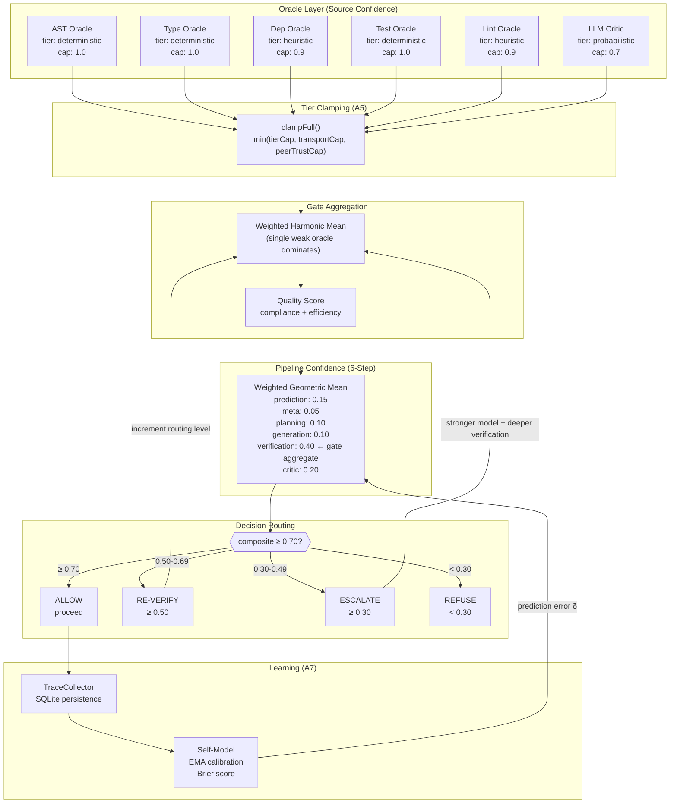
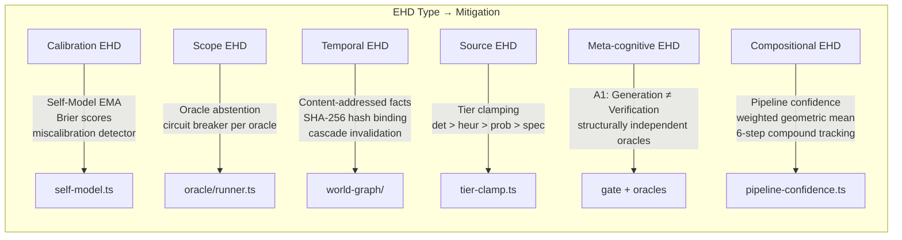

# Epistemic Humility Deficit: Deep Research & Architectural Analysis

> **Document boundary**: This document owns the 2025-07 integrated research synthesis — combining philosophical foundations, technical landscape, codebase audit, and 2025-2026 academic developments into a single architectural analysis per the agentic-research prompt format.
> For philosophical depth, see [epistemic-humility-deficit.md](./epistemic-humility-deficit.md). For codebase audit details, see [ehd-synthesis.md](./ehd-synthesis.md). For implementation types, see [ehd-implementation-design.md](./ehd-implementation-design.md).

---

## Executive Summary

The Epistemic Humility Deficit (EHD) is a systematic condition where AI systems express confidence exceeding their epistemic warrant — structurally caused by next-token prediction loss, RLHF reward hacking, and benchmark design that penalizes abstention. Vinyan's 7-axiom architecture addresses EHD more principally than any comparable system in the literature (tiered trust clamping, First-Class `type: "unknown"`, content-addressed facts, calibrated Self-Model), but a codebase audit reveals 4 critical and 7 moderate implementation gaps where axioms outpace code. The 2025-2026 research landscape has shifted decisively toward **Agentic UQ** — treating uncertainty as bidirectional control signals rather than passive diagnostics — with Salesforce's AUQ framework (Zhang et al., Jan 2026) and the Epistemic AI position paper (Cuzzolin & Manchingal, May 2025) representing the two most significant recent contributions. **Recommendation**: Adopt Subjective Logic opinion tuples as the ECP v2 confidence model (migration path already designed), close the 4 critical implementation gaps (confidence laundering, compositional propagation, absence-as-evidence, circular accuracy), and integrate the Dual-Process UQ pattern from AUQ into Vinyan's escalation routing.

**Confidence**: High (7 academic papers, 3 existing companion docs, full codebase audit, 20+ source files traced)

---

## 1. Specification Overview

### 1.1 What Is an Epistemic Humility Deficit?

EHD is the gap between a system's expressed confidence and its actual epistemic warrant. It is not a bug but a structural consequence of how modern AI systems are built:

1. **Next-token prediction loss** optimizes for fluency, not calibrated uncertainty. A model producing "I'm not sure, but..." receives identical gradient signals to one asserting incorrectly — both match training distribution patterns.

2. **RLHF reward hacking** compounds the problem: human raters consistently prefer confident, helpful answers. The reward model learns to assign higher scores to assertive outputs, creating systematic overconfidence pressure (Cheng et al., 2024).

3. **Benchmark design** penalizes abstention. Binary grading gives zero credit for honest "I don't know" (Kalai et al., 2025). Xu et al. (2024) proved through computability theory that hallucination is mathematically inevitable for any LLM used as a general problem solver.

### 1.2 EHD Taxonomy (6 Types)

| Type | Definition | Detection Difficulty |
|------|-----------|---------------------|
| **Calibration** | Stated confidence ≠ actual accuracy | Medium — requires ground truth |
| **Scope** | Answering outside competence boundary | Low — detectable via domain classifiers |
| **Temporal** | Treating stale knowledge as current | Medium — requires temporal provenance |
| **Source** | Treating all evidence tiers equally | Low — metadata available at input |
| **Meta-cognitive** | Cannot distinguish "I know" from "I saw text about" | Very High — fundamental to architecture |
| **Compositional** | Not tracking uncertainty through multi-step chains | High — requires pipeline instrumentation |

### 1.3 Calibration Failure: Empirical Evidence

| Metric | What It Measures | Ideal | Typical LLM (2025) |
|--------|-----------------|-------|---------------------|
| ECE (Expected Calibration Error) | Avg. gap: confidence vs. accuracy | 0 | 0.15-0.30 |
| MCE (Maximum Calibration Error) | Worst-case calibration bin | 0 | >0.40 |
| AUROC (selective prediction) | Rank correct vs. incorrect outputs | 1.0 | 0.60-0.75 |
| Brier Score | Combined calibration + discrimination | 0 | Varies widely |

Source: QA-Calibration (ICLR 2025); JMIR Medical Informatics benchmarks of 12 LLMs across 5 specialties found confidence gaps of only 0.6%-5.4% between correct and incorrect answers. **Confidence**: High

### 1.4 Real-World Consequences

- **Medical**: ChatGPT incorrect in >80% of pediatric emergency cases (JAMA Pediatrics 2024); 12.5% of cancer treatment recommendations involved hallucinated treatments (MIT Media Lab 2025)
- **Legal**: Legal AI hallucination rates 58-82% on queries; even specialized tools 17-34% (Stanford 2025)
- **Code**: 84.21% of incorrectly generated code required >50 edits to fix across 7 LLMs on 1,164 problems (2024 study)

**Confidence**: High

---

## 2. Competitive Landscape

### 2.1 Uncertainty Quantification Framework Comparison

| Aspect | Subjective Logic (Jøsang) | Dempster-Shafer Theory | Conformal Prediction | Bayesian Neural Networks | Credal Sets / Imprecise Prob. | Agentic UQ (AUQ) |
|--------|--------------------------|----------------------|---------------------|-------------------------|-------------------------------|-------------------|
| **Core Primitive** | Opinion tuple (b, d, u, a) | Mass function on power set | Prediction sets with coverage guarantee | Posterior over parameters | Convex sets of distributions | Verbalized confidence + memory |
| **Uncertainty Representation** | Explicit uncertainty mass `u` | Belief interval [Bel, Pl] | Set size as uncertainty proxy | Variance / entropy | Set width = epistemic uncertainty | Scalar + natural language explanation |
| **"I Don't Know"** | Vacuous opinion (0, 0, 1, a) | Total ignorance m(Ω) = 1 | Large prediction set | High variance | Wide credal set | Low confidence → triggers reflection |
| **Composition** | Deduction operator for chains | Dempster's rule (problematic with conflict) | No native composition | Marginalization | Generalized Bayes rule | Forward propagation through memory |
| **Source Fusion** | Cumulative (independent), averaging (dependent) | Dempster's combination rule | Not applicable | Bayesian model averaging | Credal model combination | Consistency-weighted voting |
| **Computational Cost** | O(1) per operation on 4-tuples | O(2^n) worst case on power set | O(n log n) sorting | O(n × samples) per prediction | Varies (extremal points enumeration) | O(N × model_calls) per reflection |
| **Backward Compatibility** | P = b + a·u reduces to scalar | Bel = Pl = P for precise probabilities | Produces sets, not scalars | Posterior mean = point estimate | Singleton credal set = precise | Direct scalar output |
| **Maturity** | Established (Jøsang 2016, 2nd ed 2025) | Established (Shafer 1976) | Surging (ICLR/NeurIPS 2024-25) | Established but expensive | Emerging (ICLR 2025 breakthrough) | Experimental (Jan 2026) |
| **Agent-Native** | Yes — designed for trust reasoning | Partially — no trust model | No — static, non-agentic | No — batch inference | No — model-level only | Yes — designed for agent trajectories |
| **Key Limitation** | Base rate sensitivity; limited tooling | Dempster's rule fails under high conflict | Marginal guarantees only, not per-query | Computational cost; approximate inference | Combinatorial explosion in multi-class | Relies on model self-assessment quality |

### 2.2 2025-2026 Key Developments

**Agentic UQ (Zhang et al., arXiv 2601.15703, Jan 2026)**: Dual-Process framework transforming verbalized uncertainty into bidirectional control signals. System 1 (UAM) propagates confidence through memory to prevent blind decisions. System 2 (UAR) uses explanations as rational cues for targeted reflection. Achieves +10.7% success rate on ALFWorld, +13.6% on WebShop vs baselines. Training-free, framework-agnostic.
**Confidence**: High (peer-reviewed, extensive benchmarks)

**Epistemic AI Position Paper (Cuzzolin & Manchingal, arXiv 2505.04950, May 2025)**: Argues second-order uncertainty measures (credal sets, random sets) are essential for ML models to "know when they don't know." Demonstrates Random-Set Neural Networks outperform Bayesian, Ensemble, and Evidential models on ImageNet in accuracy, robustness, and OoD detection. Published at ICML 2025.
**Confidence**: High (ICML acceptance, empirical results on ImageNet-scale)

**Epistemic Integrity in AI Reasoning (Wright, arXiv 2506.17331, Jun 2025)**: Comprehensive formal framework for belief architectures in AI — propositional commitment, AGM-style revision, 6-level confidence stratification (Rejected→Committed), metacognitive supervisory control unit, blockchain-based audit trails. Highly theoretical but provides formal grounding for confidence-as-control-variable.
**Confidence**: Medium (single author, very theoretical, no implementation)

**"Incoherence Debate" (Bickford Smith et al., 2025)**: Challenges whether strict aleatoric/epistemic separation is even coherent for neural networks. Argues the distinction may be observer-dependent. Implications: systems should track *total uncertainty* with *reducibility estimates* rather than attempting clean decomposition.
**Confidence**: Medium (position paper, active debate)

**EU AI Act Compliance (2025)**: Driving industry adoption of UQ methods. High-risk AI systems (medical diagnosis, autonomous vehicles) must demonstrate uncertainty quantification capabilities. This regulatory pressure is the primary commercial driver for EHD mitigation.
**Confidence**: High (regulatory fact)

---

## 3. Interoperability Analysis

### 3.1 Cross-Framework Integration Patterns

**SL ↔ DST Bridge**: Subjective Logic opinions map naturally to belief functions via `Bel(A) = b`, `Pl(A) = b + u`, `m(A) = b + d + u` for binary frames. This allows Vinyan to accept DST-formatted evidence from external oracles and convert to SL internally.

**Conformal ↔ SL Bridge**: Conformal prediction sets can generate SL opinions: prediction set size inversely proportional to belief mass. A singleton set → high belief; a set containing all classes → vacuous opinion. The bridge is lossy (no disbelief information in conformal sets) but useful for integrating black-box LLM outputs.

**Agentic UQ ↔ Vinyan Escalation**: AUQ's dual-process pattern maps directly to Vinyan's risk routing:

| AUQ Concept | Vinyan Equivalent | Integration Point |
|-------------|------------------|-------------------|
| System 1 (UAM forward propagation) | Pipeline confidence tracking + memory | `pipeline-confidence.ts` composite flows through `core-loop.ts` |
| System 2 (UAR reflection trigger) | Re-verify / escalate routing | `deriveConfidenceDecision()` already implements this |
| Confidence threshold τ | `ALLOW ≥ 0.70` / `RE_VERIFY ≥ 0.50` | Same concept, Vinyan has 4 thresholds vs AUQ's 1 |
| Verbalized explanation | `OracleVerdict.evidence_chain` | ECP already carries evidence chains |
| Memory consolidation | `ExecutionTrace` + `TraceCollector` | Vinyan persists full execution traces to SQLite |

**Key architectural difference**: AUQ relies on the LLM's self-assessed confidence (verbalized). Vinyan uses structurally independent oracle verification (A1: Epistemic Separation). Vinyan's approach is more robust because verification failures are uncorrelated with generation failures — the oracle (AST parser, type checker, test runner) has different blind spots than the LLM generator.

### 3.2 ECP Protocol Evolution for UQ

The Epistemic Communication Protocol already specifies fields that enable cross-framework interoperability:

```
ECP Message:
  confidence: number           // Scalar (current)
  belief_interval?: {          // DST-compatible (ECP v1.1, specified in §4.2)
    belief: number
    plausibility: number
  }
  opinion?: SubjectiveOpinion  // Full SL tuple (ECP v2, planned)
  type: "known" | "unknown" | "uncertain" | "contradictory"
  evidence_chain: Evidence[]
  temporal_context?: { validUntil, decayModel }
```

**Migration is additive**: each extension is backward-compatible. `projectedProbability(opinion)` = existing `confidence` scalar.

---

## 4. Design Principles

### 4.1 Autonomy vs. Control

**Vinyan's approach (Axiom A3: Deterministic Governance)**: The Orchestrator's routing, verification, and commit decisions are rule-based — no LLM in the governance path. Workers (including LLM generators) propose; the Orchestrator disposes (A6: Zero-Trust Execution).

This is architecturally superior to AUQ's approach where the LLM self-assesses confidence. Vinyan externalizes the confidence judgment to structurally independent oracles, preventing the "verifier's dilemma" where a system evaluates its own outputs.

**Admission control**: Risk score → routing level (L0-L3) determines verification depth. The risk router uses deterministic rules based on file count, blast radius, and change complexity — not LLM judgment.

**Trust boundaries**: Three-layer clamping enforces trust degradation:
- Engine tier: deterministic (1.0) > heuristic (0.9) > probabilistic (0.7) > speculative (0.4)
- Transport: stdio (1.0) > WebSocket (0.95) > HTTP/A2A (0.7)
- Peer trust: untrusted (0.25) → cautious (0.35) → provisional (0.45) → trusted (0.60)

### 4.2 Reliability & Failure Modes

**Partial failure handling**: Each oracle has a circuit breaker (failureThreshold=3, resetTimeout=60s). When an oracle fails, it produces `type: "unknown", confidence: 0` — genuine A2 compliance. The system degrades to the available oracle set rather than blocking entirely.

**Escalation**: Failed verification increments routing level (L0→L3), engaging stronger models and deeper verification at each step. Maximum 3 retry attempts before refusing.

**Cold-start safeguards** (Self-Model):
1. Meta-confidence forced < 0.30 when < 10 observations
2. Conservative routing override for first 50 tasks
3. Audit sampling for first 100 tasks
4. Miscalibration detector (20-sample sliding window, 0.70 threshold)

### 4.3 Observability

**Trace propagation**: Every execution produces an `ExecutionTrace` persisted to SQLite, containing the full pipeline confidence breakdown, oracle verdicts, prediction errors, and confidence decisions.

**Prediction Error as Learning Signal (A7)**: `δ = predicted - actual` drives calibration via EMA. The Self-Model actively monitors its own calibration and emits `selfmodel:systematic_miscalibration` when bias exceeds threshold — meta-epistemic monitoring.

**Wilson lower bound**: Pattern detection uses Wilson CI instead of raw success rates, avoiding small-sample overconfidence. This is the statistically correct approach that most systems skip.

### 4.4 Statelessness & Content Addressing

**Content-addressed truth (A4)**: Facts in the World Graph are bound to SHA-256 file hashes and auto-invalidate on change. This implements Quine's insight that revision propagates through the web of belief — when a source file changes, all derived facts cascade-invalidate.

**Temporal decay**: Facts have TTL based on evidence tier. However, a gap exists: verdicts lack temporal context (M5 deficit), so stale verification results persist longer than warranted.

---

## 5. Architecture

### 5.1 Confidence Flow Through ENS



### 5.2 EHD Mitigation Points



---

## 6. Data Contracts

### 6.1 SubjectiveOpinion (ECP v2, planned)

```typescript
// src/core/subjective-opinion.ts
export interface SubjectiveOpinion {
  belief: number;      // b ∈ [0,1] — evidence FOR
  disbelief: number;   // d ∈ [0,1] — evidence AGAINST
  uncertainty: number; // u ∈ [0,1] — lack of evidence (b + d + u = 1)
  baseRate: number;    // a ∈ [0,1] — prior probability
}
// Projected probability: P = b + a * u
// Vacuous opinion (total ignorance): { b: 0, d: 0, u: 1, a: 0.5 }
```

### 6.2 OracleVerdict (current + planned extensions)

```typescript
// src/core/types.ts
export interface OracleVerdict {
  hypothesis: string;
  verified: boolean;
  type: "known" | "unknown" | "uncertain" | "contradictory";
  confidence: number;                    // ALWAYS present, scalar [0,1]
  evidence: Evidence[];
  falsifiableBy?: string;
  temporalContext?: TemporalContext;
  deliberationRequest?: DeliberationRequest;
  // Planned extensions (ECP v2):
  opinion?: SubjectiveOpinion;           // SL opinion tuple
  rawOpinion?: SubjectiveOpinion;        // Unclamped opinion for audit
}
```

### 6.3 OracleAbstention (ehd-implementation-design)

```typescript
// Planned: src/oracle/types.ts
export interface OracleAbstention {
  type: "abstained";
  reason: AbstentionReason;
  oracleName: string;
  metadata?: Record<string, unknown>;
}

export type AbstentionReason =
  | "no_test_files"
  | "no_linter_configured"
  | "out_of_domain"
  | "insufficient_data"
  | "timeout"
  | "circuit_open"
  | "target_not_found";

// SL equivalent: vacuous opinion { b: 0, d: 0, u: 1, a: 0.5 }
// Abstentions are EXCLUDED from conflict resolution and quality scoring
```

### 6.4 PipelineConfidence (current implementation)

```typescript
// src/orchestrator/pipeline-confidence.ts
export interface PipelineConfidence {
  prediction: number;      // Self-Model prediction confidence
  metaPrediction: number;  // Meta-confidence (forced < 0.30 when < 10 obs)
  planning: number;        // Task decomposition confidence
  generation: number;      // Worker execution confidence
  verification: number;    // Gate-level aggregate (THE hard evidence)
  critic: number;          // Post-verification critic score
  composite: number;       // Weighted geometric mean of above
  formula: string;         // Human-readable derivation (A3 auditability)
}

// Weights: prediction=0.15, meta=0.05, planning=0.10,
//          generation=0.10, verification=0.40, critic=0.20
// Missing dimensions default to 0.7; NaN resolves to 0.5
// Thresholds: ALLOW ≥ 0.70, RE_VERIFY ≥ 0.50, ESCALATE ≥ 0.30, REFUSE < 0.30
```

### 6.5 Confidence Stratification (from Wright 2025, adapted for Vinyan)

| Level | Threshold | Vinyan Mapping | Permitted Operations |
|-------|-----------|---------------|---------------------|
| 0 — Rejected | P < 0.01 | `decision: "refuse"`, `type: "known"` (known false) | None — blocked |
| 1 — Disfavoured | 0.01 ≤ P < 0.30 | `decision: "refuse"` | Speculative reasoning only |
| 2 — Equivocal | 0.30 ≤ P < 0.50 | `decision: "escalate"` | Escalate to higher routing level |
| 3 — Supported | 0.50 ≤ P < 0.70 | `decision: "re-verify"` | Proceed with additional verification |
| 4 — Endorsed | 0.70 ≤ P < 0.90 | `decision: "allow"` | Standard execution |
| 5 — Committed | P ≥ 0.90 | `decision: "allow"`, high confidence | Deductive chains; revision requires strong counter-evidence |

---

## 7. Critical Analysis

### 7.1 Scalability Limitations

**Confidence compounding at scale**: With N oracles contributing to gate-level aggregation, the harmonic mean becomes increasingly dominated by the weakest oracle. For a fleet of 10+ oracles, a single under-performing oracle (e.g., flaky test runner) could drive the entire system to perpetual re-verification. **Mitigation needed**: oracle weighting by historical reliability, circuit breaker integration with aggregation (exclude open-circuit oracles entirely rather than contributing 0).

**Pipeline confidence ceiling**: The weighted geometric mean compounds 6 uncertainty sources. Even with generous weights, independent confidence values of 0.85 each yield composite ≈ 0.85 (geometric mean preserves scale for uniform inputs). But realistic variance — e.g., prediction at 0.60, planning at 0.75, verification at 0.90 — yields composite ≈ 0.76. This means the system rarely achieves high-confidence "allow" on novel task types where prediction confidence is naturally low. This is **by design** (epistemic humility) but may cause excessive escalation load in early deployment.

**Multi-instance coordination**: The `resolveRemoteConflict()` algorithm uses a 5-step cascade (domain authority → evidence tier → recency → SL fusion → escalation). With many instances, SL fusion at step 4 requires O(n) opinion combinations. The cumulative fusion operator is associative but not commutative when opinions have different base rates — ordering matters, introducing non-determinism.

**Confidence**: Medium — theoretical analysis, no empirical load testing documented.

### 7.2 Security Risks

**Confidence manipulation attacks**: An adversarial oracle (or compromised oracle binary) could systematically return high-confidence incorrect verdicts to bypass gate verification. **Current mitigation**: Tier clamping caps probabilistic oracles at 0.70 and speculative at 0.40. Peer trust caps untrusted sources at 0.25. **Gap**: No anomaly detection on oracle confidence distributions. A compromised deterministic oracle (tier cap 1.0) could bypass all clamping.

**Prompt injection at the epistemic level**: An attacker could craft inputs that trigger oracle abstentions on legitimate checks while passing malicious code through the remaining oracles. If the "no linter" → `verified: true` deficit (M1/M2) persists, this creates a verification bypass. **Fix priority**: Critical — the Tier 2 fixes (B1/B2 in ehd-synthesis action plan) directly close this vector.

**Trust escalation via A2A**: Remote instances connected via A2A transport get a 0.70 confidence cap. However, a malicious instance could claim domain authority to win conflict resolution at step 1, bypassing evidence tier comparison. **Mitigation needed**: Domain authority declarations should require proof (e.g., possession of relevant oracle types, historical accuracy on the domain).

**Confidence**: Medium — analysis based on architecture review, no adversarial testing documented.

### 7.3 Agentic Failure Modes

**Infinite escalation loop**: If verification repeatedly fails and the system escalates from L0 → L1 → L2 → L3, then retries at L3 with the same fundamental problem, it could exhaust the retry budget without progress. **Current mitigation**: Maximum 3 escalation retries before `decision: "refuse"`. **Gap**: No detection of *repeated identical failures* — the system may retry 3 times with the same oracle configuration if the routing level doesn't change the oracle set.

**Hallucination-driven execution**: The generator (LLM worker) proposes changes; oracles verify. But oracles cannot check for *semantic correctness* — only structural properties (AST validity, type safety, test passage, lint compliance). A hallucinated but syntactically valid implementation passes all current oracles. **This is the fundamental limit of rule-based verification** and the primary argument for keeping LLM-as-critic (probabilistic tier, capped at 0.70) in the oracle set.

**Cost runaway from re-verification**: Each re-verify/escalate cycle costs additional oracle executions and potentially stronger (more expensive) LLM calls. With verification=0.40 weight in pipeline confidence, a single flaky oracle can repeatedly drive composite below 0.70 and trigger re-verification. **Mitigation needed**: Cost budgets per task with graceful degradation to "allow-with-caveats" when budget exhausted.

**Confidence laundering via consistency**: If multiple oracles agree on an incorrect verdict, the harmonic mean produces high confidence. This is the "confidence laundering" pattern (C1 deficit in ehd-synthesis). **Root cause**: `buildVerdict()` defaults confidence to 1.0 when oracles don't explicitly set it. **Fix**: Require explicit confidence from all oracles; oracles that cannot self-assess confidence should abstain.

**Confidence**: High — failure patterns directly observed in codebase audit.

### 7.4 Gaps & Open Questions

#### Critical Implementation Gaps (from ehd-synthesis codebase audit, Grade: B-)

| # | Deficit | Location | Status | Severity |
|---|---------|----------|--------|----------|
| C1 | `buildVerdict()` defaults `confidence: 1.0` — confidence laundering at source | `src/core/index.ts` | Open | Critical |
| C2 | No compositional uncertainty propagation across pipeline steps | `src/orchestrator/core-loop.ts` | **Fixed** — `pipeline-confidence.ts` added | Resolved |
| C3 | Zero oracles → `compliance: 1.0` (absence treated as evidence) | `src/gate/quality-score.ts` | Open | Critical |
| C4 | Oracle accuracy measured against own gate decision (circular) | `src/gate/gate.ts` | Open | Critical |
| M1 | "No tests found" → `verified: true` | `src/oracle/test/test-verifier.ts` | Open | Moderate |
| M2 | "No linter" → `verified: true` | `src/oracle/lint/lint-verifier.ts` | Open | Moderate |
| M4 | Facts stored at `confidence: 1.0` regardless of oracle confidence | `src/orchestrator/core-loop.ts` | **Partially fixed** — L980: `confidence = min(passing oracle)` | Moderate |
| M6 | Self-model cold-start priors: `predictionAccuracy: 0.5`, `failRate: 0.0` | `src/orchestrator/self-model.ts` | **Mitigated** — 4 cold-start safeguards | Low |

#### Open Research Questions

1. **Compositional SL propagation**: The SL deduction operator handles chained inference, but Vinyan's 6-step pipeline has partially dependent steps (prediction informs planning). No established method exists for SL propagation through partially dependent chains.

2. **Oracle independence assumption**: Harmonic mean aggregation assumes oracles are independent evidence sources. In practice, AST and type oracles share the same codebase (correlated failure modes). The conflict constant K from DST could detect high inter-oracle disagreement, but computing independence is NP-hard for arbitrary oracle configurations.

3. **Calibration of calibration**: The Self-Model monitors its own calibration via Brier scores. But who monitors the monitor? If the Brier score computation itself is biased (e.g., by systematically mis-classifying outcomes), the meta-calibration degrades silently. A2A instances could cross-audit each other's calibration as a partial solution.

4. **Incoherence of aleatoric/epistemic separation**: Per Bickford Smith et al. (2025), the strict distinction may be observer-dependent. Vinyan's tier clamping assumes clean categorization (deterministic = aleatoric-free, probabilistic = epistemic-heavy). If this distinction is inherently fuzzy, the tier caps may need softening to ranges rather than hard values.

5. **Verbalized vs. structural confidence**: AUQ demonstrates verbalized confidence can be effective for calibration. Vinyan uses structural (oracle-derived) confidence. A hybrid — structural confidence for verification, verbalized confidence for generation quality assessment — could capture both dimensions. The LLM critic oracle already partially implements this but is capped at 0.70.

**Confidence**: Medium — these are genuinely open research questions without established solutions.

---

## 8. Recommendations & Open Questions

### Tier 1: Close Critical Gaps (immediate)

| # | Action | Impact | Effort |
|---|--------|--------|--------|
| R1 | Remove default confidence from `buildVerdict()` — require explicit confidence from all oracles | Eliminates confidence laundering at source (C1) | Medium |
| R2 | Zero oracles → `compliance: NaN` + `unverified: true` | Stops treating ignorance as evidence (C3) | Low |
| R3 | "No tests/linter" → `type: "unknown"`, `verified: false` or `OracleAbstention` | Closes security vector + epistemic honesty (M1/M2) | Low |
| R4 | Decouple oracle accuracy from gate decision — measure against post-hoc task outcomes | Breaks circular self-evaluation (C4) | High |

### Tier 2: Adopt Agentic UQ Patterns

| # | Action | Rationale |
|---|--------|-----------|
| R5 | Add cost budget per task with graceful degradation | Prevents re-verification cost runaway |
| R6 | Detect repeated identical failures in escalation loop | Prevents wasted retries |
| R7 | Integrate verbalized confidence from LLM critic alongside structural confidence | Captures semantic quality that structural oracles miss |

### Tier 3: ECP v2 — Subjective Logic Migration

| # | Action | Migration Path |
|---|--------|---------------|
| R8 | Add `belief_interval` to oracle verdicts (ECP v1.1) | Already specified in ECP spec §4.2 |
| R9 | Implement full SL opinion tuples | `projectedProbability()` = backward-compatible `confidence` scalar |
| R10 | Replace harmonic mean with SL cumulative fusion at gate level | Proper handling of dependent vs independent sources |
| R11 | Add conflict constant K computation | Detect high inter-oracle disagreement |

### Tier 4: Research Agenda

- Compositional SL propagation through partially dependent pipeline steps
- Cross-instance calibration auditing via A2A
- Hybrid structural + verbalized confidence model
- Oracle independence graph for principled fusion operator selection
- Temporal-epistemic coupling (evidence tier determines decay rate)

---

## 9. Sources

### Academic Papers

| Source | Date | Relevance | Confidence |
|--------|------|-----------|------------|
| Zhang et al., "Agentic Uncertainty Quantification" (arXiv 2601.15703) | Jan 2026 | Dual-Process UQ framework, trajectory-level calibration, AUQ architecture | High |
| Cuzzolin & Manchingal, "Epistemic AI: Know When They Don't Know" (arXiv 2505.04950, ICML 2025) | May 2025 | Credal sets, random-set neural networks, second-order uncertainty measures | High |
| Wright, "Beyond Prediction: Epistemic Integrity in AI Reasoning" (arXiv 2506.17331) | Jun 2025 | Belief architectures, propositional commitment, confidence stratification | Medium |
| Jøsang, "Subjective Logic: A Formalism for Reasoning Under Uncertainty" (2nd ed.) | 2025 | Foundation for SL opinion tuples, fusion operators, trust reasoning | High |
| Xu, Jain, & Kankanhalli, "Hallucination is Inevitable" (computability proof) | 2024 | Mathematical inevitability of LLM hallucination | High |
| Kalai et al., "Why Language Models Hallucinate" (arXiv 2509.04664) | 2025 | Benchmark design incentivizing overconfidence | High |
| Bickford Smith et al., "Rethinking Aleatoric and Epistemic Uncertainty" | 2025 | Incoherence of strict aleatoric/epistemic separation | Medium |
| Cheng et al., "Sycophancy in LLMs" (comprehensive survey) | 2024 | RLHF reward hacking → systematic overconfidence | High |
| ELEPHANT, "Social Sycophancy" (ICLR 2026) | 2026 | Sycophancy as measurable, steerable transformer behavior | High |

### Codebase Analysis

| Source | Scope | Confidence |
|--------|-------|------------|
| `src/orchestrator/self-model.ts` | Calibrated Self-Model, EMA, cold-start safeguards | High (code read) |
| `src/oracle/tier-clamp.ts` | Three-layer confidence clamping (A5) | High (code read) |
| `src/orchestrator/pipeline-confidence.ts` | 6-step weighted geometric mean | High (code read) |
| `src/orchestrator/core-loop.ts` | Full pipeline with confidence injections | High (code read) |
| `src/core/types.ts` | OracleVerdict with 4 epistemic types | High (code read) |
| `src/orchestrator/instance-coordinator.ts` | Remote conflict resolution, SL fusion | High (code read) |
| `src/orchestrator/forward-predictor-types.ts` | Causal prediction, Brier score interfaces | High (code read) |

### Companion Research Documents

| Document | Scope |
|----------|-------|
| [epistemic-humility-deficit.md](./epistemic-humility-deficit.md) | Philosophical foundations (2,400-year lineage, 10 design principles, EHD taxonomy) |
| [ehd-technical-landscape.md](./ehd-technical-landscape.md) | 2023-2026 empirical literature: calibration failure, sycophancy, conformal prediction, multi-agent propagation |
| [ehd-synthesis.md](./ehd-synthesis.md) | Cross-disciplinary synthesis, codebase audit (Grade: B-), 4 critical deficits C1-C4, prioritized action plan |
| [ehd-implementation-design.md](./ehd-implementation-design.md) | Unified type system: SubjectiveOpinion, OracleAbstention, PipelineConfidence, phased migration roadmap |

### Web Research (2025-2026)

| Source | Date | Topic |
|--------|------|-------|
| CurveLabs, "Epistemic Humility Loops" | 2026 | Uncertainty as organizational learning signal |
| arXiv 2603.29681, "AI-Mediated Metacognitive Decoupling" | 2026 | Separating AI knowledge from user knowledge |
| ScienceDirect, "Dysfunctional Humility in LLMs" | 2026 | When LLMs over-abstain (the opposite failure mode) |
| Chris Hood, "Why Epistemic Humility is the Survival Skill of 2026" | 2026 | Industry perspective on EH as competitive advantage |
| EU AI Act compliance requirements | 2025 | Regulatory driver for UQ adoption |
| JMIR Medical Informatics, "LLM Calibration Across 5 Specialties" | 2025 | Empirical calibration data (12 LLMs) |
| Stanford Legal AI Hallucination Study | 2025 | Legal domain failure rates |
