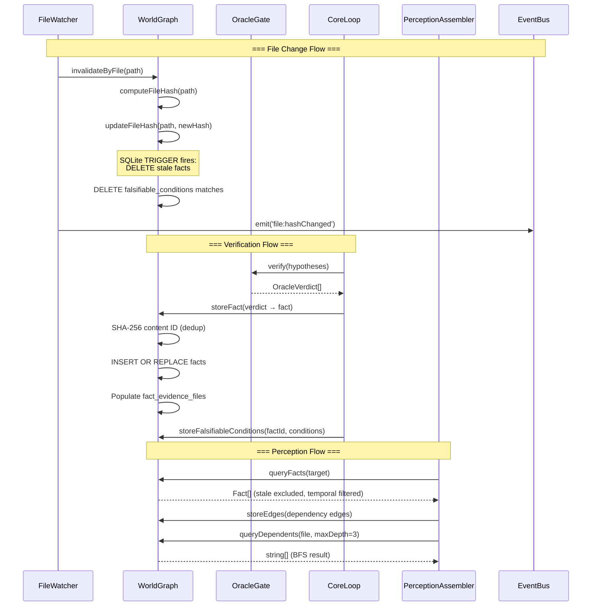
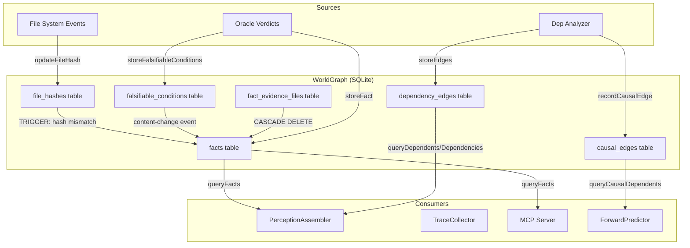
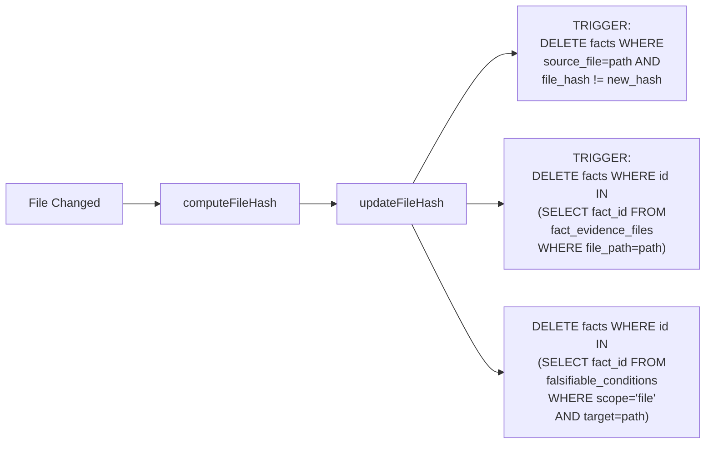

# WorldGraph: Deep Research & Architectural Analysis

**Date:** 2026-04-03
**Scope:** Vinyan's content-addressed fact store — architectural analysis, competitive landscape, design principles, and critical evaluation
**Document Boundary:** This document covers the WorldGraph as a knowledge persistence layer. For forward prediction, see [world-model-research.md](world-model-research.md). For World Model design, see [../design/world-model.md](../design/world-model.md).

---

## Executive Summary

Vinyan's `WorldGraph` is a **content-addressed, hash-bound knowledge graph** implemented as a single-file SQLite store. It combines three distinct graph structures — verified facts (knowledge graph), dependency edges (import graph), and causal edges (failure propagation graph) — into a unified substrate that serves as the agent's ground truth. Its key differentiator from all surveyed alternatives is **Axiom A4 compliance**: every fact is cryptographically bound to the source file hash at verification time, with automatic cascade invalidation via SQLite triggers when files change. This makes it a *self-pruning* knowledge base — a property no competing agent framework implements. The architecture is sound for single-agent use but faces scalability constraints at multi-worker and fleet scales.

**Confidence: High** (primary analysis based on full source code access + architecture documents)

---

## 1. Specification Overview

### 1.1 Core Primitives

WorldGraph is organized around six data structures persisted in SQLite:

| Table | Purpose | Primary Key | Key Invariant |
|-------|---------|-------------|---------------|
| `facts` | Oracle-verified propositions about the codebase | SHA-256 content hash of `(target, pattern, evidence)` | Auto-deleted when source file hash changes (A4) |
| `file_hashes` | Current SHA-256 hash of tracked files | File path | Single source of truth for file state |
| `fact_evidence_files` | Junction table for cross-file evidence | `(fact_id, file_path)` | CASCADE DELETE from `facts` |
| `dependency_edges` | Static import/dependency graph | `(from_file, to_file, edge_type)` | Populated by PerceptionAssembler |
| `causal_edges` | Observed failure propagation edges | `(source_file, target_file, oracle_name)` UNIQUE | Observation count monotonically increases |
| `falsifiable_conditions` | ECP §4.5 — conditions that invalidate facts | `(fact_id, raw_condition)` | Parsed from oracle verdicts |

### 1.2 Lifecycle & State Machine

```
File Changed → FileWatcher detects (chokidar)
  → invalidateByFile() computes new SHA-256
    → updateFileHash() writes file_hashes
      → SQLite TRIGGER: DELETE facts WHERE file_hash != new_hash
      → DELETE facts matching falsifiable_conditions
  → EventBus emits 'file:hashChanged'
```

Facts flow through a distinct lifecycle:

```
Oracle produces OracleVerdict
  → core-loop.ts calls storeFact()
    → SHA-256 content ID computed (deduplication)
    → INSERT OR REPLACE into facts
    → Populate fact_evidence_files junction
    → Periodic retention check (every 100 stores)
  → queryFacts() at Perceive phase
    → LEFT JOIN with file_hashes (stale? excluded)
    → Temporal filter: valid_until > now
    → Decay model applied at read time
```

### 1.3 Temporal Context (ECP §3.6)

Facts carry temporal metadata via three fields:

- `valid_until` (epoch ms): Hard expiration timestamp
- `decay_model`: `'none'` | `'step'` | `'linear'` | `'exponential'`
- Decay computation in `temporal-decay.ts` — applied at query time, not at storage

Decay models:

| Model | Behavior |
|-------|----------|
| `none` | Full confidence until `valid_until`, then 0 |
| `step` | Full confidence until `valid_until`, then 50% of original |
| `linear` | Decreases linearly from `verifiedAt` to `valid_until` |
| `exponential` | Half-life decay: `confidence × 2^(-elapsed/halfLife)` |

### 1.4 Retention Policy

Defined in `retention.ts` (TDD §5):

- `maxAgeDays`: 30 (default)
- `keepLastSessions`: 10 (protected from age-based deletion)
- `maxFactCount`: 50,000 (hard cap, oldest deleted first)
- Runs every 100 `storeFact()` calls

### 1.5 Version & Maturity

| Aspect | Status |
|--------|--------|
| Phase 0 (verification library) | ✅ Proven — production-tested |
| Phase 1 (autonomous agent integration) | ✅ Implemented — wired into core-loop |
| Phase 5 (causal edges, cross-file invalidation) | ✅ Implemented |
| Schema migrations | Additive only (`ALTER TABLE ADD COLUMN` with try/catch) |
| SQLite pragmas | WAL mode, foreign keys ON, autocheckpoint=200 |

**Confidence: High** (full source code read)

---

## 2. Competitive Landscape

| Aspect | **Vinyan WorldGraph** | **LangGraph Checkpointer** | **CrewAI Knowledge** | **MemGPT/Letta** | **AutoGen Memory** |
|--------|----------------------|---------------------------|---------------------|-----------------|-------------------|
| **Storage Engine** | SQLite (bun:sqlite) | Pluggable (SQLite, Postgres, Redis) | ChromaDB (vector) | SQLite + vector | In-memory / pluggable |
| **Data Model** | Typed facts + dependency graph + causal graph | State snapshots (serialized graph state) | Chunked documents with embeddings | Archival memory (vector) + recall memory (text) | Chat history + tool results |
| **Addressing** | Content-addressed (SHA-256 of fact content) | Version-addressed (checkpoint ID + thread ID) | Embedding similarity | Embedding similarity + recency | Conversation turn index |
| **Invalidation** | Automatic — file hash mismatch triggers DELETE | Manual — no auto-invalidation | Manual reset | No invalidation mechanism | No invalidation mechanism |
| **Truth Binding** | Facts bound to source file SHA-256 hash (A4) | None — snapshots are opaque blobs | None — embeddings persist indefinitely | None | None |
| **Provenance** | Full evidence chain (file:line:snippet per fact) | None — state is a snapshot, not evidence | Source document reference | Source text chunk | None |
| **Temporal Decay** | 4 decay models (none, step, linear, exponential) | None | None | Recency-weighted retrieval | None |
| **Graph Queries** | BFS over dependency + causal edges, bounded depth | Graph traversal (LangGraph nodes) | Embedding similarity search | Embedding similarity search | None |
| **Falsifiability** | Explicit per-fact conditions (ECP §4.5) | N/A | N/A | N/A | N/A |
| **Dependencies** | Zero (bun:sqlite built-in) | Varies by backend | ChromaDB + embedding provider | SQLite + FAISS/ChromaDB + OpenAI | Varies |

### Key Differentiators

1. **Content-addressed truth (unique to Vinyan)**: No other surveyed framework binds knowledge to source file hashes. LangGraph checkpoints are opaque state snapshots — if a file changes externally, the agent doesn't know its facts are stale. CrewAI embeds documents once and never rechecks freshness.

2. **Deterministic invalidation (unique to Vinyan)**: SQLite triggers automatically cascade-delete stale facts. This is fundamentally different from the vector-store approach where outdated embeddings coexist with current ones indefinitely.

3. **Graph structure vs. flat memory**: WorldGraph maintains three distinct graph structures (facts, dependencies, causal edges) queryable via BFS traversal. Most agent frameworks treat memory as a flat key-value store or an embedding index.

4. **No LLM in the retrieval path**: WorldGraph queries are deterministic SQL — no embedding computation, no LLM rewriting, no approximate nearest neighbor search. This makes retrieval reproducible and auditable (Axiom A3).

**Sources:** CrewAI Knowledge docs (crewai.com, 2026), LangGraph concepts docs (langchain-ai.github.io, 2025–2026), Lilian Weng "LLM-Powered Autonomous Agents" (lilianweng.github.io, Jun 2023), Wikipedia: Content-addressable storage (Feb 2026), Wikipedia: Knowledge graph (Mar 2026)

**Confidence: High** (direct source comparison)

---

## 3. Interoperability Analysis

### 3.1 Integration Points in Vinyan

WorldGraph is consumed by six distinct subsystems:

| Consumer | File | Operation | Purpose |
|----------|------|-----------|---------|
| **Core Loop** (Verify phase) | `core-loop.ts` | `storeFact()` | Persist oracle verdicts as verified knowledge |
| **PerceptionAssembler** (Perceive phase) | `perception.ts` | `queryFacts()`, `storeEdges()` | Build task context from known facts + dep graph |
| **Gate Hooks** (Phase 0) | `hooks.ts` | `storeFact()`, `invalidateByFile()` | Record gate verdicts, invalidate on file change |
| **FileWatcher** (runtime) | `file-watcher.ts` | `invalidateByFile()`, `updateFileHash()` | React to filesystem changes via chokidar |
| **MCP Server** | `mcp.ts` | Constructor | Expose WorldGraph to external tools |
| **TraceCollector** | `trace-collector.ts` | `invalidateByFile()` | Post-task cleanup |

### 3.2 Cross-Protocol Communication

- **Internal**: WorldGraph is accessed directly via TypeScript method calls — no protocol boundary
- **MCP (external)**: Exposed through the MCP server for external tool access to fact queries
- **Worker isolation**: Read-only SQLite copy per worker (Orchestrator is single writer — Decision D2)
- **ECP integration**: `OracleVerdict.temporalContext` maps to `Fact.validUntil` + `Fact.decayModel`; `OracleVerdict.falsifiableBy` maps to `falsifiable_conditions` table

### 3.3 Known Integration Challenges

1. **No cross-instance synchronization**: WorldGraph is a local SQLite file. Multi-instance Vinyan coordination (Phase 5 A2A) would require a separate synchronization layer.
2. **File path coupling**: Facts reference absolute file paths — workspace relocation invalidates all path-based lookups.
3. **No streaming API**: Consumers must poll `queryFacts()` — there's no pub/sub mechanism for "new fact arrived" (the EventBus covers file changes, not fact insertions).

**Confidence: High** (direct code tracing)

---

## 4. Design Principles

### 4.1 Autonomy vs. Control

| Principle | Implementation |
|-----------|---------------|
| **Admission Control** | Facts are only admitted via `storeFact()`, which requires oracle provenance (`oracleName`, `evidence[]`). No fact enters without a verifying oracle. |
| **Delegation pattern** | Push-based: oracles produce verdicts → core-loop pushes to WorldGraph. WorldGraph never queries oracles. |
| **Trust boundaries** | Workers get read-only copies. Only the Orchestrator can write (A6: Zero-Trust Execution). |
| **No LLM in governance** | All WorldGraph operations are deterministic SQL — never routed through an LLM (A3). |

### 4.2 Reliability & Failure Modes

| Scenario | Handling |
|----------|---------|
| **Stale facts** | Content-hash binding + SQLite trigger auto-deletes mismatched facts |
| **Corrupt DB** | WAL mode provides crash recovery; if inconsistent, invalidate entire dependency cone and rebuild from source |
| **Retention overflow** | Three-tier policy: age-based → session-protected → hard cap |
| **Concurrent access** | SQLite WAL allows concurrent reads, single writer. No explicit locking needed. |
| **File deletion** | FileWatcher sets hash to `'DELETED'` — all facts for that file become stale |

### 4.3 Observability

| Signal | Mechanism |
|--------|-----------|
| **Fact store count** | Internal `storeCount` counter, triggers retention |
| **File hash changes** | EventBus `file:hashChanged` event |
| **Causal edge statistics** | `getCausalEdgeCount()`, `getCausalEdges()` |
| **Missing** | Fact query latency, cache hit rate, invalidation frequency — not instrumented |

### 4.4 Statelessness & Workspace Integrity

- **Content addressing**: Fact IDs are SHA-256 of `(target, pattern, evidence)` — deterministic deduplication. Storing the same verified fact twice is a no-op.
- **Session awareness**: Facts carry `sessionId` — allows session-scoped queries and retention protection.
- **WAL hygiene**: Explicit `PRAGMA wal_autocheckpoint = 200` prevents WAL bloat; `close()` truncates WAL before shutdown.

---

## 5. Architecture

### 5.1 Component Interaction Diagram



### 5.2 Data Flow Diagram



### 5.3 Invalidation Cascade Detail



---

## 6. Data Contracts

### 6.1 Fact (Core Entity)

```typescript
interface Fact {
  id: string;            // SHA-256(target + pattern + evidence)
  target: string;        // File path or symbol identifier
  pattern: string;       // What was verified ("symbol-exists", "function-signature", etc.)
  evidence: Evidence[];  // Provenance chain
  oracleName: string;    // Which oracle produced this
  fileHash: string;      // SHA-256 of source file at verification time
  sourceFile: string;    // Absolute path to source file
  verifiedAt: number;    // Unix epoch ms
  sessionId?: string;    // Session that produced this
  confidence: number;    // 1.0 for deterministic, <1.0 for heuristic
  validUntil?: number;   // Epoch ms — ECP §3.6
  decayModel?: 'linear' | 'step' | 'none' | 'exponential';
}
```

### 6.2 Evidence (Provenance Unit)

```typescript
interface Evidence {
  file: string;          // Source file path
  line: number;          // Line number in source
  snippet: string;       // Code snippet at evidence location
  contentHash?: string;  // SHA-256 of file at evidence time
}
```

### 6.3 Causal Edge

```typescript
// Stored in causal_edges table
interface CausalEdge {
  sourceFile: string;        // File whose change broke target
  targetFile: string;        // File that broke
  oracleName: string;        // Oracle that detected the breakage
  confidence: number;        // Edge strength (0.0–1.0)
  observationCount: number;  // Times this edge was observed
  lastObservedAt: number;    // Epoch ms
}
```

### 6.4 Dependency Edge

```typescript
// Stored in dependency_edges table
interface DependencyEdge {
  from_file: string;   // Importing file
  to_file: string;     // Imported file
  edge_type: string;   // 'imports' (default), extensible
  updated_at: number;  // Unix epoch seconds
}
```

### 6.5 Falsifiable Condition

```typescript
// Stored in falsifiable_conditions table
interface FalsifiableCondition {
  fact_id: string;       // References facts.id
  scope: string;         // 'file' | 'symbol' | etc.
  target: string;        // Path or identifier to watch
  event: string;         // 'content-change' | etc.
  raw_condition: string; // Original condition string from oracle
}
```

---

## 7. Critical Analysis

### 7.1 Scalability Limitations

| Bottleneck | Impact | Severity |
|------------|--------|----------|
| **Single SQLite file** | No horizontal scaling; single-writer constraint | Medium — sufficient for single-agent, blocks fleet |
| **BFS traversal is per-query** | `queryDependents()` re-traverses on every call; no caching | Low — bounded by maxDepth=3, ~ms range |
| **Synchronous file hashing** | `readFileSync` in `computeFileHash()` blocks the event loop for large files | Medium — should be async |
| **No batch query API** | `queryFacts()` takes a single target; no multi-target batch | Low — SQLite is fast for point queries |
| **50K fact hard cap** | Large monorepos may exceed this; oldest facts deleted regardless of importance | Medium — could use priority-based retention |
| **No index on `verified_at`** | Retention queries (`ORDER BY verified_at ASC LIMIT ?`) do full table scan | Low — runs infrequently (every 100 stores) |

### 7.2 Security Risks

| Risk | Assessment | Mitigation |
|------|------------|------------|
| **Path traversal in `computeFileHash`** | `readFileSync` with user-provided path could read arbitrary files | Low risk — paths come from FileWatcher (workspace-scoped) and oracles (sandboxed) |
| **SQL injection** | All queries use parameterized statements (`?` bindings) | ✅ Mitigated |
| **Fact spoofing** | A malicious oracle could store false facts | Mitigated by A1 (generation ≠ verification) and A6 (zero-trust workers) |
| **Hash collision** | SHA-256 collision could cause fact deduplication errors | Negligible — collision probability is 1/2¹²⁸ |
| **WAL file exposure** | SQLite WAL contains recent writes in plaintext | Low risk — `.vinyan/` is workspace-local |
| **Retention race condition** | `runRetention()` uses separate COUNT + DELETE — not atomic | Low risk — worst case: slightly over/under the cap |

### 7.3 Agentic Failure Modes

| Failure Mode | Current Handling | Improvement Opportunity |
|-------------|------------------|------------------------|
| **Fact avalanche on major refactor** | FileWatcher triggers mass invalidation → all facts for changed files deleted | Could batch invalidations and rebuild incrementally |
| **Causal edge explosion** | No limit on causal edges per file pair | `pruneStaleCausalEdges()` exists (90-day TTL) but no density limit |
| **Evidence chain rot** | Evidence references file:line, but line numbers drift after edits | Content hash on evidence helps, but line numbers become stale |
| **Clock skew** | `verifiedAt` and `validUntil` use `Date.now()` — no monotonic clock | Could affect temporal decay if system clock changes |
| **Retention during burst** | Retention runs every 100 stores — a burst of 99 stores won't trigger cleanup | Acceptable — 99 extra facts is negligible |
| **`storeCausalEdgesTyped` not transactional** | Loops over individual `recordCausalEdge` calls — no BEGIN/COMMIT | Could fail partway through; contrast with `storeEdges()` which is transactional |

### 7.4 Architectural Strengths

1. **Self-healing knowledge**: The SHA-256 hash binding + trigger-based invalidation means WorldGraph *cannot* serve stale facts for files that have changed. This is a property most knowledge systems lack entirely.

2. **Zero external dependencies**: Using `bun:sqlite` means no network calls, no embedding API, no vector DB server. The WorldGraph works offline, in CI, in containers, with no configuration.

3. **Deterministic reproducibility**: Given the same set of oracle verdicts and file states, WorldGraph will produce identical query results. No randomness, no embedding drift, no approximate matching.

4. **Principled separation**: Facts (what is true), dependencies (what relates to what), and causality (what breaks what) are separate tables with distinct schemas — not conflated into a single embedding space.

5. **Axiom alignment**: Every design decision traces to a core axiom:
   - Content-addressed IDs → A4 (Content-Addressed Truth)
   - Deterministic SQL queries → A3 (Deterministic Governance)
   - Oracle-verified admission → A1 (Epistemic Separation)
   - Read-only worker copies → A6 (Zero-Trust Execution)
   - Confidence scores → A5 (Tiered Trust)

---

## 8. Recommendations & Open Questions

### Recommendations

| # | Recommendation | Rationale | Effort |
|---|---------------|-----------|--------|
| R1 | **Add observability metrics** | Instrument `storeFact()`, `queryFacts()`, and invalidation counts via EventBus. Current blind spots: query latency, cache hit rate, invalidation cascade size. | Low |
| R2 | **Async file hashing** | Replace `readFileSync` in `computeFileHash()` with `Bun.file().arrayBuffer()` to prevent event loop blocking on large files. | Low |
| R3 | **Batch query API** | Add `queryFactsBatch(targets: string[]): Map<string, Fact[]>` for PerceptionAssembler use cases where multiple targets are queried in sequence. | Low |
| R4 | **Priority-based retention** | The 50K hard cap deletes oldest first regardless of value. Weight by (a) recency of access, (b) oracle trust tier, (c) causal edge count. | Medium |
| R5 | **Wrap `storeCausalEdgesTyped` in transaction** | Currently loops without BEGIN/COMMIT — inconsistent with `storeEdges()` pattern. | Low |
| R6 | **Add `verified_at` index** | Retention queries scan by `verified_at` — an index would help at scale, though currently infrequent enough to not matter. | Low |
| R7 | **Fact insertion events** | Emit `fact:stored` event on EventBus to enable reactive consumers (e.g., ForwardPredictor cache refresh). | Medium |

### Open Questions

| Question | Context | Priority |
|----------|---------|----------|
| How to synchronize WorldGraph across fleet workers? | Phase 4/5 — current design assumes single writer | High for fleet mode |
| Should dependency edges carry confidence scores? | Currently binary (exists/not); causal edges have confidence | Medium |
| How to handle workspace relocation (path changes)? | All facts reference absolute paths | Low — workspace moves are rare |
| Should `queryFacts()` return decayed confidence values? | Currently returns original confidence; decay computed externally in `temporal-decay.ts` | Medium — could reduce consumer complexity |
| What's the optimal retention interval? | Currently every 100 stores — no empirical tuning | Low — 100 is reasonable |
| Should there be a `queryFactsByOracle()` method? | No way to query "all facts from the type oracle" without scanning full table | Low — not currently needed |

---

## 9. Sources

| Source | Date | Type | Confidence |
|--------|------|------|------------|
| Vinyan WorldGraph source code (`world-graph.ts`, `schema.ts`, `retention.ts`, `temporal-decay.ts`, `file-watcher.ts`) | 2026-04 | Primary — full code read | **High** |
| Vinyan architecture decisions (`decisions.md` D2) | 2026 | Primary — design rationale | **High** |
| Vinyan World Model design (`world-model.md`) | 2026-04 | Primary — forward predictor context | **High** |
| Vinyan world model research (`world-model-research.md`) | 2026-07 | Primary — theoretical grounding | **High** |
| Wikipedia: Content-addressable storage | Feb 2026 | Reference — CAS fundamentals | **High** |
| Wikipedia: Knowledge graph | Mar 2026 | Reference — KG taxonomy and history | **High** |
| CrewAI Knowledge documentation (crewai.com) | 2026 | Competitor — vector-based knowledge store | **High** |
| Lilian Weng, "LLM-Powered Autonomous Agents" (lilianweng.github.io) | Jun 2023 | Survey — agent memory taxonomy | **High** |
| Ha & Schmidhuber, "World Models" (NIPS 2018) | 2018 | Foundational — world model concept | **High** (foundational) |
| Craik, K. "The Nature of Explanation" | 1943 | Foundational — mental models theory | **High** (foundational) |
| Park et al., "Generative Agents" (arXiv:2304.03442) | Apr 2023 | Reference — memory stream architecture | **Medium** |
| Shinn & Labash, "Reflexion" (arXiv:2303.11366) | Mar 2023 | Reference — dynamic memory + self-reflection | **Medium** |
