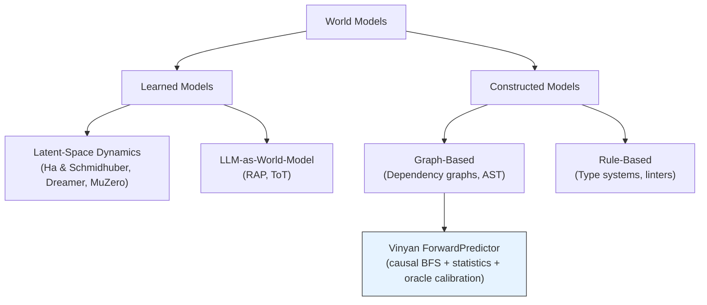

# World Model Research — Forward Prediction for Coding Agents

**Date:** 2026-07-14
**Scope:** Deep research on World Model concepts, techniques, and calibration methods — contextualizing against Vinyan's ForwardPredictor design
**GAP Reference:** gap-analysis.md §10.2 GAP-A (World Graph ≠ World Model)

> **Document boundary**: This document owns research context, theoretical grounding, and design critique for the World Model / Forward Predictor.
> For implementation spec, see [world-model.md](../design/world-model.md). For existing Self-Model spec, see [decisions.md D11](../architecture/decisions.md).

---

## 1. Executive Synthesis

Vinyan's World Model gap (GAP-A) identifies that the system is **backward-looking**: WorldGraph stores verified facts ("what IS true") but cannot predict "what WILL happen if I change file X." The ForwardPredictor design document proposes a 3-tier prediction system (Heuristic → Statistical → Causal) to close this gap.

This research validates the design's theoretical grounding across three domains:

| Domain | Key Finding | Vinyan Relevance |
|--------|------------|-----------------|
| **Model-Based RL** | Predict-then-act consistently outperforms reactive agents: DreamerV3 masters 150+ tasks, MuZero achieves superhuman planning without rules | Validates the fundamental premise that forward prediction before dispatch is worth the overhead |
| **LLM Agent Planning** | LLMs lack persistent internal world models; external world models + tree search (RAP, ToT) dramatically improve reasoning | Vinyan's explicit WorldGraph + causal BFS is the correct architecture — don't rely on LLM implicit "world knowledge" |
| **Calibration Science** | Brier score is the gold standard proper scoring rule for probabilistic prediction; 3-component decomposition (Uncertainty, Reliability, Resolution) enables targeted improvement | Vinyan's choice of Brier score for test outcome calibration is theoretically sound; should add reliability/resolution decomposition |

**Critical gap identified**: Vinyan's ForwardPredictor predicts consequences of its *own* actions (self-model), not consequences of *arbitrary code changes* (true world model). This is a strength, not a limitation — the design correctly scopes to what's verifiable via deterministic oracles.

---

## 2. Theoretical Foundations

### 2.1 Cognitive Science Origin: Mental Models (Craik, 1943) 🟢

Kenneth Craik proposed that organisms construct "small-scale models" of external reality to anticipate events, reason, and plan (Craik, 1943). Key properties:

- **Structural correspondence**: Model mirrors relevant relations in the real system
- **Predictive**: Run the model forward to anticipate outcomes without physical trial
- **Updateable**: Models are revised when predictions fail

**Vinyan mapping**: WorldGraph = structural model of codebase; ForwardPredictor = running the model forward; Brier score calibration loop = updating when predictions fail. The design directly implements Craik's three properties.

### 2.2 Ha & Schmidhuber — "World Models" (2018) 🟢

The foundational paper defining world models in deep RL (Ha & Schmidhuber, NIPS 2018). Architecture:

```
V (Vision) → VAE encoder, compresses observation into latent z
M (Memory) → MDN-RNN, predicts future z given current z + action
C (Controller) → Simple linear mapping from z to action
```

**Key insights applicable to Vinyan:**

| Ha & Schmidhuber Concept | Vinyan Analog | Gap |
|--------------------------|--------------|-----|
| V: Compress observation to latent representation | PerceptualHierarchy: dep-cone, diagnostics, file hashes | ✅ Comparable — Vinyan uses structured features instead of learned latent space |
| M: Predict next latent state | ForwardPredictor: predict test outcomes + blast radius | ✅ Designed — statistical + causal tiers |
| C: Act based on predictions | Orchestrator: routing level based on predicted risk | ✅ Designed — escalation when causal risk > 0.7 |
| "Temperature" parameter for dream generation uncertainty | `confidence` field in OutcomePrediction | ✅ Designed — 0.0-1.0 scale |
| Training agent entirely in hallucinated "dreams" | Not applicable — Vinyan has deterministic oracle ground truth | N/A — Vinyan's Oracle feedback is more reliable than dream-based training |

**Critical difference**: Ha & Schmidhuber's world model **learns** a latent-space dynamics model from raw observations. Vinyan's world model is **constructed** from deterministic static analysis (AST, type system, dependency graph) and **calibrated** from oracle outcomes. This is architecturally sounder for code — code has formal structure that doesn't need to be "discovered" via gradient descent.

> 🟢 **Established**: V+M+C architecture is the canonical reference for world models in RL. CarRacing score 906±21 (Ha & Schmidhuber, 2018).

### 2.3 Dreamer Series — Learning to Plan with World Models 🟢

**DreamerV2** (Hafner et al., ICLR 2021): First purely model-based agent to achieve human-level performance on Atari. Key innovation: discrete representations (categorical distributions) instead of Gaussian in the world model.

**DreamerV3** (Hafner et al., 2023; published Nature 2025): General algorithm mastering 150+ diverse tasks with a single set of hyperparameters. First to collect diamonds in Minecraft from scratch without human demonstrations.

| DreamerV3 Principle | Vinyan Application | Analysis |
|--------------------|--------------------|----------|
| **Symlog predictions**: Scale-invariant prediction targets | PredictionDistribution uses percentiles (lo/mid/hi) — naturally scale-invariant | ✅ Compatible |
| **Uniform mix for exploration**: 1% uniform random actions mixed in | Cold-start safeguards S1-S4: conservative override period, forced L2 minimum | ✅ Analogous — prevents overconfident early routing |
| **Single hyperparameter set across all domains** | Data gates (100 traces → Tier 2, 50 edges → Tier 3) — fixed thresholds | 🟡 Vinyan thresholds are hand-tuned, not learned |
| **Discrete world model representations** | Prediction basis: 'heuristic' \| 'statistical' \| 'causal' — discrete tiers | Partial — discrete tiers but continuous predictions within each |
| **Imagination-based planning**: Imagine trajectories, pick best | ForwardPredictor feeds PLAN step for sub-plan ranking | ✅ Designed but not yet counterfactual ("what if I used approach B?") |

> 🟢 **Established**: DreamerV3 is SOTA for general model-based RL. Proves world models generalize across wildly different domains with fixed architecture.

### 2.4 MuZero — Planning Without Rules 🟢

MuZero (Schrittwieser et al., Nature 2020): Achieves superhuman performance in Go, chess, shogi, and Atari **without knowing the game rules**. Key architecture:

```
h(observation) → hidden state s₀           (representation function)
g(sₖ, action) → sₖ₊₁, reward              (dynamics function)
f(sₖ) → policy, value                      (prediction function)
```

MuZero uses MCTS (Monte Carlo Tree Search) over the learned model for planning. It learns a "value-equivalent" model — the model doesn't need to predict raw observations, only the quantities needed for planning (reward, value, policy).

**Vinyan parallel**: ForwardPredictor predicts exactly the quantities needed for routing decisions (test outcome probability, blast radius, quality score) — not raw oracle outputs. This is the MuZero design principle of predicting only what matters for decision-making.

| MuZero Concept | Vinyan Analog |
|---------------|--------------|
| Value-equivalent model (predict what matters for decisions) | ForwardPredictor predicts routing-relevant quantities, not raw oracle verdicts |
| MCTS planning over learned dynamics | BFS over causal_edges — deterministic, not learned |
| No knowledge of rules | Full knowledge of code structure via AST/type/dep oracles |
| Learns from self-play | Learns from oracle outcomes (prediction error → calibration) |

**Stochastic MuZero** (Antonoglou et al., ICLR 2022 Spotlight): Extends MuZero to stochastic environments via afterstates and VQ-VAE for chance outcomes.

> 🟢 **Established**: MuZero is the strongest evidence that planning with a learned model matches or exceeds planning with perfect knowledge. Published in Nature.

### 2.5 RAP — LLM as World Model (Hao et al., EMNLP 2023) 🟡

"Reasoning with Language Model is Planning with World Model" proposes using the LLM itself as both world model AND reasoning agent, combined with MCTS planning.

**Core insight**: LLMs lack a persistent, updatable internal world model. RAP compensates by:
1. Using the LLM to simulate state transitions (world model role)
2. Using the LLM to generate candidate actions (agent role)
3. Using MCTS to explore the action space with the LLM-as-world-model providing "rollouts"

**Result**: RAP on LLaMA-33B surpasses Chain-of-Thought on GPT-4 by 33% on plan generation tasks.

**Vinyan implications**:
- RAP validates that **external, explicit world models beat implicit LLM world knowledge** — directly supports Vinyan's WorldGraph + ForwardPredictor design
- RAP uses LLM for state transitions (expensive, unreliable); Vinyan uses deterministic oracles (cheap, ground truth) — Vinyan's approach is strictly superior for code domains
- MCTS-style exploration could enhance Vinyan's PLAN step (currently TaskDecomposer does single-pass LLM plan generation, no search)

> 🟡 **Emerging**: RAP is a strong signal but MCTS+LLM is computationally expensive and not yet proven at scale in coding tasks.

### 2.6 Tree of Thoughts (Yao et al., NeurIPS 2023) 🟢

Extends Chain-of-Thought to deliberate problem solving:
- **Branching**: Generate multiple reasoning paths from each state
- **Evaluation**: Score each path (LLM as evaluator or external heuristic)
- **Search**: BFS or DFS over the thought tree

**Vinyan mapping**: Currently, Vinyan's TaskDecomposer generates a single DAG from the LLM. ForwardPredictor could enable ToT-style planning:
1. TaskDecomposer generates N candidate plans
2. ForwardPredictor scores each plan (predicted quality, blast radius, duration)
3. Best plan is executed
4. Prediction error from actual outcome calibrates future scoring

This is a natural extension point but **not in the current world-model.md spec**. Should be Phase 3+ after ForwardPredictor accuracy is established.

> 🟢 **Established**: ToT published at NeurIPS 2023. Proven improvements on Game of 24 (74% vs 4% for CoT), creative writing, crosswords.

### 2.7 I-JEPA — Joint Embedding Predictive Architecture (Assran et al., ICCV 2023) 🟡

LeCun's proposed path to more "human-like" AI: learn by predicting representations (not pixels/tokens).

```
Context block → Encoder → Joint embedding space ← Target block
                    ↓
              Predictor: predict target representation from context
```

**Key design choice**: Predict in **representation space** (semantic), not **pixel/token space** (syntactic). This focuses learning on semantically meaningful features.

**Vinyan analog**: Vinyan predicts in "decision-relevant feature space" — test outcome probability, blast radius, quality score — not in raw code diff space. This is the I-JEPA principle applied to software engineering: predict the quantities that matter for routing, not the raw outputs.

**Contrast with Vinyan's theory.md L7**: theory.md already identifies L7 (Self-Model / Metacognition) as bridging World Graph (verified facts) and World Model (predictive causal model), citing LeCun JEPA and DreamerV3. The ForwardPredictor design implements this bridge.

> 🟡 **Emerging**: I-JEPA is influential but primarily validated on vision tasks (ImageNet). The "predict in representation space" principle is broadly applicable but hasn't been proven in code/SE domains.

---

## 3. Calibration Theory

### 3.1 Brier Score — Proper Scoring Rule 🟢

The Brier score (Brier, 1950) is the standard metric for evaluating probabilistic predictions:

$$BS = \frac{1}{N} \sum_{t=1}^{N} (f_t - o_t)^2$$

Where $f_t$ is predicted probability and $o_t$ is actual outcome (0 or 1).

**Properties**:
- Range [0, 1]: 0 is perfect, 1 is worst
- **Strictly proper scoring rule**: The expected Brier score is uniquely minimized when the predicted probability equals the true probability (Gneiting & Raftery, 2007)
- Equivalent to MSE for probability predictions

**Multi-class extension** (Vinyan's 3-class test outcome: pass/partial/fail):

$$BS = \frac{1}{N} \sum_{t=1}^{N} \sum_{i=1}^{R} (f_{ti} - o_{ti})^2$$

This is Brier's original 1950 formulation. For $R=3$ (pass/partial/fail), the maximum possible score is 2.0.

**Vinyan's formula in world-model.md** uses: `(pPass - actual)² + (pPartial - actual)² + (pFail - actual)²` — this is correct for a single prediction instance with one-hot encoding of the actual outcome.

### 3.2 Brier Score Decomposition 🟢

Murphy (1973) decomposed the Brier score into three additive components:

$$BS = \underbrace{REL}_{\text{Reliability}} - \underbrace{RES}_{\text{Resolution}} + \underbrace{UNC}_{\text{Uncertainty}}$$

| Component | Meaning | Vinyan Implication |
|-----------|---------|-------------------|
| **Reliability** (REL) | ชี้วัดว่า predicted probability ตรงกับ actual frequency แค่ไหน — lower is better | If ForwardPredictor says "80% pass", it should pass 80% of the time |
| **Resolution** (RES) | ชี้วัดว่า conditional probabilities ต่างจาก base rate แค่ไหน — higher is better | ForwardPredictor should differentiate risky tasks from safe tasks, not just predict the average |
| **Uncertainty** (UNC) | Inherent uncertainty in outcomes — cannot be reduced by the forecaster | Depends on how "random" test outcomes actually are for the codebase |

**Recommendation**: Vinyan's `getCalibrationSummary()` should expose REL/RES/UNC decomposition, not just aggregate Brier score. This enables targeted improvement:
- High REL → predictor is overconfident or underconfident → adjust confidence bounds
- Low RES → predictor isn't discriminating between easy and hard tasks → improve features

### 3.3 Brier Score Shortcomings 🟢

- **Rare events**: Brier score is inadequate for very rare events because it doesn't discriminate between small probability changes that are significant (Benedetti, 2010)
- **Sample size**: Requires n > 1000 for reliable evaluation of higher-skill forecasts of rare events (Wilks, 2010)
- **Not superior**: An incorrect but confident forecast can receive a better Brier score than a correct but uncertain one (Ahmadian et al., 2024)

**Vinyan implications**:
- With data gate at 100 traces → Brier score is somewhat unreliable for rare failure modes
- `forwardpredictor:miscalibration` threshold at Brier > 0.4 over 20 predictions is conservative (good)
- Consider adding Penalized Brier Score (PBS) for cases where wrong prediction must always score worse than correct prediction

### 3.4 Alternative Scoring Rules 🟡

| Rule | Properties | When to Use |
|------|-----------|-------------|
| **Logarithmic** | Strictly proper, local, penalizes confident wrong predictions severely | When extreme miscalibration is costly (L3 routing decisions) |
| **CRPS** (Continuous Ranked Probability Score) | For continuous distributions | Blast radius and quality score predictions (continuous, not categorical) |
| **Interval Score** | Evaluates prediction intervals | Vinyan's lo/mid/hi percentile predictions |

**Recommendation**: 
- Keep Brier for test outcome (categorical: pass/partial/fail) ← current design is correct
- Consider CRPS for blast radius and quality score ← they are continuous distributions, MAPE/MAE are not proper scoring rules
- Add Interval Score for lo/hi bound calibration ← ensures prediction intervals are well-calibrated

> 🟢 **Established**: Proper scoring rule theory is well-established (Gneiting & Raftery, JASA 2007). Brier score is proven optimal for categorical probabilistic predictions.

---

## 4. Comparative Analysis — World Model Approaches

### 4.1 Taxonomy



### 4.2 Feature Comparison

| Feature | Ha & Schmidhuber | Dreamer v3 | MuZero | RAP | **Vinyan ForwardPredictor** |
|---------|-----------------|------------|--------|-----|---------------------------|
| Model type | Learned (VAE+RNN) | Learned (RSSM) | Learned (dynamics fn) | LLM prompting | Constructed (graph + stats) |
| Training signal | Observation reconstruction | Multi-task reward | Value/policy/reward | N/A (zero-shot) | Oracle outcomes (deterministic) |
| State representation | Learned latent z | Learned discrete+continuous | Learned hidden state | Natural language | Structured (files, types, edges) |
| Planning method | CMA-ES controller | Imagination rollouts | MCTS | MCTS over LLM | Causal BFS + statistical ranking |
| Uncertainty quantification | Temperature parameter | KL regularization | Visit counts | Token probabilities | Tiered confidence (0.0-1.0) |
| Calibration | N/A | N/A | N/A | N/A | **Brier score + MAPE + MAE** |
| Domain specificity | General RL | General RL | General RL | General reasoning | **Software engineering specific** |
| Ground truth availability | Environment reward | Environment reward | Environment reward | None | **Deterministic oracle verdicts** |
| Sample efficiency | ~10K episodes | ~1M steps | ~10B frames | Zero-shot | **100 traces for Tier 2** |
| Prediction target | Next observation | Next latent state | Value-equivalent quantities | Next reasoning state | **Test outcome + blast radius + quality** |

### 4.3 Vinyan's Unique Position

Vinyan occupies a unique niche in the world model landscape:

1. **Deterministic ground truth** — Unlike RL environments (reward is stochastic) or LLM reasoning (no ground truth), Vinyan has Oracle verdicts: tests pass or fail, types check or don't, linting passes or violates. This makes calibration vastly more reliable than any other world model system.

2. **Constructed, not learned** — The causal graph is built from static analysis (AST, type system, dependency resolution), not learned from data. This means it's correct from day one for structural relationships — no "warm-up" period for the graph itself.

3. **Calibrated, not approximated** — The statistical layer uses actual outcome frequencies, not learned neural network approximations. Brier score is a proper scoring rule with known convergence properties.

4. **Domain-specific prediction targets** — Predicts exactly what routing decisions need: P(test outcome), blast radius distribution, quality score range. No wasted capacity on predicting things that don't matter for decisions.

---

## 5. Design Critique — ForwardPredictor vs Literature

### 5.1 Strengths — What the Design Gets Right

| Design Element | Theoretical Backing | Verdict |
|---------------|--------------------|---------| 
| 3-tier progression (Heuristic → Statistical → Causal) | Analogous to DreamerV3's progressive representation learning | 🟢 **Sound** |
| Data gates (100 traces, 50 edges) | Conservative cold-start follows DreamerV3's "don't trust early predictions" principle | 🟢 **Sound** |
| Brier score for test outcomes | Strictly proper scoring rule, standard in probabilistic prediction (Gneiting & Raftery, 2007) | 🟢 **Sound** |
| Causal BFS with typed edges | Static analysis graph > learned graph for code structure | 🟢 **Sound** |
| Prediction-outcome recording in PredictionLedger | Enables calibration loop — essential for self-improvement (Axiom A7) | 🟢 **Sound** |
| Edge weight table (test-covers 0.95, imports 0.20) | Reasonable initial weights based on coupling strength | 🟡 **Reasonable but hand-tuned** |
| `forwardpredictor:miscalibration` event at Brier > 0.4 | Enables automatic degradation detection | 🟢 **Sound** |

### 5.2 Gaps — What the Design Misses

| Gap | Description | Severity | Recommendation |
|-----|------------|----------|---------------|
| **G1: No counterfactual reasoning** | ForwardPredictor answers "what will happen with this plan?" but not "what would happen with alternative plan B?" | Medium | Phase 3+: generate N plans, score each, pick best (ToT-inspired) |
| **G2: No Brier decomposition** | Aggregate Brier score hides whether errors come from miscalibration (REL) or poor discrimination (RES) | Low | Add REL/RES/UNC to `getCalibrationSummary()` |
| **G3: MAPE/MAE not proper scoring rules** | Blast radius MAPE and quality MAE don't incentivize honest probabilistic reporting | Low | Consider CRPS for continuous predictions, Interval Score for percentile bounds |
| **G4: Edge weights not adaptive** | Weights are constants — should adapt per-project as real causal patterns emerge | Medium | After Tier 3 activation: learn weights from trace data via logistic regression |
| **G5: No temporal decay on predictions** | Older predictions given equal weight in calibration | Low | Exponential decay — recent predictions matter more (already used in Sleep Cycle) |
| **G6: No multi-task interaction prediction** | Predicts single task outcomes independently — no prediction of task interactions | Low | Phase 3+: dependency-aware multi-task prediction |
| **G7: No confidence calibration curve** | No mechanism to verify that "80% predictions" actually occur 80% of the time | Medium | Add reliability diagram generation (binned calibration plot) |

### 5.3 Architecture Alignment

| Literature Principle | Vinyan Design | Alignment |
|---------------------|--------------|-----------|
| "Predict only what matters for decisions" (MuZero) | Predicts test outcome, blast radius, quality — exactly the routing inputs | ✅ Full |
| "External world model beats implicit LLM knowledge" (RAP) | WorldGraph + causal edges + oracle calibration — fully external | ✅ Full |
| "Predict in representation space, not raw space" (I-JEPA) | Predicts decision-relevant features, not raw diffs or oracle output | ✅ Full |
| "Progressive complexity" (DreamerV3 scaling) | Tier 1→2→3 data-gated progression | ✅ Full |
| "Proper scoring rules incentivize honest reporting" (Gneiting 2007) | Brier score for categorical outcomes | ✅ Partial (continuous predictions use non-proper metrics) |
| "Self-referential improvement" (Hofstadter Strange Loops) | Prediction error → calibrate → better prediction → ... | ✅ Full (Axiom A7) |
| "Cold-start conservatism" (Dreamer early training) | S1-S4 safeguards, L2 minimum during calibration | ✅ Full |

---

## 6. Software Change Impact Analysis — Domain-Specific Literature

### 6.1 Change Impact Analysis in Software Engineering 🟢

The software engineering field has extensive research on predicting the impact of code changes:

- **Program slicing** (Weiser, 1984): Identify all statements that can affect a variable — backward/forward slicing
- **Call graph analysis**: Trace method calls to identify affected components
- **Dependency analysis**: Import/export graphs, type dependencies

Vinyan's CausalEdgeExtractor extends dependency analysis with **semantic edge types** (calls-method, extends-class, implements-interface, uses-type, test-covers, re-exports). This is a superset of traditional import-only dependency graphs.

### 6.2 Blast Radius Prediction 🟡

Classical approaches compute blast radius as "number of transitively dependent files." Vinyan's ForwardPredictor improves on this by:
1. **Weighted traversal**: Different edge types have different coupling strengths (test-covers 0.95 vs imports 0.20)
2. **Depth-limited BFS**: maxDepth=3 prevents over-estimation from distant transitive dependencies
3. **Probabilistic**: Output is a distribution (lo/mid/hi), not a point estimate

> 🟡 **Emerging**: There are few published systems that combine typed dependency graphs + probability distributions for blast radius prediction. Vinyan's approach appears novel in combining these.

### 6.3 Test Outcome Prediction 🟡

Predicting whether tests will pass before running them is an active research area:

- **Predictive test selection** (Machalica et al., Facebook 2018): Use code change features to predict which tests will fail, skipping likely-passing tests
- **Test impact analysis**: Map code changes to affected tests via coverage data

Vinyan's Tier 3 (Causal) prediction combines test-covers edges with historical file success rates — essentially a hybrid of structural test impact analysis and historical prediction. The key insight is using **oracle outcomes** (not test execution time) as ground truth for calibration.

---

## 7. Implementation Recommendations

Based on the research, the following priority-ordered recommendations enhance the ForwardPredictor design:

### Priority 1: Calibration Diagnostics (Low effort, high value)

Add to `getCalibrationSummary()`:

```typescript
interface CalibrationDiagnostics {
  // Existing
  brierScore: number;
  blastMAPE: number;
  qualityMAE: number;
  predictionCount: number;
  basis: 'heuristic' | 'statistical' | 'causal';
  
  // New: Brier decomposition (Murphy 1973)
  brierReliability: number;   // lower = better calibrated
  brierResolution: number;    // higher = better discrimination
  brierUncertainty: number;   // inherent (uncontrollable)
  
  // New: Reliability curve data
  calibrationBins: Array<{
    predictedProbRange: [number, number];
    actualFrequency: number;
    count: number;
  }>;
}
```

### Priority 2: Adaptive Edge Weights (Medium effort, medium value)

After Tier 3 activation (100+ traces, 50+ causal edges), learn per-project edge weights:

```
For each (edgeType, historicalOutcome) pair:
  weight_new = α * empirical_break_frequency + (1-α) * weight_default
  where α increases with observation count (logistic ramp)
```

This replaces the hand-tuned weight table while keeping defaults for cold-start.

### Priority 3: Counterfactual Plan Scoring (High effort, high value — Phase 3+)

Enable ToT-style multi-plan evaluation:

```
TaskDecomposer.generatePlans(N=3) → Plan[]
ForwardPredictor.scorePlan(plan) → OutcomePrediction  // for each plan
PLAN step: select plan with best predicted outcome
LEARN step: compare all predictions (including non-selected plans) against actual
```

This is the highest-impact improvement but requires TaskDecomposer changes.

---

## 8. Open Questions

| # | Question | Confidence | Research Direction |
|---|---------|-----------|-------------------|
| Q1 | Are 100 traces sufficient for reliable Tier 2 predictions? | 🟡 Medium | Depends on task-type diversity — may need per-type thresholds |
| Q2 | Should edge weights vary per oracle (AST vs Type vs Test)? | 🟡 Medium | Current design uses single weight per edge type — oracle-specific weights could improve accuracy |
| Q3 | Can trace-mined edges (Sleep Cycle) produce false causal edges? | 🔴 Unknown | Wilson LB >= 0.6 with >= 10 observations is conservative, but co-occurrence ≠ causation |
| Q4 | What is the theoretical lower bound on Brier score for code test predictions? | 🔴 Unknown | Depends on inherent stochasticity of test outcomes — likely very low (most tests are deterministic) |
| Q5 | Should ForwardPredictor consume LLM context or be purely deterministic? | 🟡 Debatable | Current design is deterministic (Axiom A3) — LLM-based prediction would violate governance axiom but could improve accuracy |
| Q6 | How does prediction accuracy degrade as codebase evolves (concept drift)? | 🟡 Medium | Causal edge pruning (90-day default) partially addresses this; may need active drift detection |

---

## 9. Source Registry

### Foundational Papers

| Paper | Authors | Year | Venue | Relevance |
|-------|---------|------|-------|-----------|
| Mental Models | Craik, K.J.W. | 1943 | Book | Cognitive origin of world models |
| World Models | Ha, D. & Schmidhuber, J. | 2018 | NeurIPS | V+M+C architecture, training in dreams |
| MuZero | Schrittwieser, J. et al. | 2020 | Nature | Planning with learned model, no rules |
| DreamerV2 | Hafner, D. et al. | 2021 | ICLR | First human-level Atari via world model |
| DreamerV3 | Hafner, D. et al. | 2023/2025 | Nature | General world model, 150+ tasks |
| Stochastic MuZero | Antonoglou, I. et al. | 2022 | ICLR Spotlight | World models for stochastic environments |

### LLM Agent Planning

| Paper | Authors | Year | Venue | Relevance |
|-------|---------|------|-------|-----------|
| RAP: Reasoning via Planning | Hao, S. et al. | 2023 | EMNLP | LLM as world model + MCTS |
| Tree of Thoughts | Yao, S. et al. | 2023 | NeurIPS | Deliberate multi-path reasoning |
| I-JEPA | Assran, M. et al. (LeCun) | 2023 | ICCV | Predict in representation space |

### Calibration & Scoring

| Paper | Authors | Year | Venue | Relevance |
|-------|---------|------|-------|-----------|
| Brier Score | Brier, G.W. | 1950 | Monthly Weather Review | Original proper scoring rule |
| Brier Score Decomposition | Murphy, A.H. | 1973 | J. Applied Meteorology | REL-RES-UNC decomposition |
| Strictly Proper Scoring Rules | Gneiting, T. & Raftery, A.E. | 2007 | JASA | Theoretical foundation for scoring rules |
| Penalized Brier Score | Ahmadian, R. et al. | 2024 | Int. J. Approximate Reasoning | Addresses superiority gap in Brier |

### Cognitive Science

| Paper | Authors | Year | Venue | Relevance |
|-------|---------|------|-------|-----------|
| Forward/Inverse Models | Wolpert, D.M. | 1997 | Phil. Trans. Royal Soc. | Neural forward model theory |
| Predictive Processing | Clark, A. | 2013 | BBS | Brain as prediction machine |
| Metacognition | Fleming, S. | 2021 | Book | Self-monitoring and self-evaluation |

### Software Engineering

| Paper | Authors | Year | Venue | Relevance |
|-------|---------|------|-------|-----------|
| Program Slicing | Weiser, M. | 1984 | IEEE TSE | Impact analysis via slicing |
| Predictive Test Selection | Machalica, B. et al. | 2018 | ISSTA (Facebook) | ML-based test fail prediction |

---

**Confidence summary**: Core world model theory (§2.1-2.4) and calibration theory (§3) are on **established** ground. LLM-specific world models (§2.5-2.7) are **emerging**. Software-specific prediction (§6) is **partially established** but Vinyan's specific combination of techniques is novel.
